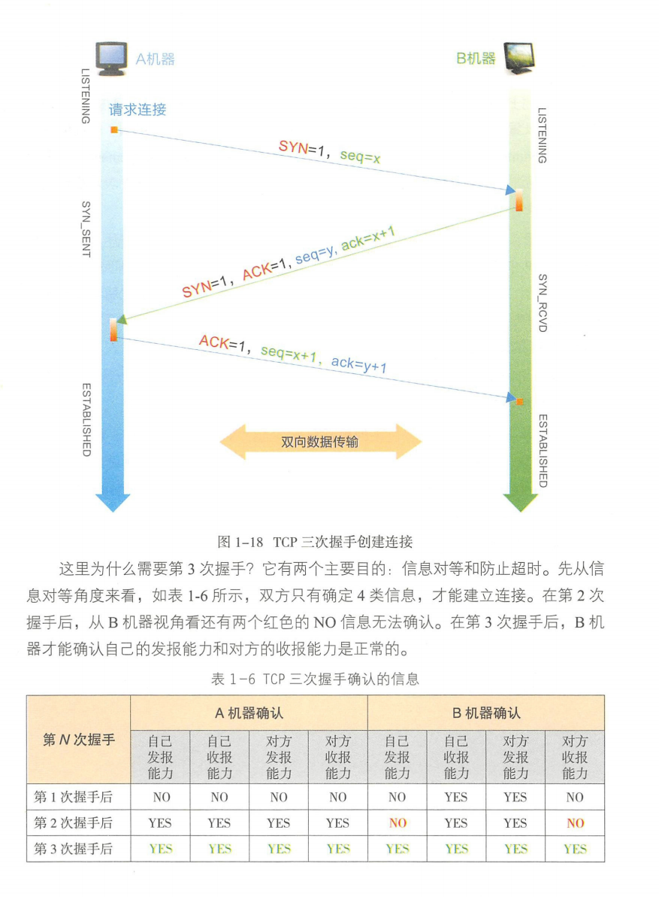

> ***仅供自己学习之用，建议以阅读书籍截图为主！***

# 计算机基础

## 走进0和1的世界

**原书参考：**


### 计算机简介

> **电子计算机**（亦称**电脑**）是利用[数字电子技术](https://zh.wikipedia.org/wiki/数字电子技术)，根据一系列指令指示并且自动执行任意算术或逻辑操作串行的设备。通用计算机因有能遵循被称为“[程序](https://zh.wikipedia.org/wiki/计算机程序)”的一般操作集的能力而使得它们能够执行极其广泛的任务。
>
> 计算机被用作各种工业和消费设备的控制系统。这包括简单的特定用途设备（如[微波炉](https://zh.wikipedia.org/wiki/微波炉)和[遥控器](https://zh.wikipedia.org/wiki/遥控器)）、工业设备（如[工业机器人](https://zh.wikipedia.org/wiki/工业机器人)和[计算机辅助设计](https://zh.wikipedia.org/wiki/计算机辅助设计)），及通用设备（如[个人电脑](https://zh.wikipedia.org/wiki/个人电脑)和[智能手机](https://zh.wikipedia.org/wiki/智能手机)之类的移动设备）等。尽管计算机种类繁多，但根据[图灵机](https://zh.wikipedia.org/wiki/图灵机)理论，一部具有着基本功能的计算机，应当能够完成任何其它计算机能做的事情。因此，理论上从[智能手机](https://zh.wikipedia.org/wiki/智能手机)到[超级计算机](https://zh.wikipedia.org/wiki/超级计算机)都应该可以完成同样的作业（不考虑时间和存储因素）。由于科技的飞速进步，下一代计算机总是在性能上能够显著地超过其前一代，这一现象有时被称作“[摩尔定律](https://zh.wikipedia.org/wiki/摩尔定律)”。通过[互联网](https://zh.wikipedia.org/wiki/互联网)，计算机互相连接，极大地提高了信息交换速度，反过来推动了科技的发展。在21世纪的现在，计算机的应用已经涉及到方方面面，各行各业了。
>
> 自古以来，简单的手动设备——就像[算盘](https://zh.wikipedia.org/wiki/算盘)——帮助人们进行计算。在[工业革命](https://zh.wikipedia.org/wiki/工业革命)初期，各式各样机械的出现，初衷都是为了自动完成冗长而乏味的任务，例如织机的编织图案。更复杂的机器在20世纪初出现，通过[模拟电路](https://zh.wikipedia.org/wiki/模拟电路)进行复杂特定的计算。第一台数字电子计算机出现于[第二次世界大战](https://zh.wikipedia.org/wiki/第二次世界大战)期间。自那时以来，电脑的速度，功耗和多功能性则不断增加。在现代，机械计算机的应用已经完全被电子计算机所取代。
>
> 计算机在组成上形式不一。依然有大量体积庞大的巨型计算机为特别的[科学](https://zh.wikipedia.org/wiki/科学)计算或面向大型组织的事务处理需求服务。比较小的、为个人应用而设计的称为[微型计算机](https://zh.wikipedia.org/wiki/微型计算机)（Personal Computer，PC），在中国地区简称为“微机”。今天在日常使用“计算机”一词时通常也是指此，不过现在计算机最为普遍的应用形式却是嵌入式，嵌入式计算机通常相对简单、体积小，并被用来控制其它设备——无论是[飞机](https://zh.wikipedia.org/wiki/飞机)、[工业机器人](https://zh.wikipedia.org/wiki/機器人)还是[数字相机](https://zh.wikipedia.org/wiki/数码相机)[[4\]](https://zh.wikipedia.org/wiki/电子计算机#cite_note-4)。
>
> 同计算机相关的技术研究叫[计算机科学](https://zh.wikipedia.org/wiki/计算机科学)，而“计算机技术”指的是将计算机科学的成果应用于工程实践所派生的诸多技术性和经验性成果的总合。“计算机技术”与“计算机科学”是两个相关而又不同的概念，它们的不同在于前者偏重于实践而后者偏重于理论。至于由数据为核心的研究则称为[信息技术](https://zh.wikipedia.org/wiki/信息技术)。
>
> 传统上，现代计算机包含至少一个处理单元（通常是[中央处理器](https://zh.wikipedia.org/wiki/中央处理器)（CPU））和某种形式的[存储器](https://zh.wikipedia.org/wiki/存储器)。处理组件执行算术和逻辑运算，并且排序和控制单元可以响应于存储的信息改变操作的顺序。外围设备包括输入设备（[键盘](https://zh.wikipedia.org/wiki/键盘)、[鼠标](https://zh.wikipedia.org/wiki/鼠标)、[操纵杆](https://zh.wikipedia.org/wiki/操纵杆)等）、输出设备（[显示器](https://zh.wikipedia.org/wiki/显示器)屏幕、[打印机](https://zh.wikipedia.org/wiki/打印机)等）以及执行两种功能（例如[触摸屏](https://zh.wikipedia.org/wiki/触摸屏)）的输入/输出设备。外围设备允许从外部来源检索信息，并使操作结果得以保存和检索。（维基百科）2021.02.28
>
> [电子计算机（维基百科）](https://zh.wikipedia.org/wiki/%E7%94%B5%E5%AD%90%E8%AE%A1%E7%AE%97%E6%9C%BA)

### 二进制

进制也就是进位计数制，是人为定义的带进位的计数方法（有不带进位的计数方法，比如原始的结绳计数法，唱票时常用的“正”字计数法，以及类似的tally mark计数）。 对于任何一种进制---X进制，就表示每一位置上的数运算时都是逢X进一位。 十进制是逢十进一，十六进制是逢十六进一，二进制就是逢二进一，以此类推，x进制就是逢x进位。

**二进制**
二进制有两个特点：它由两个数码0，1组成，二进制数运算规律是逢二进一。
为区别于其它进制，二进制数的书写通常在数的右下方注上基数2，或在后面加B表示，其中B是英文二进制Binary的首字母。
例如：二进制数10110011可以写成（10110011）2，或写成10110011B。对于十进制数可以不加标注，或加后缀D，其中D是英文十进制Decimal的首字母D。计算机领域我们之所以采用二进制进行计数，是因为二进制具有以下优点：
1） 二进制数中只有两个数码0和1，可用具有两个不同稳定状态的元器件来表示一位数码。例如，电路中某一通路的电流的有无，某一节点电压的高低，晶体管的导通和截止等。
2） 二进制数运算简单，大大简化了计算中运算部件的结构。
二进制数的加法和乘法基本运算法则各有四条，如下：
0+0=0，0+1=1，1+0=1，1+1=10
0×0=0，0×1=0，1×0=0，1×1=1
3）二进制天然兼容逻辑运算。
但是，二进制计数在日常使用上有个不便之处，就是位数往往很长，读写不便，如：把十进制的100000D写成二进制就是11000011010100000B，所以计算机领域我们实际采用的是十六进制。二进制数转换为十六进制数时，长度缩减为原先的约四分之一，把十进制的100000写成八进制就是303240。十六进制的一个数位可代表二进制的四个数位。这样，十进制的100000写成十六进制就是186A0。

### 原码、反码、补码

**一. 机器数和真值**
**机器数**
一个数在计算机中的二进制表示形式, 叫做这个数的机器数。机器数是带符号的，在计算机用一个数的最高位存放符号, 正数为0, 负数为1.比如，十进制中的数 +3 ，计算机字长为8位，转换成二进制就是00000011。如果是 -3 ，就是 10000011 。那么，这里的 00000011 和 10000011 就是机器数。

**真值**
因为第一位是符号位，所以机器数的形式值就不等于真正的数值。例如上面的有符号数 10000011，其最高位1代表负，其真正数值是 -3 而不是形式值131（10000011转换成十进制等于131）。所以，为区别起见，将带符号位的机器数对应的真正数值称为机器数的真值。

例：0000 0001的真值 = +000 0001 = +1，1000 0001的真值 = –000 0001 = –1

**二. 原码, 反码, 补码的基础概念和计算方法.**
在探求为何机器要使用补码之前, 让我们先了解原码, 反码和补码的概念.对于一个数, 计算机要使用一定的编码方式进行存储. 原码, 反码, 补码是机器存储一个具体数字的编码方式.

**原码**
原码就是符号位加上真值的绝对值, 即用第一位表示符号, 其余位表示值. 比如如果是8位二进制:

```
[+1]原 = 0000 0001

[-1]原 = 1000 0001
```

第一位是符号位. 因为第一位是符号位, 所以8位二进制数的取值范围就是:

```
[1111 1111 , 0111 1111]
```

即

```
[-127 , 127]
```

原码是人脑最容易理解和计算的表示方式.

**反码**
反码的表示方法是:

==正数的反码是其本身==

==负数的反码是在其原码的基础上, 符号位不变，其余各个位取反.==

```
[+1] = [00000001]原 = [00000001]反

[-1] = [10000001]原 = [11111110]反
```

可见如果一个反码表示的是负数, 人脑无法直观的看出来它的数值. 通常要将其转换成原码再计算.

**补码**
补码的表示方法是:

==正数的补码就是其本身==

==负数的补码是在其原码的基础上, 符号位不变, 其余各位取反, 最后+1. (即在反码的基础上+1)==

```
[+1] = [00000001]原 = [00000001]反 = [00000001]补

[-1] = [10000001]原 = [11111110]反 = [11111111]补
```

对于负数, 补码表示方式也是人脑无法直观看出其数值的. 通常也需要转换成原码在计算其数值.

**三. 为何要使用原码, 反码和补码**

现在我们知道了计算机可以有三种编码方式表示一个数. 对于正数因为三种编码方式的结果都相同:

```
[+1] = [00000001]原 = [00000001]反 = [00000001]补
```

所以不需要过多解释. 但是对于负数:

```
[-1] = [10000001]原 = [11111110]反 = [11111111]补
```

可见原码, 反码和补码是完全不同的. 既然原码才是被人脑直接识别并用于计算表示方式, *为何还会有反码和补码呢?*

首先, 因为人脑可以知道第一位是符号位, 在计算的时候我们会根据符号位, 选择对真值区域的加减.  但是对于计算机, 加减乘数已经是最基础的运算, 要设计的尽量简单. 计算机辨别”符号位”显然会让计算机的基础电路设计变得十分复杂! 于是人们想出了将符号位也参与运算的方法. 我们知道, 根据运算法则减去一个正数等于加上一个负数, 即: 1-1 = 1 + (-1) = 0 , 所以机器可以只有加法而没有减法, 这样计算机运算的设计就更简单了.

于是人们开始探索 将符号位参与运算, 并且只保留加法的方法. 首先来看原码:

计算十进制的表达式: 1-1=0

```
1 - 1 = 1 + (-1) = [00000001]原 + [10000001]原 = [10000010]原 = -2
```

如果用原码表示, 让符号位也参与计算, 显然对于减法来说, 结果是不正确的.这也就是为何计算机内部不使用原码表示一个数.

<u>*为了解决原码做减法的问题, 出现了反码:*</u>

计算十进制的表达式: 1-1=0

```
1 - 1 = 1 + (-1) = [0000 0001]原 + [1000 0001]原= [0000 0001]反 + [1111 1110]反 = [1111 1111]反 = [1000 0000]原 = -0
```

发现用反码计算减法, 结果的真值部分是正确的. 而唯一的问题其实就出现在”0”这个特殊的数值上. 虽然人们理解上+0和-0是一样的, 但是0带符号是没有任何意义的. 而且会有[0000 0000]原和[1000 0000]原两个编码表示0.

*<u>于是补码的出现, 解决了0的符号以及两个编码的问题:</u>*

```
1-1 = 1 + (-1) = [0000 0001]原 + [1000 0001]原 = [0000 0001]补 + [1111 1111]补 = [0000 0000]补=[0000 0000]原
```

这样0用[0000 0000]表示, 而以前出现问题的-0则不存在了.而且可以用[1000 0000]表示-128:

```
(-1) + (-127) = [1000 0001]原 + [1111 1111]原 = [1111 1111]补 + [1000 0001]补 = [1000 0000]补
```

-1-127的结果应该是-128, 在用补码运算的结果中, [1000 0000]补 就是-128. 但是注意因为实际上是使用以前的-0的补码来表示-128, 所以-128并没有原码和反码表示.(对-128的补码表示[1000 0000]补算出来的原码是[0000 0000]原, 这是不正确的)

使用补码, 不仅仅修复了0的符号以及存在两个编码的问题, 而且还能够多表示一个最低数. 这就是为什么8位二进制, 使用原码或反码表示的范围为[-127, +127], 而使用补码表示的范围为[-128, 127].

因为机器使用补码, 所以对于编程中常用到的32位int类型, 可以表示范围是: [-231, 231-1] 因为第一位表示的是符号位.而使用补码表示时又可以多保存一个最小值.

**四 范围溢出问题**

由于计算机中的数字用补码表示，例如8bit的byte类型的表示范围为：[-128, 127]

```
0 = [0000 0000]（补）

-128 = [1000 0000]（补）

127 = [0111 1111]（补）
```

当byte类型的变量超出界限时

```
128 = 127 + 1 = [0111 1111]补 + [0000 0001]补 = [1000 0000]补 = -128
129 = 127 + 2 = [0111 1111]补 + [0000 0010]补 = [1000 0001]补 = [1111 1111]原 = -127
...
...
-129 = -128 + (-1) = [1000 0000]补 + [1111 1111]补 = [0111 1111]补 = [0111 1111]原 = 127
-130 = -128 + （-2）= [1000 0000]补 + [1111 1110]补 = [0111 1110]补 = [0111 1110]原 = 126
```

    public class Test {
        public static void main(String[] args) {
    		byte a = (byte) 128;
        	byte b = (byte) 129;
        	byte c = (byte) -129;
        	byte d = (byte) -130;
    
        	System.out.print(a);    //-128
        	System.out.print(b);    //-127
        	System.out.print(c);    //127
        	System.out.print(d);    //126
    }
    可见，当越界时，会舍弃高位，并且在[-128,127]范围内循环。
### 操作符

**按位操作符（Bitwise operators）** 将其操作数（operands）当作32位的比特序列（由0和1组成），而不是十进制、十六进制或八进制数值。例如，十进制数9，用二进制表示则为1001。按位操作符操作数字的二进制形式，但是返回值依然是标准的JavaScript数值。


**逻辑运算符**:

逻辑运算符通常用于布尔型（逻辑）值。这种情况下，它们返回一个布尔值。然而，`&&` 和 `||` 运算符会返回一个指定操作数的值，因此，这些运算符也用于非布尔值。这时，它们也就会返回一个非布尔型值。

*短路计算：*

由于逻辑表达式的运算顺序是从左到右，也可以用以下规则进行"短路"计算：

- `(some falsy expression) && (*expr)*` 短路计算的结果为假。
- `(some truthy expression) || *(expr)*` 短路计算的结果为真。

短路意味着上述表达式中的expr部分不会被执行。


### 位移

*移位操作符操作的运算对象是二进制的位（Bit），只可用来处理整数类型（基本类型的一种）。移位操作可分为 左移操作符（<<）、“有符号”右移操作符（>>）、“无符号”右移操操作符（>>>）三种。*

**左移操作符 ( <<）：** 
value << num     value指定移动的值  num指定移动的位数

运算规则：
按照操作符右侧指定的位数将左边的操作数向左边移动（高位移除，在低位补0）；
当左移的操作数是int类型时，每移动一位它的第31位就要被移除（位数以第0位开始）；
当左移的操作数是long类型时，每移动一位 它的第63位就要被移除；
**当左边的操作数为byte、short类型时，它们会被转换为int类型，其结果要是int类型。**
在左移过程中正数可能移为负数，负数也可能移为正数。
数学意义：
在没有数字溢出的前提下，左移1位相当于乘以2的1次方，左移n位相当于乘以2的n次方。
例：这里以-101（int类型）为例，负数在计算机内是以补码形式存储的，因此移位操作时也是在补码的基础上移位。

```
-101在计算机内的存储:
源码	10000000	00000000	00000000	01100101
反码	11111111	11111111	11111111	10011010
补码	11111111	11111111	11111111	10011011
```

**“有符号”右移操作符（>>）:**
value >> num     value指定移动的值  num指定移动的位数

运算规则：
按照操作符右侧指定的位数将操作符左边的操作数向右移动（采用符号扩展机制）；
符号扩展进行移位，即：若符号为正，则在高位插入0，若符号为负，则在高位插入1（符号位保持不变）；
当左边的操作数为byte、short类型时，它们会被转换为int类型，其结果要是int类型。
数学意义：
右移一位相当于除以2，右移n位相当于除以2的n次方。
例：-101（int类型32位）

```
-101右移2位内存分析
源码	1000,0000	0000,0000	0000,0000	0110,0101	取反----->
反码	1111,1111	1111,1111	1111,1111	1001,1010	加1 ----->
补码	1111,1111	1111,1111	1111,1111	1001,1011	>>2----->
移位后补码	1111,1111	1111,1111	1111,1111	1110,0110	减1----->
反码	1111,1111	1111,1111	1111,1111	1110,0101	取反----->
源码	1000,0000	0000,0000	0000,0000	0001,1010	十进制为：-26
```

值得注意的是：无论正负偶数左移一位直接是整除结果，但对于正值奇数结果是除以2后向下取整后的结果。 对于负值奇数结果是除以2后向上取整结果。如下：

|            | 正数                  | 负数                   |
| ---------- | --------------------- | ---------------------- |
| 偶数（60） | 直接除以2（30）       | 直接除以2（-30）       |
| 奇数（61） | 除以2后向下取整（30） | 除以2后向上取整（-31） |

**“无符号”右移操作符（>>>）**

value >>> num     value指定移动的值  num指定移动的位数

运算规则：

按照操作符右侧指定的位数将操作符左边的操作数向右移动（0扩展机制）；
移位过程中，无论数值是正数还是负数，都在最高位补0
**只对32位和64位值有意义**

> 在Thinking in java 中有这么一句话：
>
> 只有数值右端的低5位才有用，这样可以防止我们移位超过int型值所具有的位数。（因为2的5次方为32，而int类型只有32位）若对一个long类型的数值进行处理，最后得到的结果也是long类型，此时只会用到数值右端的低6位，以防止移位超过long型数值具有的位数.
>

换言之，如果移动位数超过该类型的最大位数，那么编译器会对移动的位数取模。例如果对int类型移位33位，实际上只移动了33%32=1位。具体细节是（int a<<b）如果移位超过数值类型的最大位数，就将b化为二进制数，取右端的低5位数，再把这5位数化为10进制，此时这个10进制就是要将a移动的位数，long 类型同理。

**注意：移位运算符不存在“无符号”左移这一说。**
**位移负数位：**

java为了防止位移时超出数据范围，会对位移运算的位数做一个&运算。如果是int就会&0b11111，0b11111是二进制数字11111的意思。所以int位移只取后5位，即int位移范围是0-31。

```
a >>> 32 == a >>> 0
a >>> -1 == a >>> 31
```

如果是long，则是&0b11111，即只取后6位，所以位移范围是0-63。

byte则和int一样处理，只取后5位，因为一般运算时，byte、short、char都会转为int再计算。
当然，如果被final修饰则会视为常量，虽然也会自动转为int。但是计算会在编译期发生。
如果常量运算结果范围不超过byte、short、char范围，则编译器会自动把运算结果转为左侧的byte、short、char类型，否则需要我们手动强制转换。
还有类似于 >>>= ，+= 这些运算，也会自动强转。

### 取模与取余

**取模与取余的区别**
对于整型数a，b来说，取模运算或者求余运算的方法都是：
==1.求 整数商： c = a/b;==
==2.计算模或者余数： r = a - c * b==
求模运算和求余运算在第一步不同: 取余运算在取c的值时，向0 方向舍入(fix()函数)；而取模运算在计算c的值时，向负无穷方向舍入(floor()函数)。
例如计算：-7 Mod 4
那么：a = -7；b = 4；
第一步：求整数商c，如进行求模运算c = -2（向负无穷方向舍入），求余c = -1（向0方向舍入）；
第二步：计算模和余数的公式相同，但因c的值不同，求模时r = 1，求余时r = -3。

> **归纳：**当a和b符号一致时，求模运算和求余运算所得的c的值一致，因此结果一致。
> 当符号不一致时，结果不一样。求模运算结果的符号和b一致，求余运算结果的符号和a一致。
> 另外各个环境下%运算符的含义不同，比如c/c++，java 为取余，而python则为取模。

Java程序示例：Java 中的取余运算是 %，而取模运算是 Math.floorMod()。

```java
public static void main(String[] args) {
        System.out.println("-3,2取模"+Math.floorMod(-3,2));
        System.out.println("-3,2取余"+ -3%2);
        System.out.println("3,-2取模"+Math.floorMod(3,-2));
        System.out.println("3,2取余"+ 3%-2);
}
```
结果：

```
-3,2取模=1
-3,2取余=-1
3,-2取模=-1
3,2取余=1
```

### 舍入模式

**BigDecimal的7种舍入模式：**

| 方法          | 解释                                                         |
| ------------- | ------------------------------------------------------------ |
| ROUND_UP      | 远离零方向舍入，向远离0的方向舍入，也就是说，向绝对值最大的方向舍入，只要舍弃位非0即进位。 |
| ROUND_DOWN    | 趋向零方向的舍入，向0方向靠拢，也就是说，向绝对值最小的方向输入。注意，所有的位都舍弃不存在进位的情况。 |
| ROUND_CEILING | 向正无穷方向舍入，向正最大方向靠拢，如果是正数，舍入行为类似于ROUND_UP；如果是负数，则舍入行为类似于ROUND_DOWN。注意，Math.round方法使用的即此模式。 |
| ROUND_FLOOR   | 向负无穷方向舍入，向负无穷方向靠拢，如果是正数，则舍入行为类似于ROUND_DOWN；如果是负数，则舍入行为类似于ROUND_UP。 |
| HALF_UP       | 最近数字舍入（5进），这就是我们最经典的四舍五入模式。        |
| HALF_DOWN     | 最近数字舍入（5舍），在四舍五入中，5是进位的，而在>HALF_DOWN中却是舍弃不进位。 |
| HALF_EVEN     | 银行家算法，四舍六入五考虑，五后非零就进一，五后为零看奇偶，五前为偶应舍去，五前为奇要进一。 |


## 浮点数

本部分主要介绍了浮点数的表示与加减运算，可以直接参考书籍内容：


## 字符集与乱码


## CPU与内存


## TCP/IP

**本笔记主要以Java知识为主，计算机网络相关知识，会另行学习。因此不做过多介绍，以书籍介绍为主。**

### 网络协议


### IP协议


### TCP建立连接





### TCP断开连接


### 连接池


## 信息安全

### 黑客与安全

