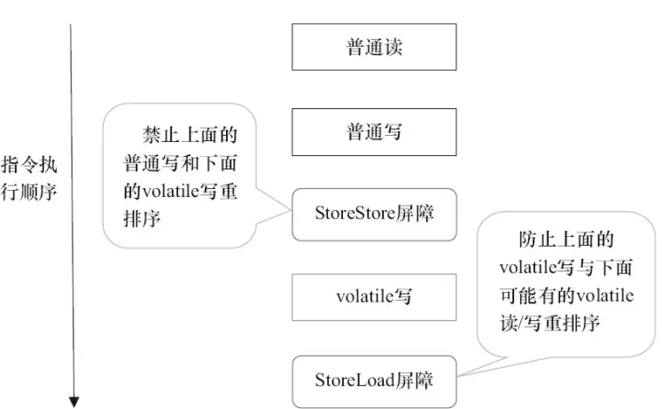

# 线程基础

## 一、认识线程

### 1、进程与线程：

> 对于操作系统来说，一个任务就是一个进程（Process），比如打开一个浏览器就是启动一个浏览器进程，打开一个记事本就启动了一个记事本进程，打开两个记事本就启动了两个记事本进程，打开一个Word就启动了一个Word进程。
>
> 有些进程还不止同时干一件事，比如Word，它可以同时进行打字、拼写检查、打印等事情。在一个进程内部，要同时干多件事，就需要同时运行多个“子任务”，我们把进程内的这些“子任务”称为线程（Thread）。

进程：是对运行时程序的封装，是**系统进行资源调度和分配的的基本单位，实现了操作系统的并发**；

线程：是进程的子任务，**是CPU调度和分派的基本单位**，**用于保证程序的实时性，实现进程内部的并发；线程是操作系统可识别的最小执行和调度单位**。每个线程都独自占用一个**虚拟处理器**：独自的**寄存器组**，**指令计数器和处理器状态**。每个线程完成不同的任务，但是**共享同一地址空间**（也就是同样的**动态内存，映射文件，目标代码等等**），**打开的文件队列和其他内核资源**。

一句话：**进程是资源分配的最小单位，线程是CPU调度的最小单位**；


### 2、并行与并发：

- 并发：一个处理器同时处理多个任务。
- 并行：多个处理器或者是多核的处理器同时处理多个不同的任务。

**区别：**并发和并行的区别就是一个人同时吃三个馒头和三个人同时吃三个馒头。


#### a、为什么需要多线程？

众所周知，CPU、内存、I/O 设备的速度是有极大差异的，为了合理利用 CPU 的高性能，平衡这三者的速度差异，计算机体系结构、操作系统、编译程序都做出了贡献，主要体现为:

- CPU 增加了缓存，以均衡与内存的速度差异；// 导致 `可见性`问题
- 操作系统增加了进程、线程，以分时复用 CPU，进而均衡 CPU 与 I/O 设备的速度差异；// 导致 `原子性`问题
- 编译程序优化指令执行次序，使得缓存能够得到更加合理地利用。// 导致 `有序性`问题


#### b、发生并发问题的根源在于：==并发三要素==

- `可见性`: CPU缓存引起

可见性：一个线程对共享变量的修改，另外一个线程能够立刻看到。

举个简单的例子，看下面这段代码：

```java
//线程1执行的代码
int i = 0;
i = 10;
 
//线程2执行的代码
j = i;
```

假若执行线程1的是CPU1，执行线程2的是CPU2。由上面的分析可知，当线程1执行 i =10这句时，会先把i的初始值加载到CPU1的高速缓存中，然后赋值为10，那么在CPU1的高速缓存当中i的值变为10了，却没有立即写入到主存当中。

此时线程2执行 j = i，它会先去主存读取i的值并加载到CPU2的缓存当中，注意此时内存当中i的值还是0，那么就会使得j的值为0，而不是10.

这就是可见性问题，线程1对变量i修改了之后，线程2没有立即看到线程1修改的值。

- `原子性`: 分时复用引起

原子性：即一个操作或者多个操作 要么全部执行并且执行的过程不会被任何因素打断，要么就都不执行。

经典的**转账问题**：比如从账户A向账户B转1000元，那么必然包括2个操作：从账户A减去1000元，往账户B加上1000元。

试想一下，如果这2个操作不具备原子性，会造成什么样的后果。假如从账户A减去1000元之后，操作突然中止。然后又从B取出了500元，取出500元之后，再执行 往账户B加上1000元 的操作。这样就会导致账户A虽然减去了1000元，但是账户B没有收到这个转过来的1000元。

所以这2个操作必须要具备原子性才能保证不出现一些意外的问题。

- `有序性`: 重排序引起

有序性：即程序执行的顺序按照代码的先后顺序执行。举个简单的例子，看下面这段代码：

```java
int i = 0;              
boolean flag = false;
i = 1;                //语句1  
flag = true;          //语句2
```

上面代码定义了一个int型变量，定义了一个boolean类型变量，然后分别对两个变量进行赋值操作。从代码顺序上看，语句1是在语句2前面的，那么JVM在真正执行这段代码的时候会保证语句1一定会在语句2前面执行吗? 不一定，为什么呢? 这里可能会发生指令重排序（Instruction Reorder）。

在执行程序时为了提高性能，编译器和处理器常常会对指令做重排序。重排序分三种类型：

- 编译器优化的重排序。编译器在不改变单线程程序语义的前提下，可以重新安排语句的执行顺序。
- 指令级并行的重排序。现代处理器采用了指令级并行技术（Instruction-Level Parallelism， ILP）来将多条指令重叠执行。如果不存在数据依赖性，处理器可以改变语句对应机器指令的执行顺序。
- 内存系统的重排序。由于处理器使用缓存和读 / 写缓冲区，这使得加载和存储操作看上去可能是在乱序执行。

从 java 源代码到最终实际执行的指令序列，会分别经历下面三种重排序：


上述的 1 属于编译器重排序，2 和 3 属于处理器重排序。这些重排序都可能会导致多线程程序出现内存可见性问题。对于编译器，JMM 的编译器重排序规则会禁止特定类型的编译器重排序（不是所有的编译器重排序都要禁止）。对于处理器重排序，JMM 的处理器重排序规则会要求 java 编译器在生成指令序列时，插入特定类型的内存屏障（memory barriers，intel 称之为 memory fence）指令，通过内存屏障指令来禁止特定类型的处理器重排序（不是所有的处理器重排序都要禁止）。


#### c、JMM解决并发问题

JMM：java内存模型，关于它的介绍这里不多赘述，放上我经常参考的笔记地址：[JAVA内存模型详解](https://pdai.tech/md/java/jvm/java-jvm-jmm.html)

> 简述：JMM决定一个线程对共享变量的写入何时对另一个线程可见，JMM定义了线程和主内存之间的抽象关系：共享变量存储在主内存(Main Memory)中，每个线程都有一个私有的工作内存（Working Memory），工作内存保存了被该线程使用到的主内存的副本拷贝，**线程对变量的所有操作都必须在工作内存中进行**，而不能直接读写主内存中的变量。
>
> 对于普通的共享变量来讲，线程A将其修改为某个值发生在线程A的工作内存中，此时还未同步到主内存中去；而线程B已经缓存了该变量的旧值，所以就导致了共享变量值的不一致。解决这种共享变量在多线程模型中的不可见性问题，较粗暴的方式自然就是加锁，但是此处使用synchronized或者Lock这些方式太重量级了，比较合理的方式其实就是volatile。
>
> 需要注意的是，JMM是个抽象的内存模型，**所以所谓的工作内存，主内存都是抽象概念，并不一定就真实的对应cpu缓存和物理内存**。


**1、从方法上解决**

JMM本质上可以理解为，Java 内存模型规范了 JVM 如何提供按需禁用缓存和编译优化的方法。具体来说，这些方法包括：

- volatile、synchronized 和 final 三个关键字
- Happens-Before 规则


**2、从本质上理解**

- 原子性

在Java中，对基本数据类型的变量的读取和赋值操作是原子性操作，即这些操作是不可被中断的，要么执行，要么不执行。 请分析以下哪些操作是原子性操作：

```java
x = 10;        //语句1: 直接将数值10赋值给x，也就是说线程执行这个语句的会直接将数值10写入到工作内存中
y = x;         //语句2: 包含2个操作，它先要去读取x的值，再将x的值写入工作内存，虽然读取x的值以及 将x的值写入工作内存 这2个操作都是原子性操作，但是合起来就不是原子性操作了。
x++;           //语句3： x++包括3个操作：读取x的值，进行加1操作，写入新的值。
x = x + 1;     //语句4： 同语句3
```

上面4个语句只有语句1的操作具备原子性。

也就是说，只有简单的读取、赋值（而且必须是将数字赋值给某个变量，变量之间的相互赋值不是原子操作）才是原子操作。

> 从上面可以看出，Java内存模型只保证了基本读取和赋值是原子性操作，如果要实现更大范围操作的原子性，可以通过synchronized和Lock来实现。由于synchronized和Lock能够保证任一时刻只有一个线程执行该代码块，那么自然就不存在原子性问题了，从而保证了原子性。

- 可见性

Java提供了volatile关键字来保证可见性。

当一个共享变量被volatile修饰时，它会保证修改的值会立即被更新到主存，当有其他线程需要读取时，它会去内存中读取新值。

而普通的共享变量不能保证可见性，因为普通共享变量被修改之后，什么时候被写入主存是不确定的，当其他线程去读取时，此时内存中可能还是原来的旧值，因此无法保证可见性。

> 另外，通过synchronized和Lock也能够保证可见性，synchronized和Lock能保证同一时刻只有一个线程获取锁然后执行同步代码，并且在释放锁之前会将对变量的修改刷新到主存当中。因此可以保证可见性。

- 有序性

在Java里面，可以通过volatile关键字来保证一定的“有序性”（具体原理参考后文volatile关键）。另外可以通过synchronized和Lock来保证有序性，很显然，synchronized和Lock保证每个时刻是有一个线程执行同步代码，相当于是让线程顺序执行同步代码，自然就保证了有序性。当然JMM是通过Happens-Before 规则来保证有序性的。


### 3、Java创建线程的方式：

> - **1.继承Thread类，重写run方法**
> - **2.实现Runnable接口，重写run方法，实现Runnable接口的实现类的实例对象作为Thread构造函数的target**
> - **3.通过Callable和FutureTask创建线程**
> - **4.通过线程池创建线程**

```java
import java.util.concurrent.Callable;
import java.util.concurrent.ExecutionException;
import java.util.concurrent.FutureTask;

/**
 * @author The_Beatles
 * @date 2021/10/31 10:12
 */

public class NewThread {

    private static class UserThread extends Thread {
        @Override
        public void run() {
            System.out.println("I am extends Thread.");
        }
    }

    // 由于Java中只能实现单继承，如果采用方式一，则线程类就无法继承其他类了，所以实现Runnable接口创建线程的方式更受欢迎。
    private static class UserRun implements Runnable {

        @Override
        public void run() {
            System.out.println("I am implements Runnable.");
        }
    }

    // 在前面两种线程创建方式中，线程执行完毕后并没有返回值，而实现Callable接口创建线程可以在线程结束后返回一个值。
    private static class UserCall implements Callable<String> {

        @Override
        public String call() throws Exception {
            return "I am implements Callable.";
        }
    }

    public static void main(String[] args) throws ExecutionException, InterruptedException {
        // Thread
        new UserThread().start();
        // Runnable
        new Thread(new UserRun()).start();
        // Callable
        FutureTask<String> futureTask = new FutureTask<>(new UserCall());
        new Thread(futureTask).start();
        System.out.println(futureTask.get());
    }
}
```


### 4、创建线程的对比：
- a.采用实现Runnable、Callable接口的方式创建多线程时:

**优势是：**

线程类只是实现了Runnable接口或Callable接口，还可以继承其他类。

在这种方式下，多个线程可以共享同一个target对象，所以非常适合多个相同线程来处理同一份资源的情况，从而可以将CPU、代码和数据分开，形成清晰的模型，较好地体现了面向对象的思想。

**劣势是：**

编程稍微复杂，如果要访问当前线程，则必须使用Thread.currentThread()方法。

- b.使用继承Thread类的方式创建多线程时

**优势是：**

编写简单，如果需要访问当前线程，则无需使用Thread.currentThread()方法，直接使用this即可获得当前线程。

**劣势是：**

线程类已经继承了Thread类，所以不能再继承其他父类。

- c.Runnable和Callable的区别

(1) Callable规定（重写）的方法是call()，Runnable规定（重写）的方法是run()。

(2) Callable的任务执行后可返回值，而Runnable的任务是不能返回值的。

(3) call方法可以抛出异常，run方法不可以。

(4) 运行Callable任务可以拿到一个Future对象，表示异步计算的结果。它提供了检查计算是否完成的方法，以等待计算的完成，并检索计算的结果。通过Future对象可以了解任务执行情况，可取消任务的执行，还可获取执行结果。


### 5、停止线程：

> 1、自然执行完。
>
> 2、抛出异常。

#### **相关API介绍：**

**stop()**：其实stop方法天生就不安全，因为它在终止一个线程时会==强制中断线程==的执行，不管run方法是否执行完了，并且还会==释放这个线程所持有的所有的锁对象==。这一现象会被其它因为请求锁而阻塞的线程看到，使他们继续向下执行。这就会造成数据的不一致。

我们拿银行转账作为例子，我们还是从A账户向B账户转账500元，我们之前讨论过，这一过程分为三步，第一步是从A账户中减去500元，假如到这时线程就被stop了，那么这个线程就会释放它所取得锁，然后其他的线程继续执行，这样A账户就莫名其妙的少了500元而B账户也没有收到钱。这就是stop方法的不安全性。

**resume()**：`Thread`类的`resume()`方法仅用于`suspend()`方法。 此方法用于恢复使用`suspend()`方法挂起的线程。此方法允许挂起的线程再次启动。

**suspend()**：suspend被弃用的原因是因为它会造成==死锁==。suspend方法和stop方法不一样，它==不会破坏对象和强制释放锁==，相反它==会一直保持对锁的占有==，一直到其他的线程调用resume方法，它才能继续向下执行。

假如有A，B两个线程，A线程在获得某个锁之后被suspend()阻塞，这时A不能继续执行，线程B在获得相同的锁之后才能调用resume方法将A唤醒，但是此时的锁被A占有，B不能继续执行，也就不能及时的唤醒A，此时A，B两个线程都不能继续向下执行而形成了死锁。这就是suspend()被弃用的原因。

**interrupt()**：interrupt()方法用于中断一个线程，而Java中线程的处理是**`协作式`**的而不是抢占式的。实际上调用一个线程的interrupt()方法中断一个线程，并不是强行关闭这个线程，只是跟这个线程打个招呼，将线程的中断标志位置为true，线程是否中断，由线程本身决定。interrupt方法的目的**是给线程发出中断信号，但是不保证线程真的会中断**。

> 如果线程在调用 Object类的 wait()、wait(long) 或 wait(long, int) 方法，或者该Thread类的 join()、join(long)、join(long, int)、sleep(long) 或 sleep(long, int) 方法过程中受阻，则其中断状态将被清除，它还将收到一个InterruptedException异常。这个时候，我们可以通过捕获InterruptedException异常来终止线程的执行，具体可以通过return等退出或改变共享变量的值使其退出。

**isInterrupt()**：

public boolean isInterrupted() 判断线程是否已经中断。线程的“中断状态”不受该方法的影响。

```java
    public boolean isInterrupted() {
        return isInterrupted(false);
    }
    private native boolean isInterrupted(boolean ClearInterrupted);
```

**static方法interrupted()**：

public static boolean interrupted 判断当前线程是否已经中断。线程的“中断状态”由该方法清除。换句话说，如果连续两次调用该方法，则第二次调用将返回 false。

```java
   public static boolean interrupted() {
        return currentThread().isInterrupted(true);
    }
```

**InterruptException:**

```java
/**
 * @author The_Beatles
 * @date 2021/10/31 11:43
 */

public class HasInterruptException {

    private static class UserThread extends Thread {

        public UserThread(String name) {
            super(name);
        }

        @Override
        public void run() {
            String threadName = Thread.currentThread().getName();
            while (!isInterrupted()) {
                try {
                    Thread.sleep(2000);
                } catch (InterruptedException e) {
                    System.out.println(threadName + " is isInterrupt flag is " + isInterrupted());
                    e.printStackTrace();
                    interrupt();
                }
                System.out.println(threadName + " is run!");
            }
            System.out.println(threadName + " is isInterrupt flag is ---" + isInterrupted());
        }
    }

    public static void main(String[] args) throws InterruptedException {
        UserThread endThread = new UserThread("HasInterruptException");
        endThread.start();
        Thread.sleep(100);
        endThread.interrupt();
    }
}
```


**==interrupt机制：==**

Java`中断响应`是描述当一个线程或方法A处于运行、阻塞或死锁状态时，外界(通常指其他线程、系统IO等)对A的影响能否让A线程或者方法抛出InterruptedException异常并提前返回，如果会提前返回并且抛出InterruptedException，就叫**可中断响应方法或线程**，如果不会抛出InterruptedException，就叫**不可中断线程或方法**。

Java语言中所有阻塞方法都声明抛出InterruptedException异常（例如 `Thread.sleep()`、 `Thread.join()` 或 `Object.wait()`）。也就是说，如果一个线程执行了阻塞方法，使得当前线阻塞，第三方线程执行interrupt方法中断线程，都会使得该阻塞方法抛出InterruptedException异常并退出阻塞，**并且将当前线程的中断标志位设置为false**。

如果没有这个机制， `interrupt()` 则只是单纯设置线程的中断状态。那这个试图中断的线程仍在阻塞当中，那么后序的中断工作则无法进行。

> 当外部线程对某线程调用了thread.interrupt()方法后，java语言的处理机制如下： 
> 1、如果该线程处在**可中断状态**下，（调用了xx.wait()，或者Selector.select(),Thread.sleep()等特定会发生阻塞的api），那么该线程会立即被唤醒，同时会受到一个InterruptedException，同时，如果是*阻塞在io上，对应的资源会被关闭*。如果该线程接下来不执行“Thread.interrupted()方法（不是interrupt），那么该线程处理任何io资源的时候，都会导致这些资源关闭。当然，解决的办法就是调用一下interrupted()，不过这里需要程序员自行根据代码的逻辑来设定，根据自己的需求确认是否可以直接忽略该中断，还是应该马上退出。 
> 2、如果该线程处在**不可中断状态**下，就是没有调用上述api，那么java只是设置一下该线程的interrupt状态，其他事情都不会发生，如果该线程之后会调用上述阻塞API，那到时候线程会马上跳出，并抛出InterruptedException，接下来的事情就跟第一种状况一致了。如果不会调用阻塞API，那么这个线程就会一直执行下去。除非你就是要实现这样的线程，一般高性能的代码中肯定会有wait()，yield()之类出让cpu的函数，不会发生后者的情况。


**==Thread.interrupt() VS Thread.stop()：==**

> 这两个方法最大的区别在于：**interrupt（）方法是设置线程的中断状态，让用户自己选择时间地点去结束线程；而stop（）方法会在代码的运行处直接抛出一个ThreadDeath错误，这是一个java.lang.Error的子类。所以直接使用stop（）方法就有可能造成对象的不一致性。** 
> 在JAVA中，曾经使用stop方法来停止线程，然而，该方法具有固有的不安全性，因而已经被抛弃(Deprecated)。那么应该怎么结束一个进程呢？官方文档中对此有详细说明：《为何不赞成使用 Thread.stop、Thread.suspend 和 Thread.resume？》。在此引用stop方法的说明： 
>
> Why is Thread.stop deprecated? 
> Because it is inherently unsafe. Stopping a thread causes it to unlock all the monitors that it has locked. (The monitors are unlocked as the ThreadDeath exception propagates up the stack.) If any of the objects previously protected by these monitors were in an inconsistent state, other threads may now view these objects in an inconsistent state. Such objects are said to be damaged. When threads operate on damaged objects, arbitrary behavior can result. This behavior may be subtle and difficult to detect, or it may be pronounced. Unlike other unchecked exceptions, ThreadDeath kills threads silently; thus, the user has no warning that his program may be corrupted. The corruption can manifest itself at any time after the actual damage occurs, even hours or days in the future. 
>
> 大概意思是： 
> 因为该方法本质上是不安全的。停止一个线程将释放它已经锁定的所有监视器（作为沿堆栈向上传播的未检查 ThreadDeath 异常的一个自然后果）。如果以前受这些监视器保护的任何对象都处于一种不一致的状态，则损坏的对象将对其他线程可见，这有可能导致任意的行为。此行为可能是微妙的，难以察觉，也可能是显著的。不像其他的未检查异常，ThreadDeath异常会在后台杀死线程，因此，用户并不会得到警告，提示他的程序可能已损坏。这种损坏有可能在实际破坏发生之后的任何时间表现出来，也有可能在多小时甚至在未来的很多天后。 
> 在文档中还提到，程序员不能通过捕获ThreadDeath异常来修复已破坏的对象。具体原因见原文。


### 6、线程的状态

#### a.线程的生命周期


#### **b.Java的线程状态有以下五种：**

1. 新建状态（NEW）

   用new关键字和Thread类或其子类建立一个线程对象后，该线程对象就处于新生状态。处于新生状态的线程有自己的内存空间，通过调用start方法进入就绪状态（runnable）。

2. 就绪状态（READY）

   在就绪下，线程进入到了可运行池，等待分配CPU。当系统选定一个等待执行的Thread对象后，它就会从等待执行状态进入执行状态，系统挑选的动作称之为“CPU调度”。一旦获得CPU时间片(`timeslice`)，线程就进入运行状态并自动调用自己的run方法。

3. 运行状态（RUNNABLE）

   处于运行状态的线程执行`run()`方法。如果该线程失去了CPU资源，会从运行状态变回就绪状态，重新等待系统分配资源。可以使用`yield()`方法使其让出CPU资源，再次变为就绪状态。

4. 阻塞状态（BLOCKED、WAITING、TIMED_WAITING）

   阻塞状态是指线程自动或被动让出CPU并暂停自己的运行(也即让出了`cpu timeslice`)。当引起阻塞的原因消除时，阻塞才能回到就绪状态等待被系统选中。

5. 死亡状态（TERMINATED）

   当线程`run()`方法执行完或者被强制终止，就认为它进入死亡状态。一旦线程死亡，就不能复生。


#### **c.状态的转变:**

- **新建状态 -> 就绪状态**

`Thread.start()` —— 使该线程开始执行；Java虚拟机调用该线程的`run`方法。

- **就绪状态 -> 运行状态**

`yield()`—— 暂停当前正在执行的线程对象，并执行其他线程。

- **运行状态 -> 阻塞状态**

当发生如下情况时，线程将会**进入阻塞状态**：

1. 线程调用`sleep()`方法主动放弃所占用的处理器资源，进入超时等待状态（TIMED_WAITING）
2. 线程调用了一个阻塞式IO方法，在该方法返回之前，该线程被阻塞
3. 线程试图获得一个同步监视器(:lock:)，但该同步监视器正被其他线程所持有，进入BLOCKED状态。
4. 线程在等待某个通知`notify`
5. 程序调用了线程的`suspend()`方法将该线程挂起。这个方法容易导致死锁，所以应该尽量避免使用该方法。

- **阻塞状态 -> 运行状态**

解除阻塞，让线程重新进入就绪状态：

1. 调用`sleep()`方法的线程经过了指定时间。
2. 线程调用的阻塞式IO方法已经返回。
3. 线程成功地获得了试图取得的**同步监视器（锁）**:lock:。
4. 线程正在等待某个通知时，其他线程发出了个**通知**。
5. 处于挂起状态的线程被调用了恢复方法。

- **运行状态 -> 死亡状态**

线程会以如下三种方式结束，结束后处于死亡状态：

1. `run()`, `call()`方法执行结束，线程便正常结束
2. 线程抛出一个未捕获的 Exception 或 Error
3. 直接调用该线程stop()方法来结束该线程——该方法容易导致死锁，通常不推荐使用。


#### **d.状态的获取:**

调用线程对象的`isAlive()`方法，当线程处于就绪、运行、阻塞了种状态时，该方法将返回true；当线程处于新建、死亡状态时，该方法将返回false。

```java
/**
 * 线程开始或结束状态的判断
 */
public class ThreadStartEnd extends Thread{

    private int i;

    public void run(){
        for (; i < 100; i++) {
            System.out.println(getName() + " - "+ i);
        }
    }

    public static void main(String[] args) {
        // 创建线程
        ThreadStartEnd thread = new ThreadStartEnd();
        for (int i = 0; i < 300; i++) {
            System.out.println("Current Thread: "+currentThread().getName()+", i= "+i);
            if (i==20){
                thread.start();
                // 判断线程启动状态
                System.out.println("isAlive? "+thread.isAlive());
            }
            // 当线程死亡时再次启动，观察反应
            // 结果是该死亡线程无法再次启动
            if (i>20 && !thread.isAlive()){
                thread.start();
            }
        }
    }
}
```

`参考:`[https://jimsunjing.github.io/tech/java/JavaThreadLife/]

#### e.扩展：

> - yield()
>
> - - 使当前线程从执行状态（运行状态）变为可执行态（就绪状态）。cpu会从众多的可执行态里选择，也就是说，当前也就是刚刚的那个线程还是有可能会被再次执行到的，并不是说一定会执行其他线程而该线程在下一次中不会执行到了。
>   - 用了yield方法后，该线程就会把CPU时间让掉，让其他或者自己的线程执行（也就是谁先抢到谁执行）
>   - 通过yield方法来实现两个线程的交替执行。不过请注意：这种交替并不一定能得到保证。
>   - yield()只是使当前线程重新回到可执行状态，所有执行yield()的线程有可能在进入到可执行状态后马上又被执行，所以yield()方法只能使同优先级的线程有执行的机会。


> **多线程原理：**
>
> 我们一般使用thread new一个线程，然后调用start方法启动，线程就会处于运行状态中ready，等待CPU调度，然后再执行线程里面的run()方法，使用start方法才真正实现了多线程运行，因为这个时候不用等待我们的run方法执行完成就可以继续执行下面的代码，这才叫多线程。
>
> 如果直接使用thread执行run方法会怎么样呢？
>
> 因为run方法是thread里面的一个普通的方法，如果直接调用run()方法，这个时候它会运行在主线程中，因为程序中只有主线程一个线程，如果有两个线程，都是直接调用run()方法，那么他们的执行顺序一定是按顺序执行的，并没有实现多线程的目的。

1、使用Thread 创建一个线程，然后调用start方法启动：

```java
/**
 * @author The_Beatles
 * @date 2021/10/31 16:25
 */

public class StartThread {

    private static class UserThread extends Thread {

        @Override
        public void run() {
            int i = 5;
            while (i > 0) {
                System.out.println(Thread.currentThread().getName() + "[" + i-- + "]: is run!");
            }
        }
    }

    public static void main(String[] args) throws InterruptedException {
        UserThread userThread = new UserThread();
        userThread.setName("UserThread");
        userThread.start();
//        userThread.run();

    }
}
```

结果：

```java
UserThread[5]: is run!
UserThread[4]: is run!
UserThread[3]: is run!
UserThread[2]: is run!
UserThread[1]: is run!

Process finished with exit code 0
```

2、通过main方法（主程序）运行run方法：

```java
public static void main(String[] args) throws InterruptedException {
        UserThread userThread = new UserThread();
        userThread.setName("UserThread");
//        userThread.start();
        userThread.run();

    }
```

结果：

```java
main[5]: is run!
main[4]: is run!
main[3]: is run!
main[2]: is run!
main[1]: is run!

Process finished with exit code 0
```

3、先执行上面的1、再执行2：

```java
public static void main(String[] args) throws InterruptedException {
        UserThread userThread = new UserThread();
        userThread.setName("UserThread");
        userThread.start();
        userThread.run();
    }
```

结果：

```java
UserThread[5]: is run!
UserThread[4]: is run!
main[5]: is run!
main[4]: is run!
main[3]: is run!
main[2]: is run!
main[1]: is run!
UserThread[3]: is run!
UserThread[2]: is run!
UserThread[1]: is run!

Process finished with exit code 0
```

4、先执行上面的2，再执行1：

```java
public static void main(String[] args) throws InterruptedException {
        UserThread userThread = new UserThread();
        userThread.setName("UserThread");
        userThread.run();
        userThread.start();
    }
```

结果：

```java
main[5]: is run!
main[4]: is run!
main[3]: is run!
main[2]: is run!
main[1]: is run!
UserThread[5]: is run!
UserThread[4]: is run!
UserThread[3]: is run!
UserThread[2]: is run!
UserThread[1]: is run!

Process finished with exit code 0
```


### 7、守护线程

> **守护线程**是一种特殊的线程，在后台默默地完成一些系统性的服务，比如垃圾回收线程、JIT线程都是守护线程。与之对应的是用户线程，用户线程可以理解为是系统的工作线程，它会完成这个程序需要完成的业务操作。如果用户线程全部结束了，意味着程序需要完成的业务操作已经结束了，系统可以退出了。所以当系统只剩下守护进程的时候，[java](http://www.cppcns.com/ruanjian/javabiancheng/)虚拟机会自动退出。
>
> java线程分为用户线程和守护线程，线程的daemon属性为true表示是守护线程(`Daemon Thread`)，false表示是用户线程(`User Thread`)。
>
> 最经典的守护线程使用就是负责GC的线程。只要用户线程还在，他就会认认真真的执行自己的工作。
>
> - 守护线程的优先级是最低的。

将线程转换为守护线程可以通过调用`Thread`对象的`setDaemon(true)`方法来实现。在使用守护线程时需要注意一下几点：

(1) `thread.setDaemon(true)`必须在`thread.start()`之前设置，否则会跑出一个`IllegalThreadStateException`异常。你不能把正在运行的常规线程设置为守护线程。

```java
public class Test {
    public static void main(String[] args) {
        Thread t = new Thread(()->{
            while(true){
                System.out.println("我是守护线程t，我在运行");
            }
        });
        t.setDaemon(true);
        t.start();
//        try {
//            TimeUnit.SECONDS.sleep(1);
//        } catch (InterruptedException e) {
//            e.printStackTrace();
//        }
    }
}

//这样执行起来什么也打印不了，但如果把注释去掉，让主线程停一秒就会持续打印。
```

(2) 在守护线程线程中产生的新线程也是守护线程。

```java
public class Test {
    public static void main(String[] args) {
        Thread t = new Thread(()->{
            Thread a = new Thread(()->{
                while (true){
                    System.out.println("我是线程a,我在运行");
                }
            });
            a.start();
        });
        t.setDaemon(true);
        t.start();
//        try {
//            TimeUnit.SECONDS.sleep(1);
//        } catch (InterruptedException e) {
//            e.printStackTrace();
//        }
    }
}

//这样执行起来什么也打印不了，但如果把注释去掉，让主线程停一秒就会持续打印。这就证明了a也是守护线程
```

(3) 守护线程应该永远不去访问固有资源，如文件、数据库，因为它会在任何时候甚至在一个操作的中间发生中断。

另外 调用`thread`对象的IsDaemon()可以获得该对象是否为守护线程。

```java
public static void main(String[] args) {
    Thread t = new Thread(()->{
        Thread a = new Thread(()->{
            while (true){
                //System.out.println("我是线程a,我在运行");
            }
        });
        System.out.println(a.isDaemon());
        a.setDaemon(false);
        System.out.println(a.isDaemon());
        a.start();
    });
    t.setDaemon(true);
    t.start();
    try {
        TimeUnit.MILLISECONDS.sleep(200);
    } catch (InterruptedException e) {
        e.printStackTrace();
    }
}

//打印结果是true和false。a可以一直运行
```

4、在Java虚拟机退出时Daemon线程中的finally块并不一定会执行。(守护进程是随着虚拟机的停止而停止运行的，你不可能预料到虚拟机何时停止，而如果在守护线程拥有类似finally代码块的语句，那么这些语句很有可能没有机会运行)

```java
/**
 * @author The_Beatles
 * @date 2021/10/31 16:40
 */

public class DaemonThread {

    private static class UserThread extends Thread {

        @Override
        public void run() {
            try {
                while (!isInterrupted()) {
                    System.out.println(Thread.currentThread().getName() + " is run!");
                }
                System.out.println(Thread.currentThread().getName() + " is isInterrupt flag is " + isInterrupted());
            } catch (Exception e) {
                e.printStackTrace();
            } finally {
                System.out.println("。。。。。。。。。finally");
            }
        }
    }

    public static void main(String[] args) throws InterruptedException {
        UserThread userThread = new UserThread();
        userThread.setDaemon(true); // 在start方法前使用
        userThread.start();
        Thread.sleep(5);
//        userThread.interrupt();
    }
}
```


## 二、线程的共享

### 1、synchronized

> 说明：`sychronized`可以作用于**变量、方法和类，但是不能作用于null。**
>
> synchronized是Java中的关键字，是一种同步锁。它修饰的对象有以下几种：
>
> 修饰一个方法
>
> 被修饰的方法称为同步方法，其作用的范围是整个方法，作用的对象是调用这个方法的对象；
>
> 修饰一个静态的方法
>
> 其作用的范围是整个静态方法，作用的对象是这个类的所有对象；
>
> 修饰一个代码块
>
> 被修饰的代码块称为同步语句块，其作用的范围是大括号{}括起来的代码，作用的对象是调用这个代码块的对象；
>
> 修饰一个类
>
> 其作用的范围是synchronized后面括号括起来的部分，作用主的对象是这个类的所有对象。

**对象锁：**

当一个对象中有`synchronized method` 或`synchronized block` 的时候，调用此对象的同步方法或进入其同步区域时，就必须先获得对象锁。如果此对象的对象锁已被其他调用者占用，则需要等待此锁被释放。java的所有对象都含有1个互斥锁，这个锁由JVM自动获取和释放。线程进入`synchronized`方法的时候获取该对象的锁，当然如果已经有线程获取了这个对象的锁，那么当前线程会等待；`synchronized`方法正常返回或者抛异常而终止，JVM会自动释放对象锁。

- 理解：

  <u>用来控制同一个实例在不同线程中的同步</u>

  - 修饰普通方法：即方法中增加`synchronized`关键字。
  - `synchronized(this)`或者`synchronized(某一个实例)`

**两个线程中分别访问同一个对象的同步方法，会互斥；不同对象的同步方法，不会互斥**


**类锁**：

由于一个class不论被实例化多少次，其中的静态方法和静态变量在内存中都只有一份。所以，一旦一个静态的方法被申明为`synchronized`。此类所有的实例化对象在调用此方法，共用同一把锁，我们称之为类锁。所谓的类锁，不过是Class对象的锁而已。

- 理解：

  <u>是用来控制静态方法（或静态变量互斥体）之间的同步</u>

  - 修饰静态方法（或静态代码块）
  - synchronized(xx.class)

两个线程中调用同一个类的两个不同的同步方法，会互斥


**代码示例：**

```java
import java.util.concurrent.TimeUnit;

/**
 * @author The_Beatles
 * @date 2021/10/31 17:48
 */

public class SyncClzAndInst {

    // 使用类🔐的线程
    private static class SynClass extends Thread {
        @Override
        public void run() {
            System.out.println("TestClass is running...");
            synClass();
        }
    }

    // 使用对象🔐的线程
    private static class InstanceSyn implements Runnable {
        private SyncClzAndInst syncClzAndInst;

        public InstanceSyn(SyncClzAndInst syncClzAndInst) {
            this.syncClzAndInst = syncClzAndInst;
        }

        @Override
        public void run() {
            System.out.println("TestInstance is running..." + syncClzAndInst);
            syncClzAndInst.instance();
        }
    }

    // 使用对象🔐的线程
    private static class Instance2Syn implements Runnable {
        private SyncClzAndInst syncClzAndInst;

        public Instance2Syn(SyncClzAndInst syncClzAndInst) {
            this.syncClzAndInst = syncClzAndInst;
        }

        @Override
        public void run() {
            System.out.println("TestInstance2 is running..." + syncClzAndInst);
            syncClzAndInst.instance2();
        }
    }

    // 使用对象🔐的方法
    private synchronized void instance() {
        try {
            TimeUnit.SECONDS.sleep(3);
        } catch (InterruptedException e) {
            e.printStackTrace();
        }
        System.out.println("synInstance is going..." + this);
        try {
            TimeUnit.SECONDS.sleep(3);
        } catch (InterruptedException e) {
            e.printStackTrace();
        }
        System.out.println("synInstance end..." + this);
    }

    // 使用对象🔐的方法
    private synchronized void instance2() {
        try {
            TimeUnit.SECONDS.sleep(3);
        } catch (InterruptedException e) {
            e.printStackTrace();
        }
        System.out.println("synInstance2 is going..." + this);
        try {
            TimeUnit.SECONDS.sleep(3);
        } catch (InterruptedException e) {
            e.printStackTrace();
        }
        System.out.println("synInstance2 end..." + this);
    }

    // 使用类🔐的方法
    private static synchronized void synClass() {
        try {
            TimeUnit.SECONDS.sleep(1);
        } catch (InterruptedException e) {
            e.printStackTrace();
        }
        System.out.println("synClass going...");
        try {
            TimeUnit.SECONDS.sleep(1);
        } catch (InterruptedException e) {
            e.printStackTrace();
        }
        System.out.println("synClass end...");
    }

    public static void main(String[] args) {
        SyncClzAndInst syncClzAndInst = new SyncClzAndInst();
        Thread t1 = new Thread(new InstanceSyn(syncClzAndInst));

//        SyncClzAndInst syncClzAndInst2 = new SyncClzAndInst();
//        Thread t2 = new Thread(new Instance2Syn(syncClzAndInst));

        t1.start();
//        t2.start();

        SynClass synClass = new SynClass();
        synClass.start();

        try {
            TimeUnit.SECONDS.sleep(1);
        } catch (InterruptedException e) {
            e.printStackTrace();
        }
    }
}
```


**注意**：

- `sychronized`对于同一个监视锁可以获取多次

```java
// Example
class Test {
  public static void main(String[] args) {
    Test t = new Test();
    synchronized (t) {
      synchronized (t) {
        System.out.println("made it!");
      }
    }
  }
}

// This program produces the output:
made it!
```

- 禁止基于可被重用的对象进行同步

错误❌：

```java
private final Boolean lock = Boolean.FALSE;
private final Integer lock = 0;
private final String lock = "guan";
private final String lock = new String("guan").intern();

// 语法不对，synchronized的锁只能是对象，而不是基本数据类型
private final int lock = 0;

// 加锁
synchronized (lock) {
	// 具体事务......
}
```

正确✅：

```java
// -128-127之间的是Integer的缓存对象
private final Integer lock = 128; // 这种方式确实有效，但不知道是否符合编程规范
private final Integer lock = new Integer(0);
private final String lock = new String("guan");
private final Object lock = new Object();
// 加锁
synchronized (lock) {
	// 具体事务......
}
```


==synchronized底层原理==

> 在Java早期版本中，synchronized属于重量级锁，效率低下，因为监视器锁（monitor）是依赖于底层的操作系统来实现，Java 的线程是映射到操作系统的原生线程之上的。如果要挂起或者唤醒一个线程，都需要操作系统帮忙完成，而操作系统实现线程之间的切换时需要从用户态转换到内核态，这个状态之间的转换需要相对比较长的时间，时间成本相对较高。
>
> 在Java 6之后从JVM层面对synchronized做了较大优化，锁的实现引入了如自旋锁、适应性自旋锁、锁消除、锁粗化、偏向锁、轻量级锁等技术来减少锁操作的开销。
>
> **synchronized 同步语句块的实现使用的是 monitorenter 和 monitorexit 指令。**
>
> 其中 monitorenter 指令指向同步代码块的开始位置，monitorexit 指令则指明同步代码块的结束位置。
>
> 当执行 monitorenter 指令时，线程试图获取锁也就是获取 monitor(monitor对象存在于每个Java对象的对象头中，synchronized 锁便是通过这种方式获取锁的，也是为什么Java中任意对象可以作为锁的原因) 的持有权.当计数器为0则可以成功获取，获取后将锁计数器设为1也就是加1。相应的在执行 monitorexit 指令后，将锁计数器设为0，表明锁被释放。如果获取对象锁失败，那当前线程就要阻塞等待，直到锁被另外一个线程释放为止。
>
> **synchronized 修饰的方法并没有 monitorenter 指令和 monitorexit 指令，取得代之的是ACC_SYNCHRONIZED标识，**该标识指明了该方法是一个同步方法，JVM 通过该 ACC_SYNCHRONIZED 访问标志来辨别一个方法是否声明为同步方法，从而执行相应的同步调用。但是原理其实都是类似的。

**扩展：**
锁主要存在四种状态，依次是：无锁状态、偏向锁状态、轻量级锁状态、重量级锁状态，他们会随着竞争的激烈而逐渐升级。注意锁可以升级不可降级，这种策略是为了提高获得锁和释放锁的效率。

**自旋**：当有个线程A去请求某个锁的时候，这个锁正在被其它线程占用，但是线程A并不会马上进入阻塞状态，而是循环请求锁(自旋)。这样做的目的是因为很多时候持有锁的线程会很快释放锁的，线程A可以尝试一直请求锁，没必要被挂起放弃CPU时间片，因为线程被挂起然后到唤醒这个过程开销很大,当然如果线程A自旋指定的时间还没有获得锁，仍然会被挂起。

**自适应性自旋**：自适应性自旋是自旋的升级、优化，自旋的时间不再固定，而是由前一次在同一个锁上的自旋时间及锁的拥有者的状态决定。例如线程如果自旋成功了，那么下次自旋的次数会增多，因为JVM认为既然上次成功了，那么这次自旋也很有可能成功，那么它会允许自旋的次数更多。

**锁消除**是指虚拟机即时编译器在运行时，对一些代码上要求同步，但是被检测到不可能存在共享数据竞争的锁进行消除。

**偏向锁**的目的是消除数据在无竞争情况下的同步原语，进一步提高程序的运行性能。如果说轻量级锁是在无竞争的情况下使用CAS操作去消除同步使用的互斥量，那么偏向锁就是在无竞争的情况下把整个同步都消除掉，连CAS操作都不用做了。偏向锁默认是开启的，也可以关闭。


### 2、volatile

#### a、锁的互斥与可见性

锁提供了两种主要特性：`互斥`（mutual exclusion） 和`可见性`（visibility）。

1. 互斥即一次只允许一个线程持有某个特定的锁，一次就只有一个线程能够使用该共享数据。
2. 可见性要更加复杂一些，它必须确保释放锁之前对共享数据做出的更改对于随后获得该锁的另一个线程是可见的。也即当一条线程修改了共享变量的值，新值对于其他线程来说是可以立即得知的。如果没有同步机制提供的这种可见性保证，线程看到的共享变量可能是修改前的值或不一致的值，这将引发许多严重问题。


#### b、volatile的作用

- **防重排序**

> `指令重排`是指JVM在编译Java代码的时候，或者CPU在执行JVM字节码的时候，对现有的指令顺序进行重新排序
>
> 指令重排的目的是为了在不改变程序执行结果的前提下，优化程序的运行效率。需要注意的是，这里所说的不改变执行结果，指的是不改变单线程下的程序执行结果。
>
> **`重排序操作不会对存在数据依赖关系的操作进行重排序`**。比如：a=1;b=a; 这个指令序列，由于第二个操作依赖于第一个操作，所以在编译时和处理器运时这两个操作不会被重排序。
>
> **重排序是为了优化性能，但是不管怎么重排序，单线程下程序的执行结果不能被改变**。比如：a=1;b=2;c=a+b这三个操作，第一步（a=1)和第二步(b=2)由于不存在数据依赖关系， 所以可能会发生重排序，但是c=a+b这个操作是不会被重排序的，因为需要保证最终的结果一定是c=a+b=3。
>
> 然而，指令重排是一把双刃剑，重排序在单线程下一定能保证结果的正确性，但是在多线程环境下，可能发生重排序，影响结果，下例中的1和2由于不存在数据依赖关系，则有可能会被重排序，先执行status=true再执行a=2。而此时线程B会顺利到达4处，而线程A中a=2这个操作还未被执行，所以b=a+1的结果也有可能依然等于2。
>
> ```java
> public class TestVolatile {
>     int a = 1;
>     boolean status = false;
> 
>     /**
>      * 状态切换为true
>      */
>     public void changeStatus() {
>         a = 2;
>         status = true;
>     }
> 
>     /**
>      * 若状态为true,则running
>      */
>     public void run() {
>         if (status) {
>             int b = a + 1;
>             System.out.println(b);
>         }
>     }
> }
> ```

我们再从一个最经典的例子来分析重排序问题。大家应该都很熟悉单例模式的实现，而在并发环境下的单例实现方式，我们通常可以采用双重检查加锁(DCL)的方式来实现。其源码如下：

```java
public class Singleton {
    public static volatile Singleton singleton;
    /**
     * 构造函数私有，禁止外部实例化
     */
    private Singleton() {};
    public static Singleton getInstance() {
        if (singleton == null) {
            synchronized (singleton.class) {
                if (singleton == null) {
                    singleton = new Singleton();
                }
            }
        }
        return singleton;
    }
}
```

现在我们分析一下为什么要在变量singleton之间加上volatile关键字。要理解这个问题，先要了解对象的构造过程，实例化一个对象其实可以分为三个步骤：

- 分配内存空间。
- 初始化对象。
- 将内存空间的地址赋值给对应的引用。

但是由于操作系统可以`对指令进行重排序`，所以上面的过程也可能会变成如下过程：

- 分配内存空间。
- 将内存空间的地址赋值给对应的引用。
- 初始化对象

如果是这个流程，多线程环境下就可能将一个未初始化的对象引用暴露出来，从而导致不可预料的结果。因此，为了防止这个过程的重排序，我们需要将变量设置为volatile类型的变量。


- **实现可见性(不保证原子性)**

可见性问题主要指一个线程修改了共享变量值，而另一个线程却看不到。引起可见性问题的主要原因是每个线程拥有自己的一个高速缓存区——线程工作内存。volatile关键字能有效的解决这个问题，我们看下下面的例子，就可以知道其作用：

```java
public class Test {
    private static volatile int count = 0;

    public static void main(String[] args){
        Thread[] threads = new Thread[5];
        for(int i = 0; i<5; i++){
            threads[i] = new Thread(()->{
                try{
                    for(int j = 0; j<10; j++){
                        System.out.println(++count);
                        Thread.sleep(500);
                    }
                }catch (Exception e){
                    e.printStackTrace();
                }
            });
            threads[i].start();
        }
    }
}
```

生成5条线程，每条线程都对count执行10次自增操作，我们预期结果是1-50均匀的打印出来，但不管运行多少次，都无法得到期望的结果：

```java
...
8
9
10
11
12
15
13
14
16
17
20
...
```

这说明仅仅保证数据的可见性并不能保证线程安全，我们需要明确的是，count++操作并不是原子操作，因为自增操作包括三个基本指令：读取数据、计算数据、返回结果.


- **保证原子性:单次读/写**

volatile不能保证完全的原子性，只能保证单次的读/写操作具有原子性。先从如下两个问题来理解（后文再从内存屏障的角度理解）：


<u>*问题1： i++为什么不能保证原子性?*</u>

对于原子性，需要强调一点，也是大家容易误解的一点：对volatile变量的单次读/写操作可以保证原子性的，如long和double类型变量，但是并不能保证i++这种操作的原子性，因为本质上i++是读、写两次操作。

现在我们就通过下列程序来演示一下这个问题：

```java
public class VolatileTest01 {
    volatile int i;

    public void addI(){
        i++;
    }

    public static void main(String[] args) throws InterruptedException {
        final  VolatileTest01 test01 = new VolatileTest01();
        for (int n = 0; n < 1000; n++) {
            new Thread(new Runnable() {
                @Override
                public void run() {
                    try {
                        Thread.sleep(10);
                    } catch (InterruptedException e) {
                        e.printStackTrace();
                    }
                    test01.addI();
                }
            }).start();
        }
        Thread.sleep(10000);//等待10秒，保证上面程序执行完成
        System.out.println(test01.i);
    }
}
```

大家可能会误认为对变量i加上关键字volatile后，这段程序就是线程安全的。大家可以尝试运行上面的程序。下面是我本地运行的结果：981 可能每个人运行的结果不相同。不过应该能看出，volatile是无法保证原子性的(否则结果应该是1000)。原因也很简单，i++其实是一个复合操作，包括三步骤：

- 读取i的值。
- 对i加1。
- 将i的值写回内存。 volatile是无法保证这三个操作是具有原子性的，我们可以通过AtomicInteger或者Synchronized来保证+1操作的原子性。 注：上面几段代码中多处执行了Thread.sleep()方法，目的是为了增加并发问题的产生几率，无其他作用。


<u>*问题2： 共享的long和double变量的为什么要用volatile?*</u>

非原子的64位操作：

因为long和double两种数据类型的操作可分为高32位和低32位两部分，因此普通的long或double类型读/写可能不是原子的。因此，鼓励大家将共享的long和double变量设置为volatile类型，这样能保证任何情况下对long和double的单次读/写操作都具有原子性。

目前各种平台下的商用虚拟机都选择把 64 位数据的读写操作作为原子操作来对待，因此我们在编写代码时一般不把long 和 double 变量专门声明为 volatile多数情况下也是不会错的。


#### c、volatile的实现原理

<u>**1、可见性实现**</u>

> volatile 变量的内存可见性是基于内存屏障(Memory Barrier)实现:
>
> 内存屏障，又称内存栅栏，是一个CPU指令。
>
> 在程序运行时，为了提高执行性能，编译器和处理器会对指令进行重排序，JMM 为了保证在不同的编译器和 CPU 上有相同的结果，通过插入特定类型的内存屏障来禁止+ 特定类型的编译器重排序和处理器重排序，插入一条内存屏障会告诉编译器和 CPU：不管什么指令都不能和这条 Memory Barrier 指令重排序。

写一段简单的Java代码，声明一个volatile变量，并赋值。

```java
public class Test {
    private volatile int a;
    public void update() {
        a = 1;
    }
    public static void main(String[] args) {
        Test test = new Test();
        test.update();
    }
}
```

通过 hsdis 和 jitwatch 工具可以得到编译后的汇编代码:

```java
......
  0x0000000002951563: and    $0xffffffffffffff87,%rdi
  0x0000000002951567: je     0x00000000029515f8
  0x000000000295156d: test   $0x7,%rdi
  0x0000000002951574: jne    0x00000000029515bd
  0x0000000002951576: test   $0x300,%rdi
  0x000000000295157d: jne    0x000000000295159c
  0x000000000295157f: and    $0x37f,%rax
  0x0000000002951586: mov    %rax,%rdi
  0x0000000002951589: or     %r15,%rdi
  0x000000000295158c: lock cmpxchg %rdi,(%rdx)  //在 volatile 修饰的共享变量进行写操作的时候会多出 lock 前缀的指令
  0x0000000002951591: jne    0x0000000002951a15
  0x0000000002951597: jmpq   0x00000000029515f8
  0x000000000295159c: mov    0x8(%rdx),%edi
  0x000000000295159f: shl    $0x3,%rdi
  0x00000000029515a3: mov    0xa8(%rdi),%rdi
  0x00000000029515aa: or     %r15,%rdi
......
```

lock 前缀的指令在多核处理器下会引发两件事情:

- 将当前处理器缓存行的数据写回到系统内存。
- 写回内存的操作会使在其他 CPU 里缓存了该内存地址的额数据无效。

为了提高处理速度，处理器不直接和内存进行通信，而是先将系统内存的数据读到内部缓存(L1，L2 或其他)后再进行操作，但操作完不知道何时会写到内存。

`如果对声明了 volatile 的变量进行写操作，JVM 就会向处理器发送一条 lock 前缀的指令，将这个变量所在缓存行的数据写回到系统内存。`

为了保证各个处理器的缓存是一致的，实现了缓存一致性协议(MESI)，每个处理器通过嗅探在总线上传播的数据来检查自己缓存的值是不是过期了，当处理器发现自己缓存行对应的内存地址被修改，就会将当前处理器的缓存行设置成无效状态，当处理器对这个数据进行修改操作的时候，会重新从系统内存中把数据读到处理器缓存里。

所有多核处理器下还会完成：当处理器发现本地缓存失效后，就会从内存中重读该变量数据，即可以获取当前最新值。

volatile 变量通过这样的机制就使得每个线程都能获得该变量的最新值。

- **lock 指令**

在 Pentium 和早期的 IA-32 处理器中，lock 前缀会使处理器执行当前指令时产生一个 LOCK# 信号，会对总线进行锁定，其它 CPU 对内存的读写请求都会被阻塞，直到锁释放。 后来的处理器，加锁操作是由高速缓存锁代替总线锁来处理。 因为锁总线的开销比较大，锁总线期间其他 CPU 没法访问内存。 这种场景多缓存的数据一致通过缓存一致性协议(MESI)来保证。

- **缓存一致性**

**缓存是分段(line)的，一个段对应一块存储空间，称之为缓存行，它是 CPU 缓存中可分配的最小存储单元，大小 32 字节、64 字节、128 字节不等，这与 CPU 架构有关，通常来说是 64 字节。** LOCK# 因为锁总线效率太低，因此使用了多组缓存。 为了使其行为看起来如同一组缓存那样。因而设计了 `缓存一致性协议`。 缓存一致性协议有多种，但是日常处理的大多数计算机设备都属于 `" 嗅探(snooping)" 协议`。 所有内存的传输都发生在一条共享的总线上，而所有的处理器都能看到这条总线。 缓存本身是独立的，但是内存是共享资源，所有的内存访问都要经过仲裁(同一个指令周期中，只有一个 CPU 缓存可以读写内存)。 **CPU 缓存不仅仅在做内存传输的时候才与总线打交道，而是不停在嗅探总线上发生的数据交换，跟踪其他缓存在做什么。 当一个缓存代表它所属的处理器去读写内存时，其它处理器都会得到通知，它们以此来使自己的缓存保持同步。 只要某个处理器写内存，其它处理器马上知道这块内存在它们的缓存段中已经失效。**


**<u>2、volatile有序性实现</u>**

- **volatile的`happens-before`关系**

> happens-before的定义：
>
> **1. 如果一个操作happens-before另一个操作，那么第一个操作的执行结果将对第二个操作可见，而且第一个操作的执行顺序排在第二个操作之前。**
> **2. 两个操作之间存在happens-before关系，并不意味着一定要按照happens-before原则制定的顺序来执行。如果重排序之后的执行结果与按照happens-before关系来执行的结果一致，那么这种重排序并不非法。**
>
> 下面是happens-before原则规则：
>
> 1. 程序次序规则：一个线程内，按照代码顺序，书写在前面的操作先行发生于书写在后面的操作； 
> 2. 锁定规则：一个unLock操作先行发生于后面对同一个锁额lock操作； 
> 3. volatile变量规则：对一个变量的写操作先行发生于后面对这个变量的读操作； 
> 4. 传递规则：如果操作A先行发生于操作B，而操作B又先行发生于操作C，则可以得出操作A先行发生于操作C； 
> 5. 线程启动规则：Thread对象的start()方法先行发生于此线程的每个一个动作； 
> 6. 线程中断规则：对线程interrupt()方法的调用先行发生于被中断线程的代码检测到中断事件的发生； 
> 7. 线程终结规则：线程中所有的操作都先行发生于线程的终止检测，我们可以通过Thread.join()方法结束、Thread.isAlive()的返回值手段检测到线程已经终止执行； 
> 8. 对象终结规则：一个对象的初始化完成先行发生于他的finalize()方法的开始；
>
> 这里只做简单介绍，具体可自行查阅JMM相关资料。

happens-before规则中有一条是volatile变量规则：对一个volatile域的写，happens-before于任意后续对这个volatile域的读。

```java
//假设线程A执行writer方法，线程B执行reader方法
class VolatileExample {
    int a = 0;
    volatile boolean flag = false;
    
    public void writer() {
        a = 1;              // 1 线程A修改共享变量
        flag = true;        // 2 线程A写volatile变量
    } 
    
    public void reader() {
        if (flag) {         // 3 线程B读同一个volatile变量
        int i = a;          // 4 线程B读共享变量
        ……
        }
    }
}
```

根据happens-before规则，上面过程会建立3类happens-before关系。

- 根据程序次序规则：1 happens-before 2 且 3 happens-before 4。
- 根据 volatile 规则：2 happens-before 3。
- 根据 happens-before 的传递性规则：1 happens-before 4。


因为以上规则，当线程A将volatile变量flag更改为true后，线程B能够迅速感知。


- **volatile 禁止重排序**

为了性能优化，JMM 在不改变正确语义的前提下，会允许编译器和处理器对指令序列进行重排序。JMM 提供了内存屏障阻止这种重排序。

Java 编译器会在生成指令系列时在适当的位置会插入内存屏障指令来禁止特定类型的处理器重排序。

JMM 会针对编译器制定 volatile 重排序规则表。


**" NO " 表示禁止重排序。**

为了实现 volatile 内存语义时，编译器在生成字节码时，会在指令序列中插入内存屏障来禁止特定类型的处理器重排序。

对于编译器来说，发现一个最优布置来最小化插入屏障的总数几乎是不可能的，为此，JMM 采取了保守的策略。

- 在每个volatile写操作的前面插入一个StoreStore屏障。
- 在每个volatile 写操作的后面插入一个StoreLoad屏障。
- 在每个volatile 读操作的后面插入一个LoadLoad屏障。
- 在每个volatile读操作的后面插入一个LoadStore屏障。

`volatile写`是在**前面和后面**分别插入内存屏障，而`volatile读`操作是在**后面**插入两个内存屏障。

| 内存屏障        | 说明                                                        |
| --------------- | ----------------------------------------------------------- |
| StoreStore 屏障 | 禁止上面的普通写和下面的 volatile 写重排序。                |
| StoreLoad 屏障  | 防止上面的 volatile 写与下面可能有的 volatile 读/写重排序。 |
| LoadLoad 屏障   | 禁止下面所有的普通读操作和上面的 volatile 读重排序。        |
| LoadStore 屏障  | 禁止下面所有的普通写操作和上面的 volatile 读重排序。        |




#### d、volatile的应用场景

> 使用 volatile 必须具备的条件
>
> - 对变量的写操作不依赖于当前值。
> - 该变量没有包含在具有其他变量的不变式中。
> - 只有在状态真正独立于程序内其他内容时才能使用volatile。


**<u>模式1：状态标志</u>**

也许实现 volatile 变量的规范使用仅仅是使用一个布尔状态标志，用于指示发生了一个重要的一次性事件，例如完成初始化或请求停机。

```java
volatile boolean shutdownRequested;
......
public void shutdown() { shutdownRequested = true; }
public void doWork() { 
    while (!shutdownRequested) { 
        // do stuff
    }
}
```


**<u>模式2：一次性安全发布(one-time safe publication)</u>**

缺乏同步会导致无法实现可见性，这使得确定何时写入对象引用而不是原始值变得更加困难。在缺乏同步的情况下，可能会遇到某个对象引用的更新值(由另一个线程写入)和该对象状态的旧值同时存在。(这就是造成著名的双重检查锁定(double-checked-locking)问题的根源，其中对象引用在没有同步的情况下进行读操作，产生的问题是您可能会看到一个更新的引用，但是仍然会通过该引用看到不完全构造的对象)。

```java
public class BackgroundFloobleLoader {
    public volatile Flooble theFlooble;
 
    public void initInBackground() {
        // do lots of stuff
        theFlooble = new Flooble();  // this is the only write to theFlooble
    }
}
 
public class SomeOtherClass {
    public void doWork() {
        while (true) { 
            // do some stuff...
            // use the Flooble, but only if it is ready
            if (floobleLoader.theFlooble != null) 
                doSomething(floobleLoader.theFlooble);
        }
    }
}
```


**<u>模式3：独立观察(independent observation)</u>**

安全使用 volatile 的另一种简单模式是定期发布观察结果供程序内部使用。例如，假设有一种环境传感器能够感觉环境温度。一个后台线程可能会每隔几秒读取一次该传感器，并更新包含当前文档的 volatile 变量。然后，其他线程可以读取这个变量，从而随时能够看到最新的温度值。

```java
public class UserManager {
    public volatile String lastUser;
 
    public boolean authenticate(String user, String password) {
        boolean valid = passwordIsValid(user, password);
        if (valid) {
            User u = new User();
            activeUsers.add(u);
            lastUser = user;
        }
        return valid;
    }
}
```


**<u>模式4：volatile bean 模式</u>**

在 volatile bean 模式中，JavaBean 的所有数据成员都是 volatile 类型的，并且 getter 和 setter 方法必须非常普通 —— 除了获取或设置相应的属性外，不能包含任何逻辑。此外，对于对象引用的数据成员，引用的对象必须是有效不可变的。(这将禁止具有数组值的属性，因为当数组引用被声明为 volatile 时，只有引用而不是数组本身具有 volatile 语义)。对于任何 volatile 变量，不变式或约束都不能包含 JavaBean 属性。

```java
@ThreadSafe
public class Person {
    private volatile String firstName;
    private volatile String lastName;
    private volatile int age;
 
    public String getFirstName() { return firstName; }
    public String getLastName() { return lastName; }
    public int getAge() { return age; }
 
    public void setFirstName(String firstName) { 
        this.firstName = firstName;
    }
 
    public void setLastName(String lastName) { 
        this.lastName = lastName;
    }
 
    public void setAge(int age) { 
        this.age = age;
    }
}
```


**<u>模式5：开销较低的读－写锁策略</u>**

volatile 的功能还不足以实现计数器。因为 ++x 实际上是三种操作(读、添加、存储)的简单组合，如果多个线程凑巧试图同时对 volatile 计数器执行增量操作，那么它的更新值有可能会丢失。 如果读操作远远超过写操作，可以结合使用内部锁和 volatile 变量来减少公共代码路径的开销。 安全的计数器使用 synchronized 确保增量操作是原子的，并使用 volatile 保证当前结果的可见性。如果更新不频繁的话，该方法可实现更好的性能，因为读路径的开销仅仅涉及 volatile 读操作，这通常要优于一个无竞争的锁获取的开销。

```java
@ThreadSafe
public class CheesyCounter {
    // Employs the cheap read-write lock trick
    // All mutative operations MUST be done with the 'this' lock held
    @GuardedBy("this") private volatile int value;
 
    public int getValue() { return value; }
 
    public synchronized int increment() {
        return value++;
    }
}
```


**<u>模式6：双重检查(double-checked)</u>**

就是我们上文举的例子。

单例模式的一种实现方式，但很多人会忽略 volatile 关键字，因为没有该关键字，程序也可以很好的运行，只不过代码的稳定性总不是 100%，说不定在未来的某个时刻，隐藏的 bug 就出来了。

```java
class Singleton {
    private volatile static Singleton instance;
    private Singleton() {
    }
    public static Singleton getInstance() {
        if (instance == null) {
            syschronized(Singleton.class) {
                if (instance == null) {
                    instance = new Singleton();
                }
            }
        }
        return instance;
    } 
}  
```

[参考](https://pdai.tech/md/java/thread/java-thread-x-key-volatile.html?)


### 3、ThreadLocal


## 三、线程的协作

当多个线程可以一起工作去解决某个问题时，如果某些部分必须在其它部分之前完成，那么就需要对线程进行协调。

### 1、join()

**在线程中调用另一个线程的 join() 方法，会将当前线程挂起，而不是忙等待，直到目标线程结束。**

对于以下代码，虽然 b 线程先启动，但是因为在 b 线程中调用了 a 线程的 join() 方法，b 线程会等待 a 线程结束才继续执行，因此最后能够保证 a 线程的输出先于 b 线程的输出。

```java
public class JoinExample {

    private class A extends Thread {
        @Override
        public void run() {
            System.out.println("A");
        }
    }

    private class B extends Thread {

        private A a;

        B(A a) {
            this.a = a;
        }

        @Override
        public void run() {
            try {
                a.join();
            } catch (InterruptedException e) {
                e.printStackTrace();
            }
            System.out.println("B");
        }
    }

    public void test() {
        A a = new A();
        B b = new B(a);
        b.start();
        a.start();
    }
}
```


```java
public static void main(String[] args) {
    JoinExample example = new JoinExample();
    example.test();
}
```

```text
A
B
```

### 2、wait() notify() notifyAll()

调用 wait() 使得线程等待某个条件满足，线程在等待时会被挂起，当其他线程的运行使得这个条件满足时，其它线程会调用 notify() 或者 notifyAll() 来唤醒挂起的线程。

它们都属于 Object 的一部分，而不属于 Thread。

只能用在同步方法或者同步控制块中使用，否则会在运行时抛出 IllegalMonitorStateExeception。

`使用 wait() 挂起期间，线程会释放锁。`这是因为，如果没有释放锁，那么其它线程就无法进入对象的同步方法或者同步控制块中，那么就无法执行 notify() 或者 notifyAll() 来唤醒挂起的线程，造成死锁。

```java
public class WaitNotifyExample {
    public synchronized void before() {
        System.out.println("before");
        notifyAll();
    }

    public synchronized void after() {
        try {
            wait();
        } catch (InterruptedException e) {
            e.printStackTrace();
        }
        System.out.println("after");
    }
}
```

```java
public static void main(String[] args) {
    ExecutorService executorService = Executors.newCachedThreadPool();
    WaitNotifyExample example = new WaitNotifyExample();
    executorService.execute(() -> example.after());
    executorService.execute(() -> example.before());
}
```

```html
before
after 
```


**wait() 和 sleep() 的区别**

- wait() 是 Object 的方法，而 sleep() 是 Thread 的静态方法；
- wait() 会释放锁，sleep() 不会。


### 3、await() signal() signalAll()

java.util.concurrent 类库中提供了 Condition 类来实现线程之间的协调，可以在 Condition 上调用 await() 方法使线程等待，其它线程调用 signal() 或 signalAll() 方法唤醒等待的线程。相比于 wait() 这种等待方式，await() 可以指定等待的条件，因此更加灵活。

使用 Lock 来获取一个 Condition 对象。

```java
public class AwaitSignalExample {
    private Lock lock = new ReentrantLock();
    private Condition condition = lock.newCondition();

    public void before() {
        lock.lock();
        try {
            System.out.println("before");
            condition.signalAll();
        } finally {
            lock.unlock();
        }
    }

    public void after() {
        lock.lock();
        try {
            condition.await();
            System.out.println("after");
        } catch (InterruptedException e) {
            e.printStackTrace();
        } finally {
            lock.unlock();
        }
    }
}
```

```java
public static void main(String[] args) {
    ExecutorService executorService = Executors.newCachedThreadPool();
    AwaitSignalExample example = new AwaitSignalExample();
    executorService.execute(() -> example.after());
    executorService.execute(() -> example.before());
}
```

```java
before
after
```


