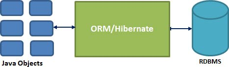
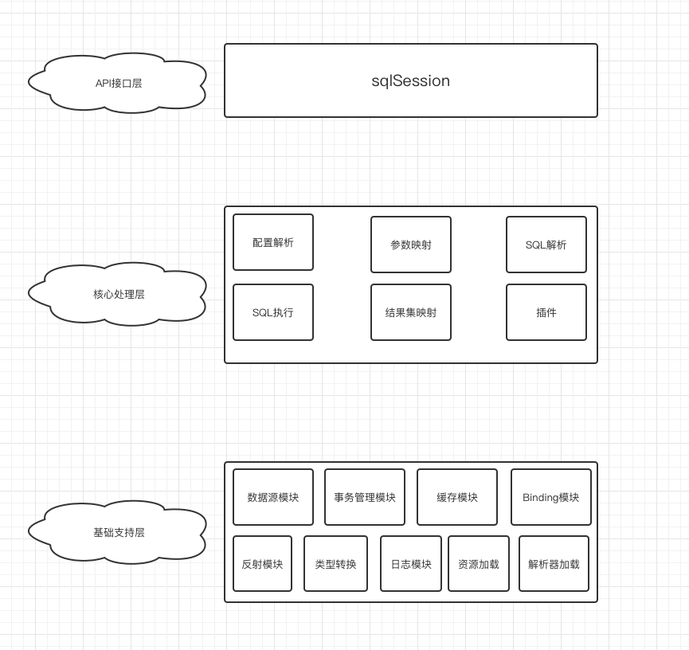
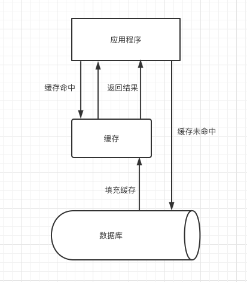
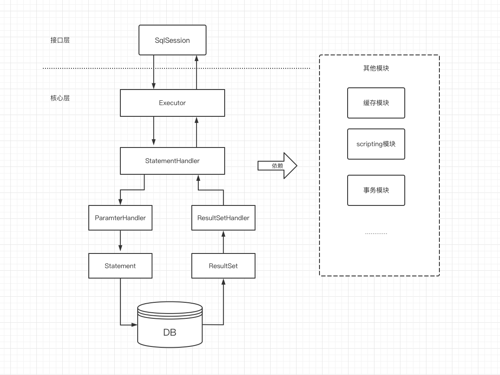

# 一、mybatis相关概述

## 1.1、对象**/**关系数据库映射（**ORM**）

`ORM`全称`Object/Relation Mapping`：表示对象-关系映射的缩写。
`ORM`完成⾯向对象的编程语⾔到关系数据库的映射。当`ORM`框架完成映射后，程序员既可以利⽤⾯向对象程序设计语⾔的简单易⽤性，⼜可以利⽤关系数据库的技术优势。`ORM`把关系数据库包装成⾯向对象的模型。`ORM`框架是⾯向对象设计语⾔与关系数据库发展不同步时的中间解决⽅案。采⽤`ORM`框架后，应⽤程序不再直接访问底层数据库，⽽是以⾯向对象的放松来操作持久化对象，⽽`ORM`框架则将这些⾯向对象的操作转换成底层SQL操作。ORM框架实现的效果：把对持久化对象的保存、修改、删除等操作，转换为对数据库的操作。

## 1.2、Mybatis简介

MyBatis是⼀款优秀的基于ORM的半⾃动轻量级持久层框架，它⽀持==定制化SQL、存储过程以及⾼级映射==。MyBatis避免了⼏乎所有的JDBC代码和⼿动设置参数以及获取结果集。MyBatis可以使⽤简单的XML或注解来配置和映射原⽣类型、接⼝和Java的POJO （`Plain Old Java Objects`,普通⽼式Java对 象）为数据库中的记录。

## 1.3、Mybatis历史

原是apache的⼀个开源项⽬iBatis, 2010年6⽉这个项⽬由apache software foundation 迁移到了google code，随着开发团队转投Google Code旗下，ibatis3.x正式更名为*Mybatis* ，代码于2013年11⽉迁移到Github。
iBATIS⼀词来源于“internet”和“abatis”的组合，是⼀个基于Java的持久层框架。iBATIS提供的持久层框架包括SQL Maps和Data Access Objects(DAO)。

## 1.4、常见持久层框架

- **hibernate**

[Hibernate](https://hibernate.org)是一款Java世界中最著名的ORM框架之一，它是使用GNU宽通用公共许可证发行的自由、开源的软件。它为面向对象的领域模型到传统的关系型数据库的映射，提供了一个使用方便的持久化框架。

> ORM 是 Object Relational Mapping 的缩写，译为“对象关系映射”框架。
>
> 所谓的 ORM 框架就是一种为了解决面向对象与关系型数据库中数据类型不匹配的技术，它通过描述 Java 对象与数据库表之间的映射关系，自动将 Java 应用程序中的对象持久化到关系型数据库的表中。
>
> ORM 框架是一种数据持久化技术，即在对象模型和关系型数据库之间建立起对应关系，并且提供一种机制，可通过 JavaBean 对象操作数据库表中的数据，如下图：

Hibernate通过hbm.xml映射文件维护Java类与数据库表的映射关系。通过Hibernate的映射，Java开发人员可以用看待Java对象的角度去看待数据库表中的数据行。数据库中所有的表通过hbm.xml配置文件映射之后，都对应一个Java 类，表中的每行数据在运行过程中会被映射成相应的java对象。在Java对象之间存在一对多、对一、多对多等复杂的层次关系,Hibernate的hbm.xml映射文件也可以维护这种层次关系，并将这种关系与数据库中的外键、关联表等进行映射，这也就是所谓的“关联映射”。

**优势：**

- Hibernate使用XML文件来处理映射Java类别到数据库表格中，并且不用编写任何代码。
- 为在数据库中直接储存和检索Java对象提供简单的APIs。
- 如果在数据库中或任何其它表格中出现变化，那么仅需要改变XML文件属性。
- 抽象不熟悉的SQL类型，并为我们提供工作中所熟悉的Java对象。
- Hibernate不需要应用程序服务器来操作。
- 操控你数据库中对象复杂的关联。
- 最小化与访问数据库的智能提取策略。
- 提供简单的数据询问。

- JPA

Java持久性API(JPA)是Java的一个规范。 它用于在Java对象和关系数据库之间保存数据。 JPA充当面向对象的领域模型和关系数据库系统之间的桥梁。

由于JPA只是一个规范，它本身不执行任何操作。 它需要一个实现。 因此，像Hibernate，TopLink和iBatis这样的ORM工具实现了JPA数据持久性规范。

此处不做过多介绍。

- Spring JDBC

严格来说，Spring JDBC并不能算是一一个ORM框架，它仅仅是使用模板方式对原生JDBC进行了-层非常薄的封装。 使用Spring JDBC可以帮助开发人员屏蔽创建数据库连接对、Statement对象、异常处理以及事务管理的重复性代码，提高开发效率。

Spring JDBC中没有映射文件、对象查询语言、缓存等概念，而是直接执行原生SQL语句。Sping JDBC中提供了多种Template 类，可以将对象中的属性映射成SQL语句中绑定的参数，Spring JDBC还提供了很多ORM化的Callback,这些Callback可以将ResultSet转化成相应的对象列表。在有些场景中，我们需要直接使用JDBC原生对象，例如，操作JDBC原生的ResultSet,则可以直接返回SqlRowSet对象，该对象是原生ResultSet对象的简单封装。Spring JDBC在功能上不及Hibernate强大，但它凭借高度的灵活性，也在Java持久化中占有了一席之地。

除此之外，SpringJDBC本身就位于Spring核心包中，也是Spring框架的基础模块之一，天生与Spring框架无缝集成。凭借Spring框架的强大功能，Spring JDBC可以实现集成多种开源数据源、管理声明式事务等功能。总的来说，Spring JDBC可以算作一个封装良好、功能强大的JDBC工具集。Spring JDBC整体架构设计非常优秀，其源码也非常值得分析，感兴趣的读者可以深入学习一下。

## 1.5、Mybatis优缺点

**优点：**

- 简单易学：本身就很小且简单。没有任何第三方依赖，最简单安装只要两个jar文件+配置几个sql映射文件易于学习，易于使用，通过文档和源代码，可以比较完全的掌握它的设计思路和实现。 
- 灵活：mybatis不会对应用程序或者数据库的现有设计强加任何影响。 sql写在xml里，便于统一管理和优化。通过sql基本上可以实现我们不使用数据访问框架可以实现的所有功能，或许更多。 
- 解除sql与程序代码的耦合：通过提供DAL层，将业务逻辑和数据访问逻辑分离，使系统的设计更清晰，更易维护，更易单元测试。sql和代码的分离，提高了可维护性。 
- 提供映射标签，支持对象与数据库的orm字段关系映射 
- 提供对象关系映射标签，支持对象关系组建维护 
- 提供xml标签，支持编写动态sql。 

**缺点：**

- 编写SQL语句时工作量很大，尤其是字段多、关联表多时，更是如此。 
- SQL语句依赖于数据库，导致数据库移植性差，不能更换数据库。 
- 框架还是比较简陋，功能尚有缺失，虽然简化了数据绑定代码，但是整个底层数据库查询实际还是要自己写的，工作量也比较大，而且不太容易适应快速数据库修改。 
- 二级缓存机制不佳

## 1.6、Mybatis整体架构

Mybatis的功能架构分为三层：分别是基础支持层、核心处理层和接口层。

1. API接口层：提供给外部使用的接口API，开发人员通过这些本地API来操纵数据库。接口层一接收到调用请求就会调用数据处理层来完成具体的数据处理。 
2. 核心处理层：负责具体的SQL查找、SQL解析、SQL执行和执行结果映射处理等。它主要的目的是根据调用的请求完成一次数据库操作。 
3. 基础支撑层：负责最基础的功能支撑，包括连接管理、事务管理、配置加载和缓存处理，这些都是共用的东西，将他们抽取出来作为最基础的组件。为上层的数据处理层提供最基础的支撑。 

### 1.6.1 基础支持层

基础支持层包含了整个Mybatis的基础模块，这些模块为核心处理层的功能提供了良好的支撑。

- 反射模块

Java中的反射虽然功能强大，但对大多数开发人员来说，写出高质量的反射代码还是有一定难度的。MyBatis中专门提供了反射模块，该模块对Java 原生的反射进行了良好的封装，提供了更加简洁易用的API,方便上层使调用，并且对反射操作进行了一系列优化，例如缓存了类的元数据，提高了反射操作的性能。

- 类型转换模块

MyBatis 为简化配置文件提供了别名机制，该机制是类型转换模块的主要功能之一。 类型转换模块的另一个功能是实现JDBC类型与Java类型之间的转换，该功能在为SQL语句绑定实参以及映射查询结果集时都会涉及。在为SQL语句绑定实参时，会将数据由Java类型转换成JDBC类型;而在映射结果集时，会将数据由JDBC类型转换成Java类型。

- 日志模块

无论在开发测试环境中，还是在线上生产环境中，日志在整个系统中的地位都是非常重要的。良好的日志功能可以帮助开发人员和测试人员快速定位Bug代码，也可以帮助运维人员快速定位性能瓶颈等问题。目前的Java世界中存在很多优秀的日志框架，例如Log4j、Log4j2、slf4j等。MyBatis作为-个设计优良的框架，除了提供详细的日志输出信息，还要能够集成多种日志框架，其日志模块的一个主要功能就是集成第三方日志框架。

- 资源加载模块

资源加载模块主要是对类加载器进行封装，确定类加载器的使用顺序，并提供了加载类文件以及其他资源文件的功能。

- 解析器模块

解析器模块的主要提供了两个功能:一个功能是对XPath进行封装，为MyBatis初始化时解析mybatis-config.xml配置文件以及映射配置文件提供支持;另一个功能是为处理动态SQL语句中的占位符提供支持。

- 数据源模块

数据源是实际开发中常用的组件之一。现在开源的数据源都提供了比较丰富的功能，例如，连接池功能、检测连接状态等，选择性能优秀的数据源组件对于提升ORM框架乃至整个应用的性能都是非常重要的。MyBatis 自身提供了相应的数据源实现，当然MyBatis也提供了与第三方数据源集成的接口，这些功能都位于数据源模块之中。

- 事务管理

MyBatis对数据库中的事务进行了抽象，其自身提供了相应的事务接口和简单实现。在很多场景中，MyBatis 会与Spring框架集成，并由Spring框架管理事务。

- 缓存模块

在优化系统性能时，优化数据库性能是非常重要的一个环节，而添加缓存则是优化数据库时最有效的手段之一。正确、 合理地使用缓存可以将部分 数据库请求拦截在缓存这层，如下图所示，这就能够减少相当部分 数据库的压力。

MyBatis中提供了一级缓存和二级缓存，而这两级缓存都是依赖于基础支持层中的缓存模块实现的，这里需要读者注意的是，MyBatis中自带的这两级缓存与MyBatis以及整个应用是运行在同一个JVM中的，共享同一块堆内存。 如果这两级缓存中的数据量较大。则可能影响系统中其他功能的运行，所以当需要缓存大量数据时，优先考虑使用Redis Memeache等缓存产品。

- Binding模块

通过前面的示例我们知道，在调用SqlSession相应方法执行数据库操作时，需要指定映射文件中定义的SQL节点，如果出现拼写错误，我们只能在运行时才能发现相应的异常。为了尽早发现这种错误，MyBatis 通过Binding模块将用户自定义的Mapper接口与映射配置文件关联起来，系统可以通过调用自定义Mapper接口中的方法执行相应的SQL语句完成数据库操作，从而避免.上述问题。

值得注意的是，开发人员无须编写自定义Mapper接口的实现，MyBatis会自动为其创建动态代理对象。在有些场景中，自定义Mapper接口可以完全代替映射配置文件，但有的映射规则和SQL语句的定义还是写在映射配置文件中比较方便，例如动态SQL语句的定义。

### 1.6.2 核心处理层

介绍完MyBatis的基础支持层之后，我们来分析MyBatis的核心处理层。在核心处理层中实现了MyBatis的核心处理流程，其中包括MyBatis的初始化以及完成一次数据库操作的涉及的全部流程。下面简单描述各个模块的功能。

- 配置解析

在MyBatis 初始化过程中，会加载mybatis-config.xml配置文件、映射配置文件以及Mapper接口中的注解信息，解析后的配置信息会形成相应的对象并保存到Configuration对象中。例如，定义的<resultMap>节点(即ResultSet 的映射规则)会被解析成ResultMap对象;定义的<result>节点(即属性映射)会被解析成ResultMapping对象。之后，利用该Configuration对象创建SqlSessionFactory对象。待MyBatis 初始化之后，开发人员可以通过初始化得到SqlSessionFactory 创建SqlSession对象并完成数据库操作。

- SQL解析与scripting模块

拼凑SQL语句是一件烦琐且易出错的过程，为了将开发人员从这项枯燥无趣的工作中解脱出来，MyBatis实现动态SQL语句的功能，提供了多种动态SQL语句对应的节点，例如，<where>节点、<if>节点、<foreach>节点等。通过这些节点的组合使用，开发人员可以写出几乎满足所有需求的动态SQL语句。

MyBatis中的scripting 模块会根据用户传入的实参，解析映射文件中定义的动态SQL节点，并形成数据库可执行的SQL语句。之后会处理SQL语句中的占位符，绑定用户传入的实参。

- SQL执行

SQL语句的执行涉及多个组件，其中比较重要的是Executor、 StatementHandler 、ParameterHandler和ResultSetHandler. Executor 主要负责维护一级缓存和二级缓存，并提供事务管理的相关操作，它会将数据库相关操作委托给StatementHandler完成。StatementHandler首先通过ParameterHandler完成SQL语句的实参绑定，然后通过java.sql.Statement对象执行SQL语句并得到结果集，最后通过ResultSetHandler 完成结果集的映射，得到结果对象并返回。下图展示了MyBatis执行一条SQL语句的大致过程。

- 插件

Mybatis自身的功能虽然强大，但是并不能完美切合所有的应用场景，因此MyBatis提供了插件接口，我们可以通过添加用户自定义插件的方式对MyBatis进行扩展。用户自定义插件也可以改变Mybatis的默认行为，例如，我们可以拦截SQL语句并对其进行重写。由于用户自定义插件会影响MyBatis的核心行为，在使用自定义插件之前，开发人员需要了解MyBatis内部的原理，这样才能编写出安全、高效的插件。

### 1.6.3 接口层

接口层相对简单，其核心是SqlSession接口，该接口中定义了MyBatis 暴露给应用程序调用的API,也就是上层应用与MyBatis交互的桥梁。接口层在接收到调用请求时，会调用核心处理层的相应模块来完成具体的数据库操作。

# 二、基础支持层

> 基础支持层位于Mybatis整体架构的最底层，支撑着Mybatis的核心处理层，是整个框架的基石。基础支持层中封装了多个较为通用的、独立的模块，不仅仅为Mybatis提供基础支撑，也可以在合适的场景中直接复用。

## 2.1、解析器模块

