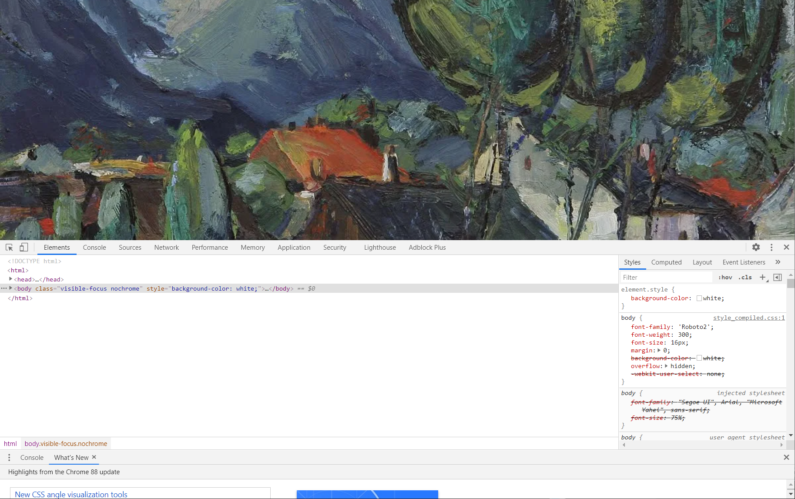
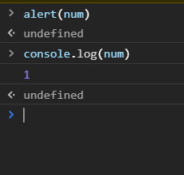
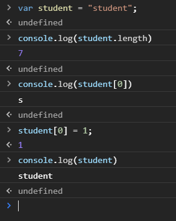

# JS快速入门

## JavaScript引入


1、内部引入

```html
<script>
    //....
</script>
```

2、外部引入

abc.js

```js
//....
```

test.html

```html
<script src="abc.js"></script>
```

相关测试代码：

```html
<!DOCTYPE html>
<html lang="en">
<head>
    <meta charset="UTF-8">
    <title>Title</title>

<!--    在script标签内，写JavaScript代码-->
<!--    <script>-->
<!--        alert('Hello World!')-->
<!--    </script>-->

<!--    外部引入-->
<!--    注意：script标签必须成对出现-->
    <script src="js/qj.js"></script>

<!--    不用显示定义type，也默认就是 JavaScript-->
    <script type="text/javascript"></script>

</head>
<body>

<!--这里也可以存放JavaScript代码-->
</body>
</html>
```

```js
alert('Hello World!')
```


## 基本语法

1、浏览器必备调试须知！



2、控制台打印



3、测试代码

```html
<!DOCTYPE html>
<html lang="en">
<head>
    <meta charset="UTF-8">
    <title>Title</title>

<!--    JavaScript严格区分大小写-->
    <script>
        // 1.定义变量  变量类型    变量名 = 变量值;
        var num = 1;
        var name = "刘德华";
        // 2.条件控制
        if (num > 60 && num < 70){
            alert("60~70")
        }else if (num > 70 && num < 80){
            alert("70~80")
        }else {
            alert("other")
        }

        // console.log(num)    在浏览器的控制台打印变量!

        /**
         * 支持文档注释
          */

    </script>

</head>
<body>

</body>
</html>
```


## 数据类型

数值，文本，图形，音频，视频......


==number==

js不区分小数和整数，Number

```javascript
123 // 整数
123.1 // 浮点数123.1
1.123e3 // 科学计数法
-99 // 负数
NaN // not a number
Infinity // 表示无限大
```

==字符串==

'abc'  "abc"

==布尔值==

true, false

==逻辑运算==

```
&& 	两个都为真，结果为真
||	一个为真，结果为真
!	真即假，假即真
```

==比较运算符==！！！重要！！！

```
=	赋值
==	等于(类型不一样，值一样，也会判断为true)
===	绝对等于(类型一样，值一样，结果为true)
```

坚持不要使用 == 比较，应采用 === 比较，这是JavaScript的缺陷。

须知：

- NaN===NaN，这个与所有的值都不相等，包括自己
- 只能通过 isNaN（NaN）来判断这个数是否是NaN。

浮点数问题：

```javascript
console.log((1/3) === (1-2/3))
```

尽量避免使用浮点数进行运算，存在精度问题！

```javascript
Math.abs((1/3) === (1-2/3))<0.00000001
//结果为true
```

==null和undefined==

- null  空
- undefined  未定义

==数组==

Java的数值必须是相同类型的对象~，JS中不需要这样！！！

```javascript
//保证代码的可读性，尽量使用[]
var arr = [1,2,3,4,5,'hello',null,true]

new Array(1,2,3,4,5,'hello',null,true);
```

取数组下标：如果越界了，就会

```javascript
undefined
```

==对象==

对象是大括号，数组是中括号~~

每个属性之间使用逗号隔开，最后一个不需要添加

```javascript
var person = {
            name: "刘德华",
            age: 3,
            tags: ['js','java','web','...']
        }
```

取对象的值

```javascript
person.name
> "刘德华"
person.age
> 3
```


## 严格检查格式

```html
<!DOCTYPE html>
<html lang="en">
<head>
    <meta charset="UTF-8">
    <title>Title</title>

<!--    前提: IDEA 需要设置支持ES6语法
          'use strict'; 严格检查模式，预防JavaScript的随意性导致产生一些问题
           必须写在JavaScript的第一行
          局部变量建议都使用 let 去定义~
-->

    <script>
        'use strict';
        //全局变量
        i = 1;
        // ES6  let
    </script>

</head>
<body>

</body>
</html>
```


# 数据类型


## 字符串

1、正常字符串我们使用 单引号，或者双引号包裹

2、注意转义字符 \

```
\'		单引号点，
\n		换行
\t		空格
\u4e2d	\u#### 	Unicode字符
\x41	Ascll字符
```

**3、多行字符串编写**

```javascript
//tab 上面 esc键下面
var msg =
    `hello
world
你好`
```

4、模板字符串

```javascript
//tab  上面 esc键下面
        let name = "nihao";
        let age = 3;

        let msg = `你好，${name}`
```

5 、字符串长度

```javascript
console.log(str.length)
```

**6、字符串的可变性，不可变**



7、大小写转换

```javascript
//注意，这里是方法，不是属性了。
student.toUpperCase()
student.toLowerCase()
```

8、获取指定下标

```javascript
student.indexOf('t')
```

**9、截取字符串**

```javascript
[)
student.substring(1) //从第一个字符串截取到最后一个字符串
结果："tudent"
student.substring(1,3) //[1,3)
"tu"
```

**其它：**

ES5：

```javascript
let persons = ['张三','李四','王五'];
function hello(a,b,c){
    console.info(a);
    console.info(b);
    console.info(c);
}

hello(persons[0],persons[1],persons[2]);
```

ES6扩展运算符：

```javascript
let persons = ['张三','李四','王五'];
function hello(a,b,c){
    console.info(a);
    console.info(b);
    console.info(c);
}

hello(...persons);
```

扩展字符串不仅可以在函数传参时使用，还可以在数组中使用：

```JavaScript
let class1 = ['张三','李四','王五'];
let class2 = ['田七','王八','赵九'];

let allPerson = [...class1,...class2];

console.log(allPerson);
```


## 数组

Array可以包含任意的数据类型

```javascript
var arr = [1,2,3,4,5]; //通过下标取值和赋值
arr[0]
arr[0] = 1
```

1、长度

```javascript
arr.length
```

注意：假如给 arr.length 赋值，数组大小就会发生变化~，如果赋值过小，元素就会丢失

2、indexOf，通过元素获得下标索引

```javascript
arr.indexOf(2)
1
```

字符串的"1" 和数字 1 是不同的

3、**slice()**  截取Array的一部分，返回一个新数组，类似于String中的 substring

4、**push()，pop()         尾部**

```javascript
push():	压入到尾部
pop():	弹出尾部的一个元素
```

5、**unshift(),shift()    头部**

```javascript
unshift():  压入到头部
shift():	弹出头部的一个元素
```

6、排序 sort()

```javascript
(3) ["B","C","A"]
arr.sort()
(3) ["A","B","C"]
```

7、元素反转 reverse()

```javascript
(3) ["A","B","C"]
arr.reverse()
(3) ["C","B","A"]
```

8、concat()

```javascript
(3) ["C","B","A"]
arr.concat([1,2,3])
(6) ["C","B","A",1,2,3]
arr
(3) ["C","B","A"]
```

注意：concat()方法并没有修改数组，只是会返回一个新的数组

9、连接符 join()

打印拼接数组，使用特定的字符串连接

```javascript
(3) ["C","B","A"]
arr.join('-')
"C-B-A"
```

10、多维数组

```javascript
arr = [[1,2],[3,4],["5","6"]];
arr[1][1]
4
```


## 对象

若干个键值对

```javascript
var 对象名 = {
    属性名: 属性值,
    属性名: 属性值,
    属性名: 属性值,
}

//定义了一个person对象，它有四个属性！
        var person = {
            name: "刘德华",
            age: 18,
            email: "12345678@qq.com",
            score: 0
        }
```

JavaScript中的对象，{......}表示一个对象，键值对描述属性 xxxx: xxxx,多个属性之间使用逗号隔开，最后一个属性不加逗号！

JavaScript中的所有的键都是字符串，值是任意对象！

1、对象赋值

```javascript
person.name = "张三"
"张三"
person.name
"张三"
```

2、使用一个不存在的对象属性，不会报错！ undefined

```javascript
person.haha
undefined
```

3、动态的删减属性,通过delete删除对象的属性

```javascript
delete person.name
true
person
```

4、动态的添加，直接给新的属性添加值即可

```javascript
person.haha = "haha"
"haha"
person
```

5、判断属性值是否在这个对象中！ xxx in xxx!

```javascript
'age' in person
true
//继承
'toString' in person
true
```

6、判断一个属性是否是这个对象自身拥有的  hasOwnProperty()

```javascript
person.hasOwnProperty('toString')
false
person.hasOwnProperty('age')
true
```


## 流程控制

if 判断

```javascript
var age = 3;
if(age > 3){	//第一个判断
    alert("haha");
}else if(age < 5){	//第二个判断
    alert("kuwa~");
}else{	//否则
    alert("kuwa~");
}
```

while循环，避免程序死循环

```javascript
while(age < 100){
    age = age + 1;
    console.log(age)
}

do{
    age = age + 1;
    console.log(age)
}while(age < 100)
```

for循环

```javascript
for(let i = 0; i < 100;i++){
    console.log(i)
}
```

**forEach 循环**  

> 5.1引入

```javascript
var age = [1,25,64,156,165,15,552,99];

age.forEach(function (value){
    console.log(value)
})
```

for...in

```javascript
//for(var index in object){}
for(var num in age){
    if(age.hasOwnProperty(num)){
        console.log(age[num])
    }
}
```


## Map 和 Set

`ES6 的新特性~`

Map:

```javascript
//ES6   Map
//学生的成绩，名字
// var names = ["tom","jack","haha"]
// var scores = [100,90,80];

var map = new Map([['tom',100],['jack',90],['haha',80]]);
var name = map.get('tom');  //通过key获得value
map.set('admin',123456);	//新增或修改
console.log(name);
map.delete("tom");			//删除
```

Set:无序不重复的集合

```javascript
//set 可以去重
var set = new Set([3,2,1,1,2,3,1,1,1])
set.add(5)	//添加！
set.delete(2);	//删除
console.log(set.has(3)); //是否包含某个元素！
```


## Iterator

> es6 新特性

遍历数组

```javascript
//通过for of实现，
var arr = [3,4,5]
for (var x of arr){
   console.log(x)
}
```

遍历map

```javascript
var map = new Map([['tom',100],['jack',90],['haha',80]]);
for (let x of map){
    console.log(x)
}
```

遍历set

```javascript
var set = new Set([3,2,1,1,2,3,1,1,1])
for (let x of set){
    console.log(x)
}
```


# 函数及面向对象

## 函数定义及变量作用域

> 定义方式一

绝对值函数

```javascript
function abs(x){
    if(x>=0){
        return x;
    }else{
        return -x;
    }
}
```

一旦执行到return 代表函数结束，返回结果！

如果没有执行return，函数执行完也会返回结果，结果就是undefined


> 定义方式二

```javascript
var abs = function(x){
    if(x>=0){
        return x;
    }else{
        return -x;
    }
}
```

function(x){...}这是一个匿名函数，但是可以把结果赋值给abs，通过abs就可以调用函数！

方式一和方式二等价！


> 调用函数

```javascript
abs(10)  //10
abs(-10) //-10
```

参数问题：JavaScript可以传任意个参数，也可以不传参数~

参数传进来是否存在的问题？	

假设不存在参数，如何规避！

```javascript
var abs = function(x){
    //手动抛出异常来判断
    if (typeof x !== 'number'){
        throw 'Not a Number';
    }
    if(x>=0){
        return x;
    }else{
        return -x;
    }
}
```


> **arguments**

`arguments`是一个JS免费赠送的关键字；

代表，传递进来的所有的参数，是一个数组！

```javascript
function abs(x){

    console.log("x=>" + x);

    for (var i = 0; i < arguments.length; i++) {
        console.log(arguments[i]);
     }

     if(x>=0){
         return x;
     }else{
         return -x;
     }
}
```


问题：arguments 包含所有的参数，我们有时候想使用多余的参数来进行附加操作，需要排除已有参数~

> **rest**

以前：

```javascript
if (arguments.length > 2){
    for (var i = 2;i < arguments.length;i++){
        //.......
    }
}
```

ES6 引入的新特性，获取除了已经定义的参数之外的所有参数~....

```javascript
function aaa(a,b,...rest){
    console.log("a=>"+a);
    console.log("b=>"+b);
    console.log(rest);
}
```

rest 参数只能写在最后面，必须用 ... 标识。


## 方法


## 闭包


## 箭头函数


## 创建对象


## class继承


## 原型链继承


# 常用对象

## Date


## JSON


# 操作Dom元素

## 插入Dom


## 更新Dom


## 删除Dom


# 操作Bom元素

## window


## navigator


## screen


## location


## Document


## History


## 操作表单


## 操作文件


