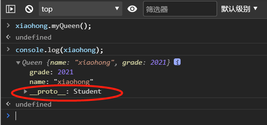
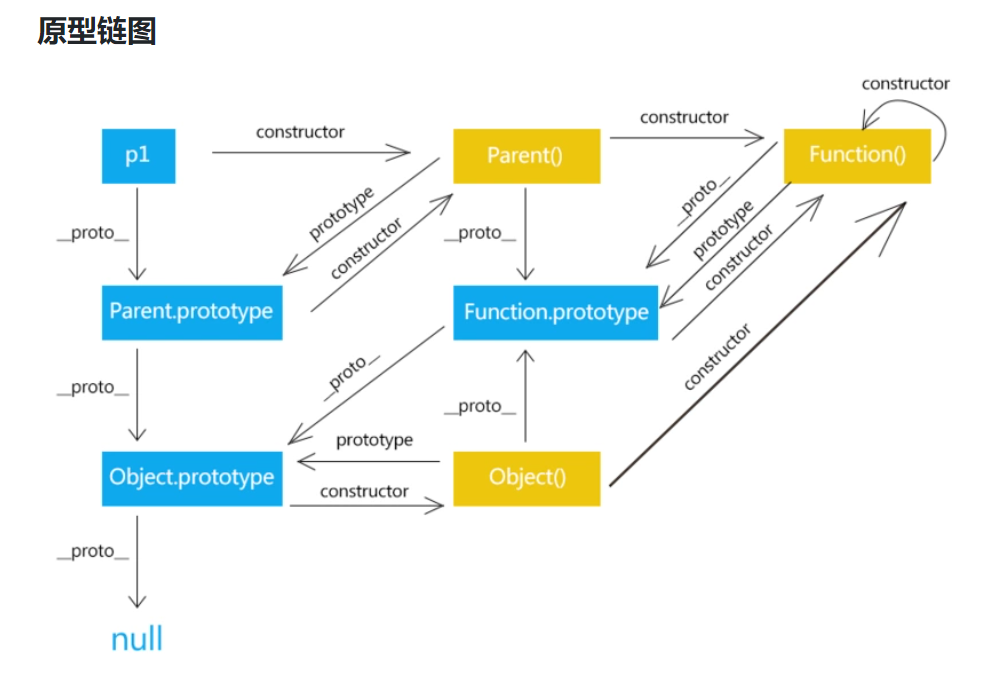
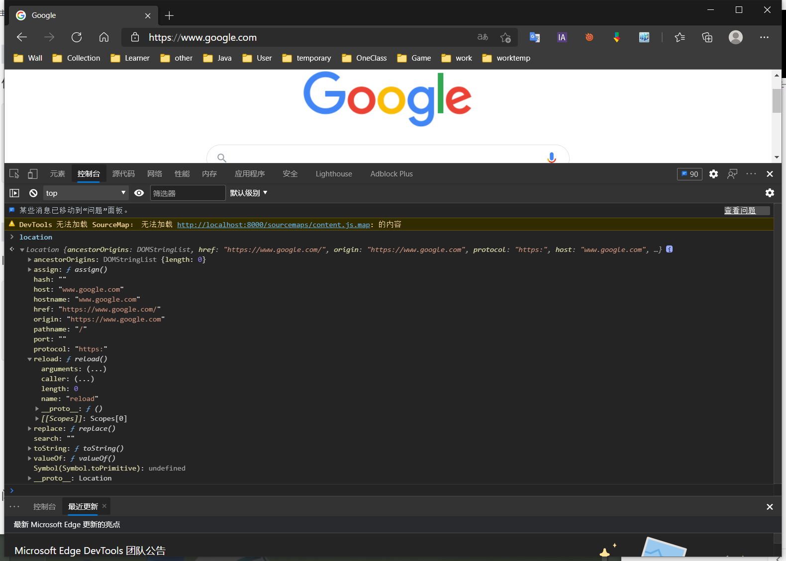
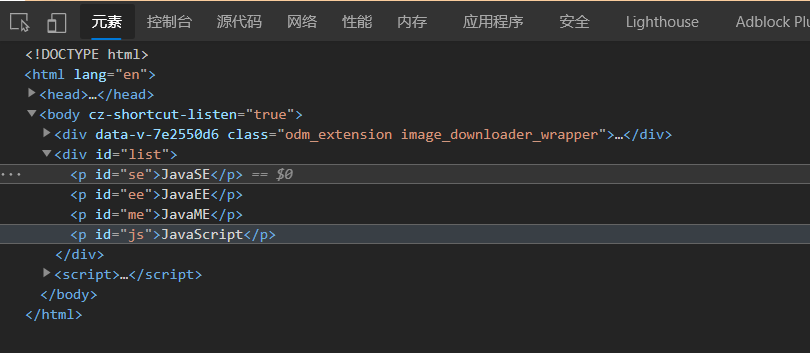

# JS快速入门

## JavaScript引入


1、内部引入

```html
<script>
    //....
</script>
```

2、外部引入

abc.js

```js
//....
```

test.html

```html
<script src="abc.js"></script>
```

相关测试代码：

```html
<!DOCTYPE html>
<html lang="en">
<head>
    <meta charset="UTF-8">
    <title>Title</title>

<!--    在script标签内，写JavaScript代码-->
<!--    <script>-->
<!--        alert('Hello World!')-->
<!--    </script>-->

<!--    外部引入-->
<!--    注意：script标签必须成对出现-->
    <script src="js/qj.js"></script>

<!--    不用显示定义type，也默认就是 JavaScript-->
    <script type="text/javascript"></script>

</head>
<body>

<!--这里也可以存放JavaScript代码-->
</body>
</html>
```

```js
alert('Hello World!')
```


## 基本语法

1、浏览器必备调试须知！


2、控制台打印


3、测试代码

```html
<!DOCTYPE html>
<html lang="en">
<head>
    <meta charset="UTF-8">
    <title>Title</title>

<!--    JavaScript严格区分大小写-->
    <script>
        // 1.定义变量  变量类型    变量名 = 变量值;
        var num = 1;
        var name = "刘德华";
        // 2.条件控制
        if (num > 60 && num < 70){
            alert("60~70")
        }else if (num > 70 && num < 80){
            alert("70~80")
        }else {
            alert("other")
        }

        // console.log(num)    在浏览器的控制台打印变量!

        /**
         * 支持文档注释
          */

    </script>

</head>
<body>

</body>
</html>
```


## 数据类型

数值，文本，图形，音频，视频......


==number==

js不区分小数和整数，Number

```javascript
123 // 整数
123.1 // 浮点数123.1
1.123e3 // 科学计数法
-99 // 负数
NaN // not a number
Infinity // 表示无限大
```

==字符串==

'abc'  "abc"

==布尔值==

true, false

==逻辑运算==

```
&& 	两个都为真，结果为真
||	一个为真，结果为真
!	真即假，假即真
```

==比较运算符==！！！重要！！！

```
=	赋值
==	等于(类型不一样，值一样，也会判断为true)
===	绝对等于(类型一样，值一样，结果为true)
```

坚持不要使用 == 比较，应采用 === 比较，这是JavaScript的缺陷。

须知：

- NaN===NaN，这个与所有的值都不相等，包括自己
- 只能通过 isNaN（NaN）来判断这个数是否是NaN。

浮点数问题：

```javascript
console.log((1/3) === (1-2/3))
```

尽量避免使用浮点数进行运算，存在精度问题！

```javascript
Math.abs((1/3) === (1-2/3))<0.00000001
//结果为true
```

==null和undefined==

- null  空
- undefined  未定义

==数组==

Java的数值必须是相同类型的对象~，JS中不需要这样！！！

```javascript
//保证代码的可读性，尽量使用[]
var arr = [1,2,3,4,5,'hello',null,true]

new Array(1,2,3,4,5,'hello',null,true);
```

取数组下标：如果越界了，就会

```javascript
undefined
```

==对象==

对象是大括号，数组是中括号~~

每个属性之间使用逗号隔开，最后一个不需要添加

```javascript
var person = {
            name: "刘德华",
            age: 3,
            tags: ['js','java','web','...']
        }
```

取对象的值

```javascript
person.name
> "刘德华"
person.age
> 3
```


## 严格检查格式

```html
<!DOCTYPE html>
<html lang="en">
<head>
    <meta charset="UTF-8">
    <title>Title</title>

<!--    前提: IDEA 需要设置支持ES6语法
          'use strict'; 严格检查模式，预防JavaScript的随意性导致产生一些问题
           必须写在JavaScript的第一行
          局部变量建议都使用 let 去定义~
-->

    <script>
        'use strict';
        //全局变量
        i = 1;
        // ES6  let
    </script>

</head>
<body>

</body>
</html>
```


# 数据类型


## 字符串

1、正常字符串我们使用 单引号，或者双引号包裹

2、注意转义字符 \

```
\'		单引号点，
\n		换行
\t		空格
\u4e2d	\u#### 	Unicode字符
\x41	Ascll字符
```

**3、多行字符串编写**

```javascript
//tab 上面 esc键下面
var msg =
    `hello
world
你好`
```

4、模板字符串

```javascript
//tab  上面 esc键下面
        let name = "nihao";
        let age = 3;

        let msg = `你好，${name}`
```

5 、字符串长度

```javascript
console.log(str.length)
```

**6、字符串的可变性，不可变**


7、大小写转换

```javascript
//注意，这里是方法，不是属性了。
student.toUpperCase()
student.toLowerCase()
```

8、获取指定下标

```javascript
student.indexOf('t')
```

**9、截取字符串**

```javascript
[)
student.substring(1) //从第一个字符串截取到最后一个字符串
结果："tudent"
student.substring(1,3) //[1,3)
"tu"
```

**其它：**

ES5：

```javascript
let persons = ['张三','李四','王五'];
function hello(a,b,c){
    console.info(a);
    console.info(b);
    console.info(c);
}

hello(persons[0],persons[1],persons[2]);
```

ES6扩展运算符：

```javascript
let persons = ['张三','李四','王五'];
function hello(a,b,c){
    console.info(a);
    console.info(b);
    console.info(c);
}

hello(...persons);
```

扩展字符串不仅可以在函数传参时使用，还可以在数组中使用：

```JavaScript
let class1 = ['张三','李四','王五'];
let class2 = ['田七','王八','赵九'];

let allPerson = [...class1,...class2];

console.log(allPerson);
```


## 数组

Array可以包含任意的数据类型

```javascript
var arr = [1,2,3,4,5]; //通过下标取值和赋值
arr[0]
arr[0] = 1
```

1、长度

```javascript
arr.length
```

注意：假如给 arr.length 赋值，数组大小就会发生变化~，如果赋值过小，元素就会丢失

2、indexOf，通过元素获得下标索引

```javascript
arr.indexOf(2)
1
```

字符串的"1" 和数字 1 是不同的

3、**slice()**  截取Array的一部分，返回一个新数组，类似于String中的 substring

4、**push()，pop()         尾部**

```javascript
push():	压入到尾部
pop():	弹出尾部的一个元素
```

5、**unshift(),shift()    头部**

```javascript
unshift():  压入到头部
shift():	弹出头部的一个元素
```

6、排序 sort()

```javascript
(3) ["B","C","A"]
arr.sort()
(3) ["A","B","C"]
```

7、元素反转 reverse()

```javascript
(3) ["A","B","C"]
arr.reverse()
(3) ["C","B","A"]
```

8、concat()

```javascript
(3) ["C","B","A"]
arr.concat([1,2,3])
(6) ["C","B","A",1,2,3]
arr
(3) ["C","B","A"]
```

注意：concat()方法并没有修改数组，只是会返回一个新的数组

9、连接符 join()

打印拼接数组，使用特定的字符串连接

```javascript
(3) ["C","B","A"]
arr.join('-')
"C-B-A"
```

10、多维数组

```javascript
arr = [[1,2],[3,4],["5","6"]];
arr[1][1]
4
```


## 对象

若干个键值对

```javascript
var 对象名 = {
    属性名: 属性值,
    属性名: 属性值,
    属性名: 属性值,
}

//定义了一个person对象，它有四个属性！
        var person = {
            name: "刘德华",
            age: 18,
            email: "12345678@qq.com",
            score: 0
        }
```

JavaScript中的对象，{......}表示一个对象，键值对描述属性 xxxx: xxxx,多个属性之间使用逗号隔开，最后一个属性不加逗号！

JavaScript中的所有的键都是字符串，值是任意对象！

1、对象赋值

```javascript
person.name = "张三"
"张三"
person.name
"张三"
```

2、使用一个不存在的对象属性，不会报错！ undefined

```javascript
person.haha
undefined
```

3、动态的删减属性,通过delete删除对象的属性

```javascript
delete person.name
true
person
```

4、动态的添加，直接给新的属性添加值即可

```javascript
person.haha = "haha"
"haha"
person
```

5、判断属性值是否在这个对象中！ xxx in xxx!

```javascript
'age' in person
true
//继承
'toString' in person
true
```

6、判断一个属性是否是这个对象自身拥有的  hasOwnProperty()

```javascript
person.hasOwnProperty('toString')
false
person.hasOwnProperty('age')
true
```


## 流程控制

if 判断

```javascript
var age = 3;
if(age > 3){	//第一个判断
    alert("haha");
}else if(age < 5){	//第二个判断
    alert("kuwa~");
}else{	//否则
    alert("kuwa~");
}
```

while循环，避免程序死循环

```javascript
while(age < 100){
    age = age + 1;
    console.log(age)
}

do{
    age = age + 1;
    console.log(age)
}while(age < 100)
```

for循环

```javascript
for(let i = 0; i < 100;i++){
    console.log(i)
}
```

**forEach 循环**  

> 5.1引入

```javascript
var age = [1,25,64,156,165,15,552,99];

age.forEach(function (value){
    console.log(value)
})
```

for...in

```javascript
//for(var index in object){}
for(var num in age){
    if(age.hasOwnProperty(num)){
        console.log(age[num])
    }
}
```


## Map 和 Set

`ES6 的新特性~`

Map:

```javascript
//ES6   Map
//学生的成绩，名字
// var names = ["tom","jack","haha"]
// var scores = [100,90,80];

var map = new Map([['tom',100],['jack',90],['haha',80]]);
var name = map.get('tom');  //通过key获得value
map.set('admin',123456);	//新增或修改
console.log(name);
map.delete("tom");			//删除
```

Set:无序不重复的集合

```javascript
//set 可以去重
var set = new Set([3,2,1,1,2,3,1,1,1])
set.add(5)	//添加！
set.delete(2);	//删除
console.log(set.has(3)); //是否包含某个元素！
```


## Iterator

> es6 新特性

遍历数组

```javascript
//通过for of实现，
var arr = [3,4,5]
for (var x of arr){
   console.log(x)
}
```

遍历map

```javascript
var map = new Map([['tom',100],['jack',90],['haha',80]]);
for (let x of map){
    console.log(x)
}
```

遍历set

```javascript
var set = new Set([3,2,1,1,2,3,1,1,1])
for (let x of set){
    console.log(x)
}
```


# 函数及面向对象

## 函数定义及变量作用域

> 定义方式一

绝对值函数

```javascript
function abs(x){
    if(x>=0){
        return x;
    }else{
        return -x;
    }
}
```

一旦执行到return 代表函数结束，返回结果！

如果没有执行return，函数执行完也会返回结果，结果就是undefined


> 定义方式二

```javascript
var abs = function(x){
    if(x>=0){
        return x;
    }else{
        return -x;
    }
}
```

function(x){...}这是一个匿名函数，但是可以把结果赋值给abs，通过abs就可以调用函数！

方式一和方式二等价！


> 调用函数

```javascript
abs(10)  //10
abs(-10) //-10
```

参数问题：JavaScript可以传任意个参数，也可以不传参数~

参数传进来是否存在的问题？	

假设不存在参数，如何规避！

```javascript
var abs = function(x){
    //手动抛出异常来判断
    if (typeof x !== 'number'){
        throw 'Not a Number';
    }
    if(x>=0){
        return x;
    }else{
        return -x;
    }
}
```


> **arguments**

`arguments`是一个JS免费赠送的关键字；

代表，传递进来的所有的参数，是一个数组！

```javascript
function abs(x){

    console.log("x=>" + x);

    for (var i = 0; i < arguments.length; i++) {
        console.log(arguments[i]);
     }

     if(x>=0){
         return x;
     }else{
         return -x;
     }
}
```


问题：arguments 包含所有的参数，我们有时候想使用多余的参数来进行附加操作，需要排除已有参数~ ?

> **rest**

以前：

```javascript
if (arguments.length > 2){
    for (var i = 2;i < arguments.length;i++){
        //.......
    }
}
```

ES6 引入的新特性，获取除了已经定义的参数之外的所有参数~....

```javascript
function aaa(a,b,...rest){
    console.log("a=>"+a);
    console.log("b=>"+b);
    console.log(rest);
}
```

rest 参数只能写在最后面，必须用 ... 标识。


## 变量的作用域

在JavaScript中，var定义变量实际是有作用域的。

假设在函数体中声明，则在函数体外不可以使用  ~ （非要想实现得去话，可以研究一下***闭包***）

```javascript
function qj(){
    var x = 1;
    x = x + 1;
}

x = x + 2; //Uncaught ReferenceError: x is not defined
```

如果两个函数使用了相同的变量名，只要在函数内部，就不冲突

```javascript
function qj(){
    var x = 1;
    x = x + 1;
}
function qj2(){
    var x = 'A';
    x = x + 1;
}
```

内部函数可以访问外部函数的成员，反之不行

```javascript
function qj(){
    var x = 1;

    //内部函数可以访问外部函数的成员，反之不行
    function qj2(){
        var y = x + 1;
    }

    var z = y + 1; // Uncaught ReferenceError: y is not defined
}
```

假设，内部函数变量和外部函数的变量，重名！

```javascript
function qj(){
    var x = 1;

    //内部函数可以访问外部函数的成员，反之不行
    function qj2(){
        var x = 'A';
        console.log('inner'+x);
    }
    console.log('outer'+x)
    qj2();
}

qj()
```

假设在JavaScript中 函数查找变量从自身函数开始~，由“内”向“外”查找，假设外部存在这个同名的函数变量，则内部函数会屏蔽外部函数的变量。


> 提升变量的作用域

```javascript
function qj(){
    var x = "x" + y;
    console.log(x);
    var y = 'y';
}
```

结果： xundefined

说明：js执行引擎，自动提升了y的声明，但不会提升变量y的赋值；

```javascript
function qj2(){
    var y;
    var x = "x" + y;
    console.log(x);
    y = 'y';
}
```

这个是在JavaScript建立之初就存在的特性，养成规范：所有的变量定义都放在函数的头部，不要乱放，便于代码维护；

```javascript
function qj2(){
    var x = 1,
        y = x + 1,
        z,i,a;//undefined
    //之后随意使用
}
```


>  全局函数

```javascript
//全局变量
var x = 1;

function f(){
    console.log(x);
}
f();
console.log(x);
```

**全局对象 window**

```javascript
var x = 'xxx';
alert(x);
alert(window.x); // 默认所有的全局变量，都会绑定在 window对象下
```

**alert()这个函数本身也是一个window的变量；**

```javascript
var x = 'xxx';

window.alert(x);
var old_alert = window.alert;

//old_alert(x);

window.alert = function (){

};
//发现alert()失效了
window.alert(123);

//恢复
window.alert = old_alert;
window.alert(456);
```

JavaScript实际上只有一个全局作用域，任何变量（函数也可以视为变量），假设没有在函数作用范围内找到，就会向外查找，如果在全局作用域都没有找到，报错  **RefrenceError**

> 规范

由于我们所有的全局变量都会绑定到我们的window上，如果不同的js文件，使用了相同的全局变量，冲突 -> 如何能够减少冲突？

```javascript
//唯一全局变量
var The_Beatles = {};

//定义全局变量
The_Beatles.name = '披头士';
The_Beatles.add = function (a,b){
    return a + b;
}
```

把自己的代码全部放入自己定义的唯一空间名字中，降低全局命名冲突的问题~

jQuery

> **局部作用域 let**

```javascript
function aaa(){
    for (var i = 0; i < 100; i++) {
        console.log(i);
    };
    console.log(i+1) //问题？ i 出了这个作用域还可以使用
}
```

ES6 let关键字，解决局部作用域冲突问题！

```javascript
function aaa(){
    for (let i = 0; i < 100; i++) {
        console.log(i);
    };
    console.log(i+1) // Uncaught ReferenceError: i is not defined
}
```

建议都使用 ***let*** 去定义局部作用域的变量；

> 常量 const

在ES6之前，怎么定义常量：只有用全部大写字母命名的变量就是常量；建议不要修改这样的值；

```javascript
var PI = '3.14';

console.log(PI);
PI = '213'; //可以改变这个值
console.log(PI);
```

在 ES6引入了常量关键字  ***const*** 

```javascript
const PI = '3.14'; //只读变量

console.log(PI);
PI = '213'; // Uncaught TypeError: Assignment to constant variable.
```


## 方法

> 定义方法

方法就是把函数放在对象的里面，对象只有两个东西：属性和方法

```javascript
var queen = {
    name: '皇后',
    birth: 2008,
    //方法
    age: function (){
        //今年 - 出生的年
        var now = new Date().getFullYear();
        return now - this.birth;
    }
}
//属性
queen.name
//方法,一定要带括号（）
queen.age()
```

this.代表什么？拆开上面的代码看看~

```javascript
function getAge(){
    //今年 - 出生的年
    var now = new Date().getFullYear();
    return now - this.birth;
}

var queen = {
    name: '皇后',
    birth: 2008,
    age: getAge,
}

//queen.age();  ok!
//getAge()  NaN  window
```

this是无法指向的，是默认指向调用他的那个对象；

> apply

在JS中可以控制 this 的指向！

```javascript
function getAge(){
    //今年 - 出生的年
    var now = new Date().getFullYear();
    return now - this.birth;
}

var queen = {
    name: '皇后',
    birth: 2008,
    age: getAge,
};

//queen.age();  ok!

getAge.apply(queen,[]);//this,指向了queen，参数为空
```


# 内部对象

> 标准对象

```javascript
typeof 123
"number"
typeof '123'
"string"
typeof true
"boolean"
typeof NaN
"number"
typeof []
"object"
typeof {}
"object"
typeof Math.abs
"function"
typeof undefined
"undefined"
```


## Date

**基本使用**

```javascript
var now = new Date();
now.getFullYear(); //年 VM109:1 Sat Feb 27 2021 13:42:17 GMT+0800 (中国标准时间)
now.getMonth(); // 月 0~11 代表月
now.getDate(); //日
now.getDay(); //星期几
now.getHours(); // 时
now.getMinutes();// 分
now.getSeconds();// 秒

now.getTime(); // 时间戳 全世界统一 1970 1.1 0:00:00

console.log(new Date(1614404537931)); //时间戳转为时间
```

转换

```javascript
now = new Date(1614404537931);
Sat Feb 27 2021 13:42:17 GMT+0800 (中国标准时间)
now.toLocaleString(); //注意，调用是一个方法，不是一个属性！
"2021/2/27 下午1:42:17"
now.toGMTString()
"Sat, 27 Feb 2021 05:42:17 GMT"
```


## JSON

> json 是什么

早期，所有数据传输习惯使用 XML文件！

- [JSON](https://baike.baidu.com/item/JSON)([JavaScript](https://baike.baidu.com/item/JavaScript) Object Notation, JS 对象简谱) 是一种轻量级的数据交换格式。
- 简洁和清晰的**层次结构**使得 JSON 成为理想的数据交换语言。 易于人阅读和编写，同时也易于机器解析和生成，并有效地提升网络传输效率。


在JavaScript中一切皆为对象、任何js支持的类型都可以用JSON来表示；

格式：

- 对象都用 {}
- 数组都用 []
- 所有的键值对都使用 key: value


JSON字符串 和 JS 对象的转换

```javascript
var user = {
    name: "The_Beatles",
    age: 3,
    sex: '男'
}

//对象转化为json字符串
var jsonUser = JSON.stringify(user);

//json 字符串转化为对象 参数为 json 字符串
let obj = JSON.parse('{"name":"The_Beatles","age":3,"sex":"男"}');
```

区别：

```javascript
var obj = {a: 'hello',b:'hellob'};
var json = '{"a": "hello","b":"hellob"}';
```


## Ajax

- 原生的js写法 xhr异步请求
- jQuery 封装好的方法 $（“#name”).ajax("")
- axios 请求


# 面向对象编程

> **原型对象**

JavaScript、Java、C#、、、、面向对象；JavaScript有些区别!

- 类：模板		原型对象

- 对象：具体的实例

在JavaScript中，这个需要换一下思维方式。

原型：

```javascript
var Student = {
    name: "The_Beatles",
    age: 3,
    run: function (){
        console.log(this.name + "run...");
    }
};

var xiaoming = {
    name: "xiaoming"
}

//原型对象
xiaoming._proto_ = Student;

var Bird = {
    fly: function (){
        console.log(this.name + "fly...");
    }
}

//小明的原型 是 student
xiaoming._proto_ = Bird;
```

//以前定义一个类：

```javascript
function Student(name){
    this.name = name;
}

// 给student新增一个方法
Student.prototype.hello = function (){
    alert('Hello')
}
```


> class 继承

**class**关键字，是在ES6引入的

1、定义一个类，属性，方法

```javascript
//ES6 之后========
// 定义一个学生类
class Student{

    constructor(name) {
        this.name = name;
    }

    hello(){
        alert('hello')
    }
}

var xiaoming = new Student("xiaoming");
var xiaohong = new Student("xiaohong");
xiaoming.hello();
```

**2、继承**

```javascript
//ES6 之后========
// 定义一个学生类
class Student{

    constructor(name) {
        this.name = name;
    }

    hello(){
        alert('hello')
    }
}

class Queen extends Student{
    constructor(name,grade) {
        super(name);
        this.grade = grade;
    }

    myQueen(){
        alert("皇后乐队！")
    }

}

var xiaoming = new Student("xiaoming");
var xiaohong = new Queen("xiaohong",2021);
xiaoming.hello();
```

本质：查看对象原型




> 原型链

_ proto _: *另做详解：*




# 操作Bom对象（重点）

> 浏览器介绍

JavaScript和浏览器关系？

JavaScript诞生就是为了能够让他在浏览器中运行！

BOM：浏览器对象模型

- IE 6~11
- Chrome
- Safari
- Firefox
- Opera

第三方

- QQ浏览器
- 360浏览器


> **window**（重要）

window 代表 浏览器窗口

```javascript
//获取浏览器窗口高度和宽度
window.alert(1)
undefined
window.innerHeight
60
window.innerWidth
500
window.outerHeight
904
window.outerWidth
1265
```


> Navigator

Navigator,封装了浏览器的信息

```javascript
navigator.appName
"Netscape"
navigator.appVersion
"5.0 (Windows NT 10.0; Win64; x64) AppleWebKit/537.36 (KHTML, like Gecko) Chrome/88.0.4324.182 Safari/537.36 Edg/88.0.705.81"
navigator.userAgent
"Mozilla/5.0 (Windows NT 10.0; Win64; x64) AppleWebKit/537.36 (KHTML, like Gecko) Chrome/88.0.4324.182 Safari/537.36 Edg/88.0.705.81"
navigator.platform
"Win32"
```

大多数时候，我们不会使用**navigator**对象，因为会被认为修改！

不建议使用这些属性来判断和编写代码


> screen

代表屏幕的尺寸

```javascript
screen.width
2752 px
screen.height
1152 px
```


> **location**（重要）

location 代表当前页面的URL信息



```javascript
host: "www.google.com"
href: "https://www.google.com/"
protocol: "https:"
reload: ƒ reload() //刷新网页
//设置新的地址
location.assign("https://www.google.com/")
```


> document

document 代表当前页面，HTML，DOM文档树

```javascript
document.title
"百度一下，你就知道"
document.title='The_Beatles'
"The_Beatles"
```

获取具体的文档树节点

```javascript
<dl id="app">
    <dt>JAVA</dt>
    <dd>JAVASE</dd>
    <dd>JAVAEE</dd>
</dl>

<script>
    let dl = document.getElementById('app');
</script>
```

获取cookie

```javascript
document.cookie
"BIDUPSID=61D22427F997B3ABE658D2628F1FDB5; PSTM=1589634324; BAIDUID=61D22427F997B3AB24444AF8605870FD:FG=1; BAIDUID_BFESS=61D22427F997B3AB24444AF8605870FD:FG=1; Hm_lvt_aec699bb6442ba076c89816dc490771=161347680; COOKIE_SESSION=19_0_3_0_7_3_1_1_3_1_1_1_2937452_0_13_0_1613475771_0_1613475758%7C9%230_0_1593602103%7C1; BD_HOME=1; H_PS_PSSID=33273_31253_33594_33570_26350_33268; BD_UPN=12314753; BA_HECTOR=012k81a0252h2h2kq01g3k37j0q"
```

劫持cookie原理

www.taobao.com

```html
<script src="aa.js"></script>
<!-- 恶意人员，获取你的cookie上传到他的服务器 -->
```

服务器端可以设置 cookie：httpOnly


> history （不建议使用）

history 代表浏览器的历史记录

```javascript
history.back() //网页后退
history.forward() //网页前进
```


# 操作DOM对象（重点）

> 核心

浏览器网页就是一个Dom树形结构！

- 更新：更新Dom节点
- 遍历Dom节点：得到Dom节点
- 删除：删除一个Dom节点
- 添加：添加一个新的节点

要操作一个Dom节点，就必须要先获得这个Dom节点


> 获得Dom节点

```javascript
//对应 css 选择器
let h1 = document.getElementsByTagName("h1");
let p1 = document.getElementById("p1");
let p2 = document.getElementsByClassName("p2");
let father = document.getElementById("father");

let children = father.children[index]; //获取父节点下的所有子节点
//father.firstChild
//father.lastChild
```

这是原生代码，之后我们尽量都是使用jQuery();


> 更新节点

```javascript
<div id="id1">

</div>

<script>
    let id1 = document.getElementById('id1');
</script>
```

操作文本

- `*id1.innerText='4567'* `修改文的值
- `*id1.innerHTML='<strong>123 </strong>'*`  可以解析HTML文本标签

操作CSS

```javascript
id1.style.color = 'yellow'; // 属性使用 字符串 包裹
"yellow"
id1.style.color = 'red'; 
"red"
id1.style.fontSize='20px' // - 转 驼峰命名问题
"20px"
id1.style.padding = '2em';
"2em"
```


> 删除节点

删除节点的步骤：先获取父节点，再通过父节点删除自己

```html
<div id="father">
    <h1>标题一</h1>
    <p id="p1">p1</p>
    <p class="p2">p2</p>
</div>
<script>
	var self = document.getElementById('p1'); 
    var father = p1.parentElement;
    father.removeChild(self);
    
    //删除是一个动态的过程。
    father.removeChild(father.children[0]);
    father.removeChild(father.children[1]);
    father.removeChild(father.children[2]);
</script>
```

注意：删除多个节点的时候，children是在时刻变化的，删除节点的时候一定要注意；


> 插入节点

我们获得了某个Dom节点，假设这个Dom节点是空的，我们通过 innerHTML 就可以增加一个元素了，但是这个Dom节点已经存在元素了，我们不能这么干了，会产生覆盖。

追加

```html
<p id="js">JavaScript</p>
<div id="list">
    <p id="se">JavaSE</p>
    <p id="ee">JavaEE</p>
    <p id="me">JavaME</p>
</div>

<script>
    let js = document.getElementById('js'),
        list = document.getElementById('list');
    list.appendChild(js);// 追加到后面
</script>
```

效果：




> 创建一个新的标签,实现插入

```html
<!--<p id="newP"></p>-->

<p id="js">JavaScript</p>
<div id="list">
    <p id="se">JavaSE</p>
    <p id="ee">JavaEE</p>
    <p id="me">JavaME</p>
</div>

<script>
    let js = document.getElementById('js'), //已经存在的节点
        list = document.getElementById('list');
    //通过js 创建一个新的节点
    let newP = document.createElement('p');// 创建一个p标签
    newP.id = 'newP';
    newP.innerText = 'Hello,Queen';
    
    //创建一个标签标签节点   （通过这个属性，可以设置任意的值）
    let myScript = document.createElement('script');
    myScript.setAttribute('type','text/javascript');
    
    let myStyle = document.createElement('style'); //创建了一个空style标签
    myStyle.setAttribute('type','text/css');
    myStyle.innerHTML = 'body{background-color: chartreuse;}'; //设置标签内容

    document.getElementsByTagName('head')[0].appendChild(myStyle);
</script>
```


> insert

```javascript
let ee = document.getElementById('ee');
let js = document.getElementById('js');
let list = document.getElementById('list');
// 要包含的节点.insertBefore(newNode,targetNode)
list.insertBefore(js,ee);
```


# 操作表单（验证）

> 表单是什么 form DOM 树

- 文本框 text
- 下拉框  <select>
- 单选框 radio
- 多选框  checkbox
- 隐藏框  hidden
- 密码框  password
- .......

表单的目的：提交信息

> 获得要提交的信息

```html
<form action="#" method="post">
    <p>
    <span>用户名： </span><input type="text" id="username">
    </p>

    <p>
        <span>性别：</span>
        <input type="radio" name="sex" value="man" id="boy">男
        <input type="radio" name="sex" value="woman" id="girl">女
    </p>

</form>

<script>
            
    let input_text = document.getElementById('username');
    let boy_radio = document.getElementById('boy');
    let girl_radio = document.getElementById('girl');
    // 得到输入框的值
    input_text.value
    // 修改输入框的值
    input_text.value = '124324';

    //  对于单选框，多选框等等固定的值，boy_radio.value只能取到当前的值
    boy_radio.checked; // 查看返回的结果，是否为true，如果为true，则被选中~
    girl_radio.checked = true; // 赋值

</script>
```


> 提交表单   MD5加密密码，表单优化

```html
<!--
表单绑定提交事件
onsubmit= 绑定一个提交检测的函数， true，  false
将这个结果返回给表单，使用 onsubmit 接收！
onsubmit="return aaa()"
-->
<form action="https://www.baidu.com/" method="post" onsubmit="return aaa()">
    <p>
        <span>用户名： </span><input type="text" id="username" name="username">
    </p>

    <p>
        <span>密码：</span><input type="password" id="input_password">
    </p>

    <input type="hidden" id="md5_password" name="password">

    <!--    绑定事件 onclick 被点击-->
    <button type="submit">提交</button>

</form>

<script>
    function aaa() {
        alert(1);
        let username = document.getElementById('username');
        let md5_password = document.getElementById('md5_password');
        let password = document.getElementById('input_password');
        // password.value= md5(password.value);
        md5_password.value = md5(password.value);
        // 可以校验判断表单内容，true就是通过提交，false，阻止提交
        return true;

        // console.log(username.value);
        // console.log(password.value);
        // //加密：MD5 算法
        // password.value = md5(password.value);
        // console.log(password.value);
    }
</script>
```


# jQuery

JavaScript

jQuery库，里面存在大量的JavaScript函数

> 获取jQuery


```html
<!DOCTYPE html>
<html lang="en">
<head>
    <meta charset="UTF-8">
    <title>Title</title>
    <!--    cdn-->
<!--    <script src="https://cdn.bootcdn.net/ajax/libs/jquery/3.5.1/jquery.js"></script>-->

    <script src="lib/jquery-3.5.1.js"></script>
</head>
<body>

<!--公式 : $(selector).action()-->
<a href="" id="test-jquery">点我</a>

<script>
    document.getElementById('id')
    //选择器就是css的选择器
    $('#test-jquery').click(function (){
       alert("666")
    })
</script>
</body>
</html>
```


> 选择器

```html
<script>
    //原生js，选择器少，麻烦不好记
    //标签
    document.getElementsByTagName();
    //id
    document.getElementById();
    //类
    document.getElementsByClassName();

    //jQuery css 中的选择器它全都能用
    $('p').click(); //标签选择器
    $('#id1').click(); //id选择器
    $('.class1').click(); //class选择器
</script>
```

文档工具站：https://jquery.cuishifeng.cn/


> 事件

鼠标事件，键盘事件，其它事件。（谷歌就完了）

```html
<!DOCTYPE html>
<html lang="en">
<head>
    <meta charset="UTF-8">
    <title>Title</title>
    <script src="lib/jquery-3.5.1.js"></script>
    <style>
        #divMove{
            width: 500px;
            height: 500px;
            border: 1px solid red;
        }
    </style>
</head>
<body>

<!--要求：获取鼠标当前的一个坐标-->
mouse : <span id="mouseMove"></span>
<div id="divMove">
    在这里移动鼠标
</div>

<script>
    // 当网页元素加载完毕之后，响应事件
    $(function (){
        $('#divMove').mousemove(function (e){
            $('#mouseMove').text('x:'+e.pageX + 'y:'+e.pageY)
        })
    });
</script>

</body>
</html>
```


> 操作Dom

```html
<ul id="test-ul">
    <li class="js">JavaScript</li>
    <li name="python">Python</li>
</ul>

<script>
    // document.getElementById('')

    $('#test-ul li[name=python]').text();
    $('#test-ul').html();

</script>
```

节点文本操作

```javascript
$('#test-ul li[name=python]').text(); //获得值
$('#test-ul li[name=python]').text('设置值'); //设置值
$('#test-ul').html(); //获得值
$('#test-ul').html('<strong>123</strong>'); //设置值
```

css操作

```javascript
$('#test-ul li[name=python]').css("color","red"); //单个
$('#test-ul li[name=python]').css({"color","red"}); //多个
```

元素的显示和隐藏: 本质 display : none

```javascript
$('#test-ul li[name=python]').show()
$('#test-ul li[name=python]').hide()
```

娱乐测试

```javascript
$(window).width()
$(window).height()
$('#test-ul li[name=python]').toggle();
```


未来ajax();

```javascript
$('#from').ajax()
```


