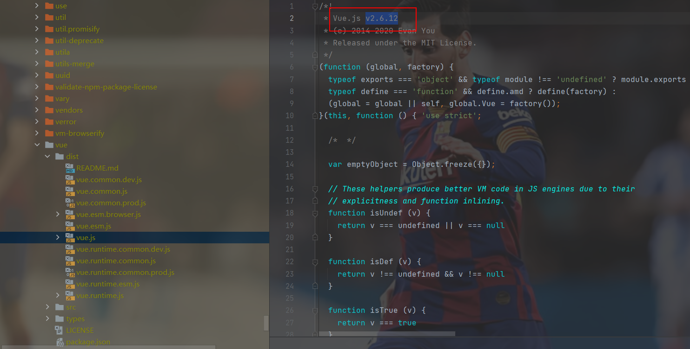

# 什么是Vue CLI

> CLI：Command-Line Interface，翻译为命令行界面，但俗称*脚手架*
>
> The CLI (`@vue/cli`) is a globally installed npm package and provides the `vue` command in your terminal. It provides the ability to quickly scaffold a new project via `vue create`, or instantly prototype new ideas via `vue serve`. You can also manage your projects using a graphical user interface via `vue ui`.

Vue CLI是一个官方发布 vue.js 项目脚手架，使用 vue-cli 可以快速搭建Vue开发环境以及对应的webpack配置.


# Vue CLI使用前提

## Node

- 安装NodeJS

可以直接在官方网站中下载安装.
网址: http://nodejs.cn/download/

- 检测安装的版本

默认情况下自动安装Node和NPM
Node环境要求8.9以上或者更高版本


- 什么是NPM呢?

NPM的全称是Node Package Manager
是一个NodeJS包管理和分发工具，已经成为了非官方的发布Node模块（包）的标准。
后续我们会经常使用NPM来安装一些开发过程中依赖包.

> cnpm安装
> 由于国内直接使用 npm 的官方镜像是非常慢的，这里推荐使用淘宝 NPM 镜像。
> 你可以使用淘宝定制的 cnpm (gzip 压缩支持) 命令行工具代替默认的 npm:
> npm install -g cnpm --registry=https://registry.npm.taobao.org
> 这样就可以使用 cnpm 命令来安装模块了：
> cnpm install [name]


## webpack

Vue.js官方脚手架工具就使用了webpack模板.

Webpack的全局安装: npm install webpack -g


# Vue CLI的安装与使用（cli2）

## **安装、查看版本、卸载Vue脚手架命令**

```sh
npm install -g @vue/cli
npm uninstall -g @vue/cli@特定版本 3.12.0

vue --version

yarn global add @vue/cli
yarn global remove @vue/cli@特定版本
```


> 如果出现之前安装过旧版本，直接安装会报文件已存在的错误，请删除以下文件：
>
> 
>
> (由于我在安装cli4之前，先安装了cli2，在安装cli4是报错，原因是有些文件已经存在，如果要继续安装cli4就需要将已经存在的文件删除。已经存在的文件分别是：
> C:\Users\YJP\AppData\Roaming\npm\vue
> C:\Users\YJP\AppData\Roaming\npm\vue.ps1
> C:\Users\YJP\AppData\Roaming\npm\vue.cmd
> 将他们删除后进行执行npm install -g @vue/cli就能成功)


## 拉取旧版本

Vue CLI >= 3 和旧版使用了相同的 `vue` 命令，所以 Vue CLI 2 (`vue-cli`) 被覆盖了。如果你仍然需要使用旧版本的 `vue init` 功能，你可以全局安装一个桥接工具：

```sh
npm install -g @vue/cli-init
# `vue init` 的运行效果将会跟 `vue-cli@2.x` 相同
vue init webpack my-project
```


```sh
# Vue CLI2 初始化项目**
vue init webpack my-project
# Vue CLI >= 3初始化项目**
vue create my-project
```


## Vue CLI2详解

上面讲解了安装，下面直接介绍运行使用：

`此处引用B站王红元老师课件`


初始化后的文件结构：

**目录结构详解**


## Runtime-Compiler和Runtime-only的区别

**运行时 + 编译器（Runtime-Compiler） vs. 只包含运行时（Runtime-only）**

> 如果你需要在客户端编译模板 (比如传入一个字符串给 `template` 选项，或挂载到一个元素上并以其 DOM 内部的 HTML 作为模板)，就将需要加上编译器，即完整版：
>
> ```js
> // 需要编译器
> new Vue({
>   template: '<div>{{ hi }}</div>'
> })
> 
> // 不需要编译器
> new Vue({
>   render (h) {
>     return h('div', this.hi)
>   }
> })
> ```
>
> 当使用 `vue-loader` 或 `vueify` 的时候，`*.vue` 文件内部的模板会在构建时预编译成 JavaScript。你在最终打好的包里实际上是不需要编译器的，所以只用运行时版本即可。
>
> 因为运行时版本相比完整版体积要小大约 30%，所以应该尽可能使用这个版本。如果你仍然希望使用完整版，则需要在打包工具里配置一个别名：
>
> **webpack**
>
> ```js
> module.exports = {
>   // ...
>   resolve: {
>     alias: {
>       'vue$': 'vue/dist/vue.esm.js' // 用 webpack 1 时需用 'vue/dist/vue.common.js'
>     }
>   }
> }
> ```

**简单总结**
如果在之后的开发中，你依然使用template，就需要选择Runtime-Compiler
如果你之后的开发中，使用的是.vue文件夹开发，那么可以选择Runtime-only

**为什么存在这样的差异呢？**

我们需要先理解Vue应用程序是如何运行起来的，Vue中的模板如何最终渲染成真实DOM，我们来看下面的一幅图。


## render函数的使用


## npm run build

**build运行结构流程图：**


## npm run dev

**dev运行结构流程图：**


## 修改配置：webpack.base.conf.js起别名

因为运行时版本相比完整版体积要小大约 30%，所以应该尽可能使用这个版本。如果你仍然希望使用完整版，则需要在打包工具里配置一个别名：

**webpack**

```js
module.exports = {
  // ...
  resolve: {
    alias: {
      'vue$': 'vue/dist/vue.esm.js' // 用 webpack 1 时需用 'vue/dist/vue.common.js'
    }
  }
}
```


# Vue CLI3

## vue-cli 3 与 2 版本区别

> 鉴于本人学习是参考该老师的视频，内容相对较旧，本人为cli4，暂且如此。

- vue-cli 3 是基于 webpack 4 打造，vue-cli 2 还是 webapck 3。
- vue-cli 3 的设计原则是“0配置”，移除的配置文件根目录下的，build和config等目录。
- vue-cli 3 提供了 vue ui 命令，提供了可视化配置，更加人性化。
- 移除了static文件夹，新增了public文件夹，并且index.html移动到public中。


## 安装与使用

**创建项目**

```sh
# Vue CLI >= 3初始化项目**
vue create my-project
```

鉴于本人是cli4，暂且记录一些异同。(后面有部分解释说明如下步骤)


*为和老师的年代保持同步，选择2.x*


- 步骤简析：


- 目录结构简析：


## 关于配置

1、配置文件在哪儿？


2、UI方面的配置：启动配置服务器：vue ui


*关于一些细节：*

- 在package.json文件里显示的版本为如下：


而在UI控制台显示为更高的版本的问题？


我们使用的实际版本应该在编译好的文件里查看版本！！！



3、如果需要手动输入一些配置，可以新建一个vue.config.js文件，（必须这个名称）,然后在里面添加。


例如：起别名：


# 扩展：箭头函数的this

```html
<!DOCTYPE html>
<html lang="en">
<head>
  <meta charset="UTF-8">
  <title>Title</title>
</head>
<body>
<script>
  // 什么时候使用箭头函数
  // setTimeout(function () {
  //   console.log(this)  //window
  // }, 1000)

  // setTimeout(() => {
  //   console.log(this)  //window
  // },1000)

  // 结论：箭头函数中的this是如何查找的？
  // 向外层作用域中，一层层查找this，直到有this的定义
  // const obj = {
  //   aaa() {
  //     // setTimeout(function (){
  //     //   console.log(this) //window
  //     // })
  //
  //     setTimeout(() => {
  //       console.log(this) //obj对象
  //     })
  //   },
  // }

  const obj = {
    aaa() {
      setTimeout(function () {
        setTimeout(function () {
          console.log(this) //window
        })

        setTimeout(() => {
          console.log(this) //window
        })
      })

      setTimeout(() => {
        setTimeout(() => {
          console.log(this) //window
        })

        setTimeout(function () {
          console.log(this) //obj对象
        })
      })
    },
  }

  obj.aaa()
</script>
</body>
</html>
```


