# Vue简介

[Vue官网](https://cn.vuejs.org/)

**本笔记参考官网文档，进行自学使用！**


**简介：**Vue.js 是什么？

> Vue (读音 /vjuː/，类似于 view) 是一套用于构建用户界面的渐进式框架。与其它大型框架不同的是，Vue 被设计为可以自底向上逐层应用。Vue 的核心库只关注视图层，不仅易于上手，还便于与第三方库或既有项目整合。另一方面，当与现代化的工具链以及各种支持类库结合使用时，Vue 也完全能够为复杂的单页应用提供驱动。


# 安装

## 直接用 < script > 引入

直接下载并用 `<script>` 标签引入，`Vue` 会被注册为一个全局变量。

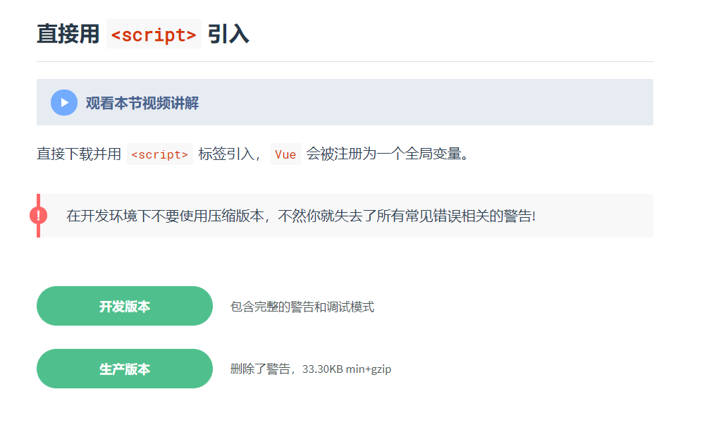


### CDN

对于制作原型或学习，你可以这样使用最新版本：

```html
<script src="https://cdn.jsdelivr.net/npm/vue/dist/vue.js"></script>
```

对于生产环境，我们推荐链接到一个**明确的版本号和构建文件**，以避免新版本造成的不可预期的破坏：

```html
<script src="https://cdn.jsdelivr.net/npm/vue@2.6.12"></script>
```

如果你使用原生 ES Modules，这里也有一个兼容 ES Module 的构建文件：

```html
<script type="module">
  import Vue from 'https://cdn.jsdelivr.net/npm/vue@2.6.12/dist/vue.esm.browser.js'
</script>
```


### NPM

在用 Vue 构建大型应用时推荐使用 NPM 安装。NPM 能很好地和诸如 webpack 或 Browserify 模块打包器配合使用。同时 Vue 也提供配套工具来开发单文件组件。

```shell
# 最新稳定版
$ npm install vue
```


# 基础

## 起步

Hello World!

配置好后，就开始吧！


## 声明式渲染

浏览器的工作步骤：

- 加载：根据请求的URL进行域名解析，向服务器发起请求，接收文件（HTML、JS、CSS、图象等）。
- 解析：对加载到的资源（HTML、JS、CSS等）进行语法解析，建议相应的内部数据结构（比如HTML的DOM树，JS的（对象）属性表，CSS的样式规则等等）
- 渲染：构建渲染树，对各个元素进行位置计算、样式计算等等，然后根据渲染树对页面进行渲染（可以理解为“画”元素）这几个过程不是完全孤立的，会有交叉，比如HTML加载后就会进行解析，然后拉取HTML中指定的CSS、JS等。

**声明式渲染：**

- 声明式渲染，你只要控制应用程序中的**流程和状态**，好比"It should look like this"，与之对应的是命令式渲染。

- 命令式渲染，你需要控制你的应用程序，好比"This is what you should do"。

  > 声明式的好处是你不会陷入表示状态的实现细节。你委托给保持应用程序视图一致的组件，并且只关注状态。想象一下，你有一个管家，你想吃晚饭。如果是命令式，你需要一步一步告诉他们如何做晚餐。你必须提供主题这些说明：去厨房打开冰箱从冰箱中取出鸡肉...把食物带到桌子上...而在一个声明式的意思中，你会简单地描述你想要的---我想要一顿鸡肉晚餐。声明式让你可以更关注在状态表现，而不用去考虑底层如何实现。

Vue.js 的核心是一个允许采用简洁的模板语法来声明式地将数据渲染进 DOM 的系统：

```html
<div id="app">
  {{ message }}
</div>
```

```css
var app = new Vue({
  el: '#app',
  data: {
    message: 'Hello Vue!'
  }
})
```

```html
Hello Vue!
```

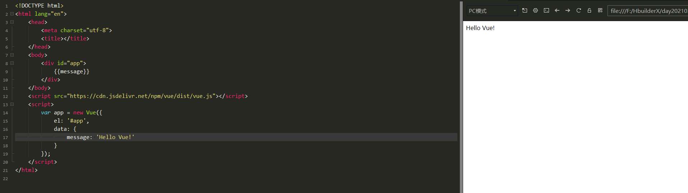

我们已经成功创建了第一个 Vue 应用！

> 现在数据和 DOM 已经被建立了关联，所有东西都是**响应式**的。我们要怎么确认呢？打开你的浏览器的 JavaScript 控制台 (就在这个页面打开)，并修改 app.message 的值，你将看到上例相应地更新。

注意我们不再和 HTML 直接交互了。一个 Vue 应用会将其挂载到一个 DOM 元素上 (对于这个例子是 `#app`) 然后对其进行完全控制。那个 HTML 是我们的入口，但其余都会发生在新创建的 Vue 实例内部。

除了文本插值，我们还可以像这样来绑定元素 attribute：

```html
<!DOCTYPE html>
<html lang="en">
	<head>
		<meta charset="utf-8">
		<title></title>
	</head>
	<body>
		<div id="app-2" v-bind:title="message">
			鼠标放我这试试！
		</div>
	</body>
	<script src="https://cdn.jsdelivr.net/npm/vue/dist/vue.js"></script>
	<script>
		var app2 = new Vue({
			el: '#app-2',
			data: {
				message: '这儿可以看时间哦！' + new Date().toLocaleDateString()
			}
		});
	</script>
</html>

```

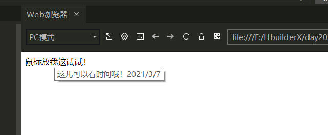

这里我们遇到了一点新东西。你看到的 v-bind attribute 被称为指令。指令带有前缀 v-，以表示它们是 Vue 提供的特殊 attribute。可能你已经猜到了，它们会在渲染的 DOM 上应用特殊的响应式行为。在这里，该指令的意思是：“*将这个元素节点的 title attribute 和 Vue 实例的 message property 保持一致*”。

如果你再次打开浏览器的 JavaScript 控制台，输入 app2.message = '新消息'，就会再一次看到这个绑定了 title attribute 的 HTML 已经进行了更新。


## 条件与循环

控制切换一个元素是否显示也相当简单：

```html
<!DOCTYPE html>
<html lang="en">
	<head>
		<meta charset="utf-8">
		<title></title>
	</head>
	<body>
		<div id="app-3">
			<p v-if="seen">你看到我了吗？</p>
		</div>
	</body>
	<script src="https://cdn.jsdelivr.net/npm/vue/dist/vue.js"></script>
	<script>
		var app3 = new Vue({
			el: '#app-3',
			data: {
				seen: true
			}
		});
	</script>
</html>

```

继续在控制台输入 `app3.seen = false`，你会发现之前显示的消息消失了。

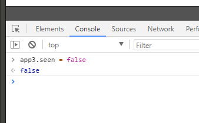

这个例子演示了我们不仅可以把数据绑定到 DOM 文本或 attribute，还可以绑定到 DOM **结构**。此外，Vue 也提供一个强大的过渡效果系统，可以在 Vue 插入/更新/移除元素时自动应用过渡效果。

还有其它很多指令，每个都有特殊的功能。例如，`v-for` 指令可以绑定数组的数据来渲染一个项目列表：

```html
<!DOCTYPE html>
<html lang="en">
	<head>
		<meta charset="utf-8">
		<title></title>
	</head>
	<body>
		<div id="app-4">
			<ol>
				<li v-for="todo in todos">
					{{todo.text}}
				</li>
			</ol>
		</div>
	</body>
	<script src="https://cdn.jsdelivr.net/npm/vue/dist/vue.js"></script>
	<script>
		var app4 = new Vue({
			el: '#app-4',
			data: {
				todos: [
					{text: 'JavaScript'},
					{text: 'Java'},
					{text: 'MySQL'}
				]
			}
		});
	</script>
</html>

```

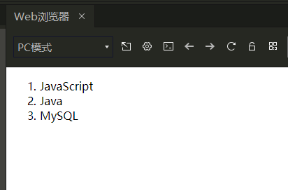

在控制台里，输入 `app4.todos.push({ text: 'Vue' })`，你会发现列表最后添加了一个Vue。

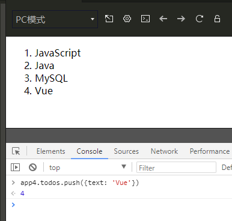


## 处理用户输入

```html
<!DOCTYPE html>
<html lang="en">
	<head>
		<meta charset="utf-8">
		<title></title>
	</head>
	<body>
		<div id="app-5">
			{{message}}
			<button v-on:click='reverseMessage'>反转消息</button>
		</div>
	</body>
	<script src="https://cdn.jsdelivr.net/npm/vue/dist/vue.js"></script>
	<script>
		var app5 = new Vue({
			el: '#app-5',
			data: {
				message: 'Hello Vue!',
			},
			methods: {
				reverseMessage: function() {
					this.message = this.message.split('').reverse().join('')
				}
			}
		});
	</script>
</html>

```

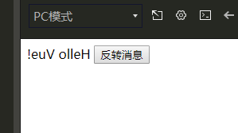

注意在 `reverseMessage` 方法中，我们更新了应用的状态，但没有触碰 DOM——所有的 DOM 操作都由 Vue 来处理，你编写的代码只需要关注逻辑层面即可。

Vue 还提供了 `v-model` 指令，它能轻松实现表单输入和应用状态之间的**双向绑定**。

```html
<!DOCTYPE html>
<html lang="en">
	<head>
		<meta charset="utf-8">
		<title></title>
	</head>
	<body>
		<div id="app-6">
			<p>{{message}}</p>
			<input v-model="message" />
		</div>
	</body>
	<script src="https://cdn.jsdelivr.net/npm/vue/dist/vue.js"></script>
	<script>
		var app6 = new Vue({
			el: '#app-6',
			data: {
				message: 'Hello Vue!',
			},
		});
	</script>
</html>

```

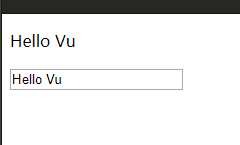


## 组件化应用构建

组件系统是 Vue 的另一个重要概念，因为它是一种抽象，允许我们使用小型、独立和通常可复用的组件构建大型应用。仔细想想，几乎任意类型的应用界面都可以抽象为一个组件树：


在 Vue 里，一个组件本质上是一个拥有预定义选项的一个 Vue 实例。在 Vue 中注册组件很简单：

```javascript
// 定义名为 todo-item 的新组件
Vue.component('todo-item', {
  template: '<li>这是个待办项</li>'
})

var app = new Vue(...)
```

现在你可以用它构建另一个组件模板：

```html
<ol>
  <!-- 创建一个 todo-item 组件的实例 -->
  <todo-item></todo-item>
</ol>
```

但是这样会为每个待办项渲染同样的文本，这看起来并不炫酷。我们应该能从父作用域将数据传到子组件才对。让我们来修改一下组件的定义，使之能够接受一个 **prop**：

```javascript
Vue.component('todo-item', {
  // todo-item 组件现在接受一个
  // "prop"，类似于一个自定义 attribute。
  // 这个 prop 名为 todo。
  props: ['todo'],
  template: '<li>{{ todo.text }}</li>'
})
```

现在，我们可以使用 `v-bind` 指令将待办项传到循环输出的每个组件中：

**eg1:**

```html
<!DOCTYPE html>
<html lang="en">
	<head>
		<meta charset="utf-8">
		<title></title>
	</head>
	<body>
		<div id="app-7">
			<ol>
				<!--
				      现在我们为每个 todo-item 提供 todo 对象
				      todo 对象是变量，即其内容可以是动态的。
				      我们也需要为每个组件提供一个“key”，稍后再
				      作详细解释。
				    -->
				<todo-item 
					v-for="item in bandList" 
					v-bind:todo = "item"
					v-bind:key = "item.id">
				</todo-item>
			</ol>
		</div>
	</body>
	<script src="https://cdn.jsdelivr.net/npm/vue/dist/vue.js"></script>
	<script>
		
		// 定义名为 todo-item 的新组件
		Vue.component('todo-item', {
			props: ['todo'],
		  template: '<li>{{todo.text}}</li>'
		});
		
		var app7 = new Vue({
			el: '#app-7',
			data: {
				bandList: [
					{id: 0, text: 'Queen'},
					{id: 1, text: 'The Beatles'},
					{id: 2, text: 'Beyond'},
				]
			},
		});
	</script>
</html>

```

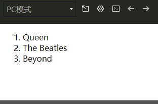

尽管这只是一个刻意设计的例子，但是我们已经设法将应用分割成了两个更小的单元。子单元通过 prop 接口与父单元进行了良好的解耦。我们现在可以进一步改进 `<todo-item>` 组件，提供更为复杂的模板和逻辑，而不会影响到父单元。

在一个大型应用中，有必要将整个应用程序划分为组件，以使开发更易管理。在后续教程中我们将详述组件，不过这里有一个 (假想的) 例子，以展示使用了组件的应用模板是什么样的：

```html
<div id="app">
  <app-nav></app-nav>
  <app-view>
    <app-sidebar></app-sidebar>
    <app-content></app-content>
  </app-view>
</div>
```

**eg2：**

```html
<!DOCTYPE html>
<html lang="en">
	<head>
		<meta charset="utf-8">
		<title></title>
	</head>
	<body>
		<div id="app-6">
			<!-- 组件：传递给组件中的值：props -->
			<Queen v-for="item in items" v-bind:queen = "item"></Queen>
		</div>
	</body>
	<script src="https://cdn.jsdelivr.net/npm/vue/dist/vue.js"></script>
	<script>
		
		// 定义一个Vue组件component
		Vue.component("Queen",{
			props: ['queen'],
			template: '<li>{{queen}}</li>'
		});
		
		var app6 = new Vue({
			el: '#app-6',
			data: {
				items: [
					"Java",
					"JavaScript",
					"MySQL"
				]
			},
		});
	</script>
</html>

```

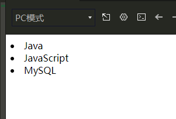


### 与自定义元素的关系

> 你可能已经注意到 Vue 组件非常类似于**自定义元素**——它是 Web 组件规范的一部分，这是因为 Vue 的组件语法部分参考了该规范。例如 Vue 组件实现了 Slot API 与 `is` attribute。但是，还是有几个关键差别：
>
> 1. Web Components 规范已经完成并通过，但未被所有浏览器原生实现。目前 Safari 10.1+、Chrome 54+ 和 Firefox 63+ 原生支持 Web Components。相比之下，Vue 组件不需要任何 polyfill，并且在所有支持的浏览器 (IE9 及更高版本) 之下表现一致。必要时，Vue 组件也可以包装于原生自定义元素之内。
> 2. Vue 组件提供了纯自定义元素所不具备的一些重要功能，最突出的是跨组件数据流、自定义事件通信以及构建工具集成。
>
> 虽然 Vue 内部没有使用自定义元素，不过在应用使用自定义元素、或以自定义元素形式发布时，依然有很好的互操作性。Vue CLI 也支持将 Vue 组件构建成为原生的自定义元素。


## Axios异步通信

**什么是 axios？**
Axios 是一个基于 promise 的 HTTP 库，可以用在浏览器和 node.js 中。

**特性：**

- 从浏览器中创建 XMLHttpRequests
- 从 node.js 创建 http请求
- 支持 Promise API （JS中链式编程）
- 拦截请求和响应
- 转换请求数据和响应数据
- 取消请求
- 自动转换 JSON 数据
- 客户端支持防御 XSRF （跨站请求伪造）

```html
<!DOCTYPE html>
<html lang="en">
<head>
    <meta charset="utf-8">
    <title></title>
<!--    v-clock 解决闪烁问题-->
    <style>
        [v-clock]{
            display: none;
        }
    </style>

</head>
<body>
<div id="vue" v-clock>
    <div>{{info.name}}</div>
    <div>{{info.Chinese.name}}</div>

    <a v-bind:href="info.url">The Beatles</a>
</div>
</body>

<script src="https://cdn.jsdelivr.net/npm/vue/dist/vue.js"></script>
<script src="https://unpkg.com/axios/dist/axios.min.js"></script>
<script type="text/javascript">
    var vm = new Vue({
        el: '#vue',

        data(){
            return{
                // 请求的返回参数格式，必须和json字符串一样
                info:{
                    name: null,
                    Chinese: {
                        name: null
                    },
                    url: null
                }
            }
        },
        mounted() {
            // 钩子函数  链式编程  ES6新特性
            axios.get('../data.json').then(response => (this.info = response.data));
        }
    });
</script>

</html>

```

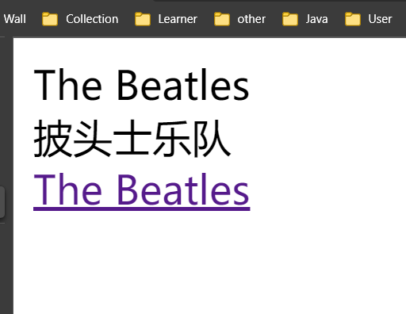