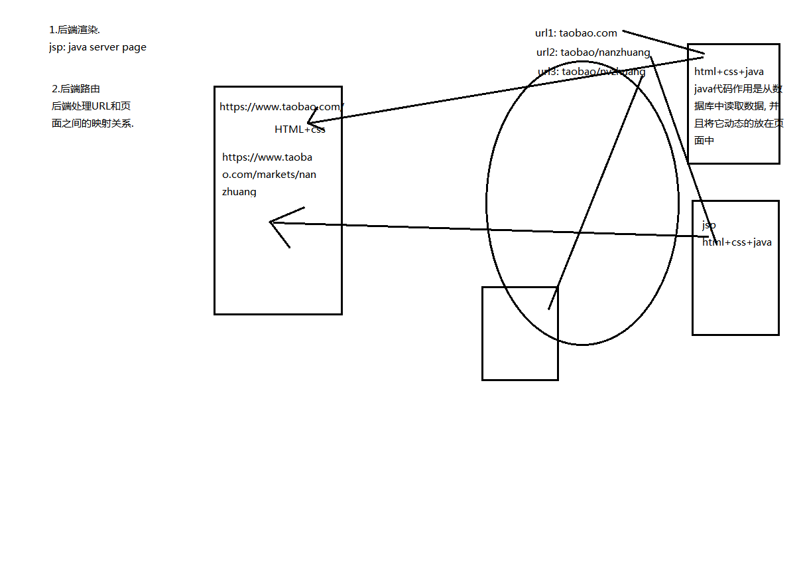
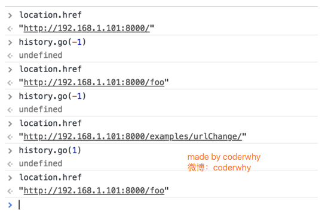
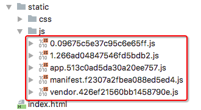

# 什么是路由？

> 路由是一个网络工程里面的术语。
> 路由（routing）就是通过互联的网络把信息从源地址传输到目的地址的活动. --- 维基百科

路由器提供了两种机制: **路由**和**转送**.

- 路由是决定数据包从来源到目的地的路径.
- 转送将输入端的数据转移到合适的输出端.

路由中有一个非常重要的概念叫**路由表**.
路由表本质上就是一个映射表, 决定了数据包的指向.


# 路由的发展

## 后端路由阶段

​	早期的网站开发整个HTML页面是由服务器来渲染的,服务器直接生产渲染好对应的HTML页面, 返回给客户端进行展示.但是, 

一个网站, *这么多页面服务器如何处理呢?*
一个页面有自己对应的网址, 也就是URL,URL会发送到服务器, 服务器会通过正则对该URL进行匹配, 并且最后交给一个Controller进行处理,Controller进行各种处理, 最终生成HTML或者数据, 返回给前端,这就完成了一个**IO操作**.
上面的这种操作, 就是**后端路由**.

---

​	当我们页面中需要请求不同的路径内容时, 交给服务器来进行处理, 服务器渲染好整个页面, 并且将页面返回给客户端.这种情况下渲染好的页面, 不需要单独加载任何的js和css, 可以直接交给浏览器展示, 这样也有利于SEO的优化.
后端路由的**缺点**:
一种情况是整个页面的模块由后端人员来编写和维护的.
另一种情况是前端开发人员如果要开发页面, 需要通过PHP和Java等语言来编写页面代码.
而且通常情况下HTML代码和数据以及对应的逻辑会混在一起, 编写和维护都是非常糟糕的事情.




## 前端路由阶段

### 前后端分离阶段

**前后端分离阶段：**
随着*Ajax*的出现, 有了前后端分离的开发模式.
后端只提供API来返回数据, 前端通过Ajax获取数据, 并且可以通过JavaScript将数据渲染到页面中.
这样做最大的优点就是前后端责任的清晰, 后端专注于数据上, 前端专注于交互和可视化上.
并且当移动端(iOS/Android)出现后, 后端不需要进行任何处理, 依然使用之前的一套API即可.
目前很多的网站依然采用这种模式开发.


### 单页面富应用阶段

**单页面富应用阶段:**
其实SPA最主要的特点就是在前后端分离的基础上加了一层前端路由.
也就是前端来维护一套路由规则.


**前端路由的核心是什么呢？**

改变URL，但是页面不进行整体的刷新。
*如何实现呢？*

**URL的hash:**
URL的hash也就是锚点(#), 本质上是改变window.location的href属性，我们可以通过直接赋值location.hash来改变href, 但是页面不发生刷新.


**HTML5的history模式：pushState()**

history接口是HTML5新增的, 它有五种模式改变URL而不刷新页面,history.pushState().


**HTML5的history模式：replaceState()**


**HTML5的history模式：go**



**说明:**

上面只演示了三个方法,因为 history.back() 等价于 history.go(-1),history.forward() 则等价于 history.go(1),这三个接口等同于浏览器界面的前进后退。


# vue-router简介

> 目前前端流行的三大框架, 都有自己的路由实现:
> Angular的ngRouter
> React的ReactRouter
> Vue的vue-router

==vue-router==是Vue.js官方的路由插件，它和vue.js是深度集成的，适合用于构建单页面应用。
我们可以访问其官方网站对其进行学习: https://router.vuejs.org/zh/

vue-router是基于**路由和组件**的，
**路由**用于设定访问路径, 将路径和组件映射起来。
在vue-router的单页面应用中, 页面的路径的改变就是**组件的切换**。

---

**安装和使用vue-router**

*使用npm来安装路由:*

步骤一: 安装vue-router

```sh
npm install vue-router --save
```

步骤二: 在模块化工程中使用它(因为是一个插件, 所以可以通过Vue.use()来安装路由功能)


第一步：导入路由对象，并且调用 Vue.use(VueRouter)
第二步：创建路由实例，并且传入路由映射配置
第三步：在Vue实例中挂载创建的路由实例.


```js
import Vue from 'vue' 
import VueRouter from 'vue-router' 

Vue.use(VueRouter)
```

*使用vue-router的步骤:*
第一步: 创建路由组件
第二步: 配置路由映射: 组件和路径映射关系
第三步: 使用路由: 通过<router-link>和<router-view>


# vue-router基本使用

## 初始步骤

- 创建router实例


- 挂载到Vue实例中


- 步骤一：创建路由组件


- 步骤二：配置组件和路径的映射关系


- 步骤三：使用路由.


<!--<router-link>: 该标签是一个vue-router中已经内置的组件, 它会被渲染成一个<a>标签.
<router-view>: 该标签会根据当前的路径, 动态渲染出不同的组件.
网页的其他内容, 比如顶部的标题/导航, 或者底部的一些版权信息等会和<router-view>处于同一个等级.
在路由切换时, 切换的是<router-view>挂载的组件, 其他内容不会发生改变.-->


---

## 相关配置

- 路由的默认路径

我们这里还有一个不太好的实现: 默认情况下, 进入网站的首页, 我们希望<router-view>渲染首页的内容.但是我们的实现中, 默认没有显示首页组件, 必须让用户点击才可以.如何可以让路径默认跳转到首页, 并且<router-view>渲染首页组件呢?
非常简单, 我们只需要配置多配置一个映射就可以了！


**配置解析:**
我们在routes中又配置了一个映射. 
path配置的是根路径: /	（也可以不填写/）
redirect是重定向, 也就是我们将根路径重定向到/home的路径下, 这样就可以得到我们想要的结果了.

- HTML5的History模式

我们前面说过改变路径的方式有两种:
**URL的hash**
**HTML5的history**
默认情况下, 路径的改变使用的URL的hash.
如果希望使用HTML5的history模式, 非常简单, 进行如下配置即可:


如下：


## router-link补充

在前面的<router-link>中, 我们只是使用了一个属性: **to**, 用于指定跳转的路径.
<router-link>还有一些其他属性:
**tag**: tag可以指定<router-link>之后渲染成什么组件, 比如上面的代码会被渲染成一个<li>元素, 而不是<a>
**replace**: replace不会留下history记录, 所以指定replace的情况下, 后退键返回不能返回到上一个页面中
**active-class**: 当<router-link>对应的路由匹配成功时, 会自动给当前元素设置一个router-link-active的class, 设置active-class可以修改默认的名称.
在进行高亮显示的导航菜单或者底部tabbar时, 会使用到该类.
但是通常不会修改类的属性, 会直接使用默认的router-link-active即可. 


---

修改**linkActiveClass**

该class具体的名称也可以通过router实例的属性进行修改 


**exact-active-class：**
类似于active-class, 只是在精准匹配下才会出现的class.
后面看到嵌套路由时, 我们再看下这个属性.


## 路由代码跳转

有时候, 页面的跳转可能需要执行对应的JavaScript代码, 这个时候, 就可以使用第二种跳转方式了
比如, 我们将代码修改如下: 


# vue-router详解

## 动态路由

> 我们经常需要把某种模式匹配到的所有路由，全都映射到同个组件。例如，我们有一个 `User` 组件，对于所有 ID 各不相同的用户，都要使用这个组件来渲染。那么，我们可以在 `vue-router` 的路由路径中使用“动态路径参数”(dynamic segment) 来达到这个效果：
>
> ```js
> const User = {
>   template: '<div>User</div>'
> }
> 
> const router = new VueRouter({
>   routes: [
>     // 动态路径参数 以冒号开头
>     { path: '/user/:id', component: User }
>   ]
> })
> ```
>
> 现在呢，像 `/user/foo` 和 `/user/bar` 都将映射到相同的路由。
>
> 一个“路径参数”使用冒号 `:` 标记。当匹配到一个路由时，参数值会被设置到 `this.$route.params`，可以在每个组件内使用。于是，我们可以更新 `User` 的模板，输出当前用户的 ID：
>
> ```js
> const User = {
>   template: '<div>User {{ $route.params.id }}</div>'
> }
> ```
>
> 你可以在一个路由中设置多段“路径参数”，对应的值都会设置到 `$route.params` 中。例如：
>
> | 模式                          | 匹配路径            | $route.params                          |
> | ----------------------------- | ------------------- | -------------------------------------- |
> | /user/:username               | /user/evan          | `{ username: 'evan' }`                 |
> | /user/:username/post/:post_id | /user/evan/post/123 | `{ username: 'evan', post_id: '123' }` |
>
> 除了 `$route.params` 外，`$route` 对象还提供了其它有用的信息，例如，`$route.query` (如果 URL 中有查询参数)、`$route.hash` 等等。

---

在某些情况下，一个页面的path路径可能是不确定的，比如我们进入用户界面时，希望是如下的路径：
/user/aaaa或/user/bbbb
除了有前面的/user之外，后面还跟上了用户的ID
这种path和Component的匹配关系，我们称之为**动态路由**(也是路由传递数据的一种方式)。


## 路由的懒加载

> 当打包构建应用时，JavaScript 包会变得非常大，影响页面加载。如果我们能把不同路由对应的组件分割成不同的代码块，然后当路由被访问的时候才加载对应组件，这样就更加高效了。
>
> 结合 Vue 的异步组件 (opens new window)和 Webpack 的代码分割功能 (opens new window)，轻松实现路由组件的懒加载。
>
> 首先，可以将异步组件定义为返回一个 Promise 的工厂函数 (该函数返回的 Promise 应该 resolve 组件本身)：
>
> ```js
> const Foo = () =>
>   Promise.resolve({
>     /* 组件定义对象 */
>   })
> ```
>
> 第二，在 Webpack 2 中，我们可以使用动态 import (opens new window)语法来定义代码分块点 (split point)：
>
> ```js
> import('./Foo.vue') // 返回 Promise
> ```
>
> *注意*
>
> 如果您使用的是 Babel，你将需要添加 `syntax-dynamic-import` (opens new window)插件，才能使 Babel 可以正确地解析语法。
>
> 结合这两者，这就是如何定义一个能够被 Webpack 自动代码分割的异步组件。
>
> ```js
> const Foo = () => import('./Foo.vue')
> ```
>
> 在路由配置中什么都不需要改变，只需要像往常一样使用 `Foo`：
>
> ```js
> const router = new VueRouter({
>   routes: [{ path: '/foo', component: Foo }]
> })
> ```
>
> **把组件按组分块**
>
> 有时候我们想把某个路由下的所有组件都打包在同个异步块 (chunk) 中。只需要使用 命名 chunk (opens new window)，一个特殊的注释语法来提供 chunk name (需要 Webpack > 2.4)。
>
> ```js
> const Foo = () => import(/* webpackChunkName: "group-foo" */ './Foo.vue')
> const Bar = () => import(/* webpackChunkName: "group-foo" */ './Bar.vue')
> const Baz = () => import(/* webpackChunkName: "group-foo" */ './Baz.vue')
> ```
>
> Webpack 会将任何一个异步模块与相同的块名称组合到相同的异步块中。

---

*路由懒加载做了什么?*

路由懒加载的主要作用就是将路由对应的组件打包成一个个的js代码块。
只有在这个路由被访问到的时候, 才加载对应的组件。

==懒加载前：==


==懒加载后：==





**懒加载的方式：**

- 方式一: 结合Vue的异步组件和Webpack的代码分析.

```js
const Home = resolve => { require.ensure(['../components/Home.vue'], () => { resolve(require('../components/Home.vue')) })};
```

- 方式二: AMD写法

```js
const About = resolve => require(['../components/About.vue'], resolve);
```

- 方式三: 在ES6中, 我们可以有更加简单的写法来组织Vue异步组件和Webpack的代码分割.

```js
const Home = () => import('../components/Home.vue')
```


## 嵌套路由

> 实际生活中的应用界面，通常由多层嵌套的组件组合而成。同样地，URL 中各段动态路径也按某种结构对应嵌套的各层组件，例如：
>
> ```text
> /user/foo/profile                     /user/foo/posts
> +------------------+                  +-----------------+
> | User             |                  | User            |
> | +--------------+ |                  | +-------------+ |
> | | Profile      | |  +------------>  | | Posts       | |
> | |              | |                  | |             | |
> | +--------------+ |                  | +-------------+ |
> +------------------+                  +-----------------+
> ```
>
> 借助 `vue-router`，使用嵌套路由配置，就可以很简单地表达这种关系。
>
> 接着上节创建的 app：
>
> ```html
> <div id="app">
>   <router-view></router-view>
> </div>
> ```
>
> ```js
> const User = {
>   template: '<div>User {{ $route.params.id }}</div>'
> }
> 
> const router = new VueRouter({
>   routes: [{ path: '/user/:id', component: User }]
> })
> ```
>
> 这里的 `<router-view>` 是最顶层的出口，渲染最高级路由匹配到的组件。同样地，一个被渲染组件同样可以包含自己的嵌套 `<router-view>`。例如，在 `User` 组件的模板添加一个 `<router-view>`：
>
> ```js
> const User = {
>   template: `
>     <div class="user">
>       <h2>User {{ $route.params.id }}</h2>
>       <router-view></router-view>
>     </div>
>   `
> }
> ```
>
> 要在嵌套的出口中渲染组件，需要在 `VueRouter` 的参数中使用 `children` 配置：
>
> ```js
> const router = new VueRouter({
>   routes: [
>     {
>       path: '/user/:id',
>       component: User,
>       children: [
>         {
>           // 当 /user/:id/profile 匹配成功，
>           // UserProfile 会被渲染在 User 的 <router-view> 中
>           path: 'profile',
>           component: UserProfile
>         },
>         {
>           // 当 /user/:id/posts 匹配成功
>           // UserPosts 会被渲染在 User 的 <router-view> 中
>           path: 'posts',
>           component: UserPosts
>         }
>       ]
>     }
>   ]
> })
> ```
>
> **要注意，以 `/` 开头的嵌套路径会被当作根路径。 这让你充分的使用嵌套组件而无须设置嵌套的路径。**
>
> 你会发现，`children` 配置就是像 `routes` 配置一样的路由配置数组，所以呢，你可以嵌套多层路由。
>
> 此时，基于上面的配置，当你访问 `/user/foo` 时，`User` 的出口是不会渲染任何东西，这是因为没有匹配到合适的子路由。如果你想要渲染点什么，可以提供一个 空的 子路由：
>
> ```js
> const router = new VueRouter({
>   routes: [
>     {
>       path: '/user/:id',
>       component: User,
>       children: [
>         // 当 /user/:id 匹配成功，
>         // UserHome 会被渲染在 User 的 <router-view> 中
>         { path: '', component: UserHome }
> 
>         // ...其他子路由
>       ]
>     }
>   ]
> })
> ```

---

*嵌套路由是一个很常见的功能*

比如在home页面中, 我们希望通过/home/news和/home/message访问一些内容.
一个路径映射一个组件, 访问这两个路径也会分别渲染两个组件.

路径和组件的关系如下:


实现嵌套路由有**两个步骤**:
创建对应的子组件, 并且在路由映射中配置对应的子路由.
在组件内部使用<router-view>标签.

定义两个组件:


**嵌套默认路径**

嵌套路由也可以配置默认的路径, 配置方式如下: 


## 传参

传递参数主要有两种类型: **params**和**query**

- **params的类型:**
  配置路由格式: /router/:id
  传递的方式: 在path后面跟上对应的值
  传递后形成的路径: /router/123, /router/abc

- **query的类型:**
  配置路由格式: /router, 也就是普通配置
  传递的方式: 对象中使用query的key作为传递方式
  传递后形成的路径: /router?id=123, /router?id=abc

如何使用它们呢? 也有两种方式: <router-link>的方式和JavaScript代码方式

**<router-link>**


**JavaScript代码**


**获取参数通过$route对象获取的.**

在使用了 vue-router 的应用中，路由对象会被注入每个组件中，赋值为 this.$route ，并且当路由切换时，路由对象会被更新。

通过$route获取传递的信息如下:


## $route和 $router是有区别的

> $router为VueRouter实例，想要导航到不同URL，则使用$router.push方法
>
> $route为当前router跳转对象里面可以获取name、path、query、params等


