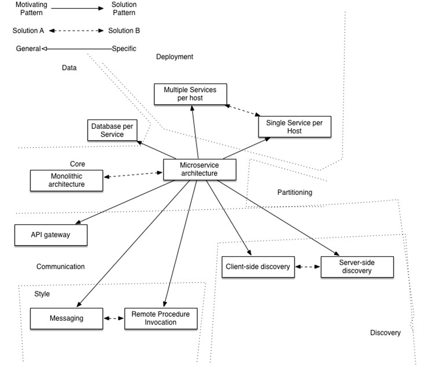
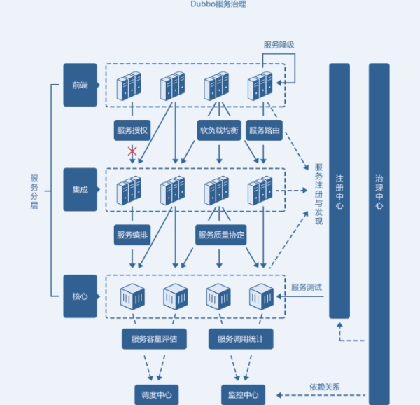
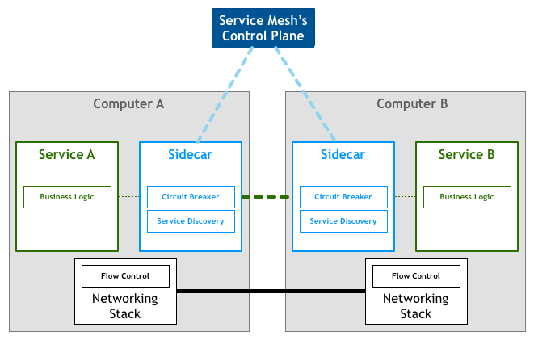
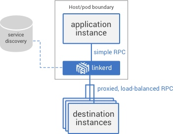
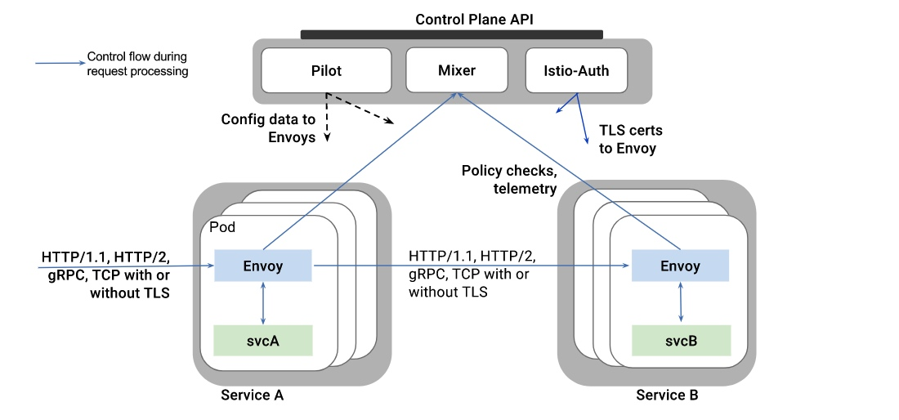
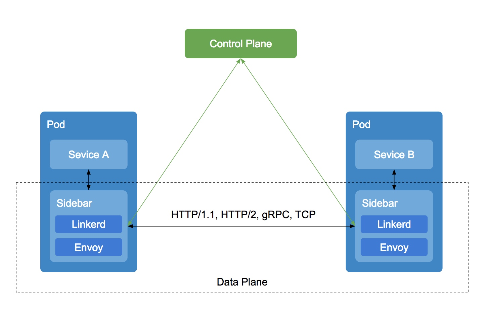
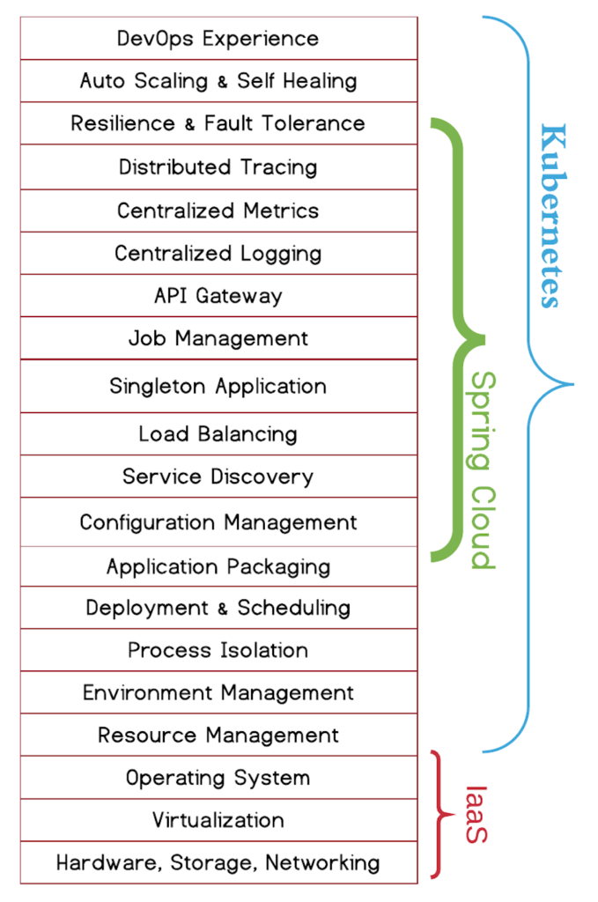
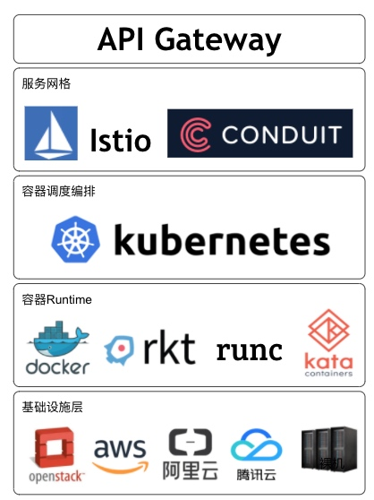

# springCloud

> Spring Cloud provides tools for developers to quickly build some of the common patterns in distributed systems (e.g. configuration management, service discovery, circuit breakers, intelligent routing, micro-proxy, control bus, one-time tokens, global locks, leadership election, distributed sessions, cluster state). Coordination of distributed systems leads to boiler plate patterns, and using Spring Cloud developers can quickly stand up services and applications that implement those patterns. They will work well in any distributed environment, including the developer’s own laptop, bare metal data centres, and managed platforms such as Cloud Foundry.

Features

> Spring Cloud focuses on providing good out of box experience for typical use cases and extensibility mechanism to cover others.
>
> - Distributed/versioned configuration
> - Service registration and discovery
> - Routing
> - Service-to-service calls
> - Load balancing
> - Circuit Breakers
> - Global locks
> - Leadership election and cluster state
> - Distributed messaging

# 微服务架构

==**建议阅读：[Martin Fowler](https://martinfowler.com/)的文章[Microservices](https://martinfowler.com/articles/microservices.html)**==

---

**微服务**是一种用于构建应用的架构方案。微服务架构有别于更为传统的单体式方案，可将应用拆分成多个核心功能。每个功能都被称为一项服务，可以单独构建和部署，这意味着各项服务在工作（和出现故障）时不会相互影响。

> 
>
> 

## 单体架构

单体架构，是指将开发好的项目打成war包，然后发布到tomcat等容器中的应用。

假设你正准备开发一款与Uber和滴滴竞争的出租车调度软件，经过初步会议和需求分析，你可能会手动或者使用基于Spring Boot、Play或者Maven的生成器开始这个新项目，它的六边形架构是模块化的 ，架构图如下：

应用核心是业务逻辑，由定义服务、领域对象和事件的模块完成。围绕着核心的是与外界打交道的适配器。适配器包括数据库访问组件、生产和处理消息的消息组件，以及提供API或者UI访问支持的web模块等。

尽管也是模块化逻辑，但是最终它还是会打包并部署为单体式应用。具体的格式依赖于应用语言和框架。例如，许多Java应用会被打包为WAR格式，部署在Tomcat或者Jetty上，而另外一些Java应用会被打包成自包含的JAR格式，类似的，Rails和Node.js会被打包成层级目录。

单体式应用也易于部署，只需要把打包应用拷贝到服务器端，通过在负载均衡器后端运行多个拷贝就可以轻松实现应用扩展。在早期这类应用运行的很好。

**单体架构存在的问题：**

- 复杂性高

以某个百万行级别的单体应用xxx为例，整个项目包含的模块非常多，模块的边界模糊、依赖关系不清晰、代码质量参差不齐、混乱地堆砌在一起，整个项目非常复杂。每次修改代码都心惊胆战，甚至添加一个简单的功能，或者修改一个Bug都会带来隐含的缺陷。

- 技术债务

随着时间推移、需求变更和人员更迭，会逐渐形成应用程序的技术债务， 并且越积越多。“不坏不修”，这在软件开发中非常常见，在单体应用中这种思想更甚。已使用的系统设计或代码难以被修改，因为应用程序中的 其他模块可能会以意料之外的方式使用它。

- 部署频率低

随着代码的增多，构建和部署的时间也会增加。而在单体应用中，每次功能的变更或缺陷的修复都会导致需要重新部署整个应用。全量部署的方式耗时长、影响范围大、风险高，这使得单体应用项目上线部署的频率较低。而部署频率 低又导致两次发布之间会有大量的功能变更和缺陷修复，出错概率比较高。

- 可靠性差

某个应用Bug，例如死循环、00M等，可能会导致整个应用的崩溃。

- 扩展能力受限

单体应用只能作为一个整体进行扩展，无法根据业务模块的需要进行伸缩。例如，应用中有的模块是计算密集型的，它需要强劲的 CPU ;有的模块则是 IO 密集型的，需要更大的内存。由于这些模块部署在一起，不得不在硬件的选择上做出妥协。

- 阻碍技术创新

单体应用往往使用统一的技术平台或方案解决所有的问题，团队中的每个成员都必须使用相同的开发语言和框架，要想引人新框架或新技术平台会非常困难。例如，一个使用 Struts 2构建的、有100万行代码的单体应用，如果想要换用 Spring MVC ，毫无疑问切换的成本是非常高的。

## 微服务架构

微服务架构是一种架构模式，它提倡将单一应用程序划分成一组小的服务，服务之间互相协调、互相配合，为用户提供最终价值。每个服务运行在其独立的进程中，服务与服务间采用轻量级的通信机制互相沟通（通常是基于HTTP的RESTful API）。

每个服务都围绕着具体业务进行构建，并且能够被独立地部署到生产环境、类生产环境等。另外，应尽量避免统一的、集中式的服务管理机制，对具体的一个服务而言，应根据业务上下文，选择合适的语言、工具对其进行构建。

微服务是一种架构风格，一个大型复杂软件应用由一个或多个微服务组成。系统中的各个微服务可被独立部署，各个微服务之间是松耦合的。每个微服务仅关注于完成一件任务并很好地完成该任务。在所有情况下，每个任务代表着一个小的业务能力。

***微服务架构优势***

在将应用分解的同时，规避了原本复杂度无止境的积累。每一个微服务专注于单一功能，并通过定义良好的接口清晰表述服务边界。由于体积小、复杂度低，每个微服务可由一个小规模开发团队完全掌控，易于保持高可维护性和开发效率。

**1.独立部署**

由于微服务具备独立的运行进程，所以每个微服务也可以独立部署。当某个微服务发生变更时无需编译、部署整个应用。由微服务组成的应用相当于具备一系列可并行的发布流程，使得发布更加高效，同时降低对生产环境所造成的风险，最终缩短应用交付周期。

**2.技术选型灵活**

微服务架构下，技术选型是去中心化的。每个团队可以根据自身服务的需求和行业发展的现状，自由选择最适合的技术栈。由于每个微服务相对简单，故需要对技术栈进行升级时所面临的风险就较低，甚至完全重构一个微服务也是可行的。

**3.容错**

当某一组建发生故障时，在单一进程的传统架构下，故障很有可能在进程内扩散，形成应用全局性的不可用。在微服务架构下，故障会被隔离在单个服务中。若设计良好，其他服务可通过重试、平稳退化等机制实现应用层面的容错。

**4.扩展独立**

单块架构应用也可以实现横向扩展，就是将整个应用完整的复制到不同的节点。当应用的不同组件在扩展需求上存在差异时，微服务架构便体现出其灵活性，因为每个服务可以根据实际需求独立进行扩展。

**微服务架构示例：**

***微服务所面临的缺点和挑战***

**1.划分标准**

微服务强调了服务大小，但实际上这并没有一个统一的标准。业务逻辑应该按照什么规则划分为微服务，这本身就是一个经验工程。有些开发者主张10-100行代码就应该建立一个微服务。虽然建立小型服务是微服务架构崇尚的，但要记住，微服务是达到目的的手段，而不是目标。微服务的目标是充分分解应用程序，以促进敏捷开发和持续集成部署。

**2.分布式的复杂性**

微服务的另一个主要缺点是微服务的分布式特点带来的复杂性。开发人员需要基于RPC或者消息实现微服务之间的调用和通信，而这就使得服务之间的发现、服务调用链的跟踪和质量问题变得的相当棘手。

**3.分布式事务**

微服务的另一个挑战是分区的数据库体系和分布式事务。更新多个业务实体的业务交易相当普遍。这些类型的事务在单体应用中实现非常简单，因为单体应用往往只存在一个数据库。但在微服务架构下，不同服务可能拥有不同的数据库。CAP原理的约束，使得我们不得不放弃传统的强一致性，而转而追求最终一致性，这个对开发人员来说是一个挑战。

**4.跨服务部署**

微服务的另一大挑战是跨多个服务的更改。比如在传统单体应用中，若有A、B、C三个服务需要更改，A依赖B，B依赖C。我们只需更改相应的模块，然后一次性部署即可。但是在微服务架构中，我们需要仔细规划和协调每个服务的变更部署。我们需要先更新C，然后更新B，最后更新A。

**5.部署策略**

部署基于微服务的应用也要复杂得多。单体应用可以简单的部署在一组相同的服务器上，然后前端使用负载均衡即可。每个应用都有相同的基础服务地址，例如数据库和消息队列。而微服务由不同的大量服务构成。每种服务可能拥有自己的配置、应用实例数量以及基础服务地址。这里就需要不同的配置、部署、扩展和监控组件。此外，我们还需要服务发现机制，以便服务可以发现与其通信的其他服务的地址。因此，成功部署微服务应用需要开发人员有更好地部署策略和高度自动化的水平。

以上问题和挑战可大体概括为：

- API Gateway
- 服务间调用
- 服务发现
- 服务容错
- 服务部署
- 数据调用

## 微服务架构VS单体架构

**1.分工不同**

以前我们通常是一个有规模的团队围绕一个单体应用工作，可能是一人一个模块；微服务架构可以为软件开发提供不同的方法，把传统模式下的单体应用拆分成独立的服务，从而可以单独开发、单独部署、单独维护，在微服务架构下可能是一人一个系统。

**2.存储方式不同**

单体架构所有的模块都共用一个数据库，存储方式比较单一，微服务每个模块都可以使用不同的存储方式（比如有的用redis，有的用mysql等），数据库也是单个模块对应自己的数据库。

**3.部署方式不同**

在单体应用中，每次功能的变更或缺陷的修复都会导致需要重新部署整个应用。微服务架构服务可独立部署，并且可以独立于其他服务进行扩展，如果部署得当，基于微服务的架构可以帮助业务避免欠下技术债务，以及大幅提高效率的重大价值。

**4.容灾不同**

当某一组建发生故障时，在单一进程的传统架构下，故障很有可能在进程内扩散，形成应用全局性的不可用。在微服务架构下，故障会被隔离在单个服务中。好的微服务可以隔离故障避免服务整体down掉，坏的微服务设计仍然可以因为一个子服务出现问题导致连锁反应。

**5.开发模式不同**

单体架构所有的模块开发所使用的技术一样，开发模式比较受限，微服务每个模块都可以使用不同的开发技术，开发模式更灵活。

## 微服务架构之SpringCloud

通过前面对微服务和单体架构的对比，以及微服务所面临的问题，由此出现了很多微服务框架，可以解决以上问题。Spring Cloud为开发者提供了快速构建分布式系统的通用模型的工具（包括配置管理、服务发现、熔断器、智能路由、微代理、控制总线、一次性令牌、全局锁、领导选举、分布式会话、集群状态等）。 主要项目包括：

- Spring Cloud Config：由Git存储库支持的集中式外部配置管理。配置资源直接映射到Spring Environment，但是如果需要可以被非Spring应用程序使用。
- Spring Cloud Netflix：与各种Netflix OSS组件（Eureka，Hystrix，Zuul，Archaius等）集成。
- Spring Cloud Bus：用于将服务和服务实例与分布式消息传递联系起来的事件总线。用于在集群中传播状态更改（例如配置更改事件）。
- Spring Cloud for Cloudfoundry：将您的应用程序与Pivotal Cloudfoundry集成。提供服务发现实现，还可以轻松实现通过SSO和OAuth 2保护资源，还可以创建Cloudfoundry服务代理。
- Spring Cloud - Cloud Foundry Service Broker：提供构建管理一个Cloud Foundry中服务的服务代理的起点。
- Spring Cloud Cluster：领导选举和通用状态模型（基于ZooKeeper，Redis，Hazelcast，Consul的抽象和实现）。
- Spring Cloud Consul：结合Hashicorp Consul的服务发现和配置管理
- Spring Cloud Security：在Zuul代理中为负载平衡的OAuth 2休眠客户端和认证头中继提供支持。
- Spring Cloud Sleuth：适用于Spring Cloud应用程序的分布式跟踪，与Zipkin，HTrace和基于日志（例如ELK）跟踪兼容。
- Spring Cloud Data Flow：针对现代运行时的可组合微服务应用程序的云本地编排服务。易于使用的DSL，拖放式GUI和REST-API一起简化了基于微服务的数据管道的整体编排。
- Spring Cloud Stream：轻量级事件驱动的微服务框架，可快速构建可连接到外部系统的应用程序。使用Apache Kafka或RabbitMQ在Spring Boot应用程序之间发送和接收消息的简单声明式模型。
- Spring Cloud Stream Application Starters：Spring Cloud任务应用程序启动器是Spring Boot应用程序，可能是任何进程，包括不会永远运行的Spring Batch作业，并且它们在有限时间的数据处理之后结束/停止。
- Spring Cloud ZooKeeper：ZooKeeper的服务发现和配置管理。
- Spring Cloud for Amazon Web Services：轻松集成托管的Amazon的Web Services服务。它通过使用Spring的idioms和APIs便捷集成AWS服务，例如缓存或消息API。开发人员可以围绕托管服务，不必关心基础架构来构建应用。
- Spring Cloud Connectors：使PaaS应用程序在各种平台上轻松连接到后端服务，如数据库和消息代理（以前称为“Spring Cloud”的项目）。
- Spring Cloud Starters：作为基于Spring Boot的启动项目，降低依赖管理（在Angel.SR2后，不在作为独立项目）。
- Spring Cloud CLI：插件支持基于Groovy预言快速创建Spring Cloud的组件应用。

# Let's go

前面的背景介绍就到此为止，下面让我们开始正式的学习springCloud。

话不多说，开整！

**首先带着问题去学习：**

前面我们长篇大论的说了很多，总结出如下微服务架构的4个核心问题：

- 服务很多，客户端该怎么访问？
- 这么多服务？服务之间如何通信？
- 这么多服务？如何治理？
- 服务挂了怎么办？

概括就是：

- API
- HTTP，RPC
- 注册和发现
- 熔断机制

**常见面试题**

1.什么是微服务？

2.微服务之间是如何独立通讯的？

3.springCloud和Dubbo有哪里区别？

4.springBoot和SpringCloud，请你谈谈对他们的理解

5.什么是服务熔断？什么是服务降级？

6.微服务的优缺点分别是什么？说一下你在项目中遇到的坑

7.你所知道的微服务技术栈有哪些？请列举一二

8.eureka和zookeeper都可以提供服务注册与发现的功能，请说说两个的区别？

……

# 扩展知识

## Dubbo

Dubbo是一个阿里巴巴开源出来的一个分布式服务框架，致力于提供高性能和透明化的RPC远程服务调用方案，以及SOA服务治理方案。其核心部分包含：

- 远程通讯： 提供对多种基于长连接的NIO框架抽象封装，包括多种线程模型，序列化，以及“请求-响应”模式的信息交换方式。
- 集群容错：提供基于接口方法的透明远程过程调用，包括多协议支持，以及软负载均衡，失败容错，地址路由，动态配置等集群支持。
- 自动发现：基于注册中心目录服务，使服务消费方能动态的查找服务提供方，使地址透明，使服务提供方可以平滑增加或减少机器。

## Service Mesh

Service Mesh又译作“服务网格”，作为服务间通信的基础设施层。如果用一句话来解释什么是Service Mesh，可以将它比作是应用程序或者说微服务间的TCP/IP，负责服务之间的网络调用、限流、熔断和监控。对于编写应用程序来说一般无须关心TCP/IP这一层（比如通过 HTTP 协议的 RESTful 应用），同样使用Service Mesh也就无须关系服务之间的那些原来是通过应用程序或者其他框架实现的事情，比如Spring Cloud、OSS，现在只要交给Service Mesh就可以了。

Service Mesh有如下几个特点：

- 应用程序间通讯的中间层
- 轻量级网络代理
- 应用程序无感知
- 解耦应用程序的重试/超时、监控、追踪和服务发现

Service Mesh的架构如下图所示：

Service Mesh作为Sidebar运行，对应用程序来说是透明，所有应用程序间的流量都会通过它，所以对应用程序流量的控制都可以在Service Mesh中实现。

目前流行的Service Mesh开源软件有Linkerd、Envoy和Istio，而最近Buoyant（开源Linkerd的公司）又发布了基于Kubernetes的Service Mesh开源项目Conduit。

## Linkerd

Linkerd是开源网络代理，设计为以服务网格部署：用于管理，控制和监控应用程序内的服务与服务间通讯的专用层。

Linkerd旨在解决Twitter、Yahoo、Google和Microsoft等公司运营大型生产系统时发现的问题。根据经验，最复杂，令人惊奇和紧急行为的来源通常不是服务本身，而是服务之间的通讯。Linkerd解决了这些问题，不仅仅是控制通讯机制，而是在其上提供一个抽象层。

它的主要特性有：

- 负载平衡：Linkerd提供了多种负载均衡算法，它们使用实时性能指标来分配负载并减少整个应用程序的尾部延迟。
- 熔断：Linkerd包含自动熔断，将停止将流量发送到被认为不健康的实例，从而使他们有机会恢复并避免连锁反应故障。
- 服务发现：Linkerd 与各种服务发现后端集成，通过删除特定的(ad-hoc)服务发现实现来帮助您降低代码的复杂性。
- 动态请求路由：Linkerd 启用动态请求路由和重新路由，允许您使用最少量的配置来设置分段服务（staging service），金丝雀（canaries），蓝绿部署（blue-green deploy），跨DC故障切换和黑暗流量（dark traffic）。
- 重试次数和截止日期：Linkerd可以在某些故障时自动重试请求，并且可以在指定的时间段之后让请求超时。
- TLS：Linkerd可以配置为使用TLS发送和接收请求，您可以使用它来加密跨主机边界的通信，而不用修改现有的应用程序代码。
- HTTP代理集成：Linkerd可以作为HTTP代理，几乎所有现代HTTP客户端都广泛支持，使其易于集成到现有应用程序中。
- 透明代理：您可以在主机上使用iptables规则，设置通过Linkerd的透明代理。
- gRPC：Linkerd支持HTTP/2和TLS，允许它路由gRPC请求，支持高级RPC机制，如双向流，流程控制和结构化数据负载。
- 分布式跟踪：Linkerd支持分布式跟踪和度量仪器，可以提供跨越所有服务的统一的可观察性。
- 仪器仪表：Linkerd支持分布式跟踪和度量仪器，可以提供跨越所有服务的统一的可观察性。

## Envoy

Envoy是一个面向服务架构的L7代理和通信总线而设计的，这个项目诞生是出于以下目标：

对于应用程序而言，网络应该是透明的，当发生网络和应用程序故障时，能够很容易定位出问题的根源。

Envoy可提供以下特性：

- 外置进程架构：可与任何语言开发的应用一起工作；可快速升级。
- 基于新C++11编码：能够提供高效的性能。
- L3/L4过滤器：核心是一个L3/L4网络代理，能够作为一个可编程过滤器实现不同TCP代理任务，插入到主服务当中。通过编写过滤器来支持各种任务，如原始TCP代理、HTTP代理、TLS客户端证书身份验证等。
- HTTP L7过滤器：支持一个额外的HTTP L7过滤层。HTTP过滤器作为一个插件，插入到HTTP链接管理子系统中，从而执行不同的任务，如缓冲，速率限制，路由/转发，嗅探Amazon的DynamoDB等等。
- 支持HTTP/2：在HTTP模式下，支持HTTP/1.1、HTTP/2，并且支持HTTP/1.1、HTTP/2双向代理。这意味着HTTP/1.1和HTTP/2，在客户机和目标服务器的任何组合都可以桥接。
- HTTP L7路由：在HTTP模式下运行时，支持根据content type、runtime values等，基于path的路由和重定向。可用于服务的前端／边缘代理。
- 支持gRPC：gRPC是一个来自谷歌的RPC框架，使用HTTP/2作为底层的多路传输。HTTP/2承载的gRPC请求和应答，都可以使用Envoy的路由和LB能力。
- 支持MongoDB L7：支持获取统计和连接记录等信息。
- 支持DynamoDB L7：支持获取统计和连接等信息。
- 服务发现：支持多种服务发现方法，包括异步DNS解析和通过REST请求服务发现服务。
- 健康检查：含有一个健康检查子系统，可以对上游服务集群进行主动的健康检查。也支持被动健康检查。
- 高级LB：包括自动重试、断路器，全局限速，阻隔请求，异常检测。未来还计划支持请求速率控制。
- 前端代理：可作为前端代理，包括TLS、HTTP/1.1、HTTP/2，以及HTTP L7路由。
- 极好的可观察性：对所有子系统，提供了可靠的统计能力。目前支持statsd以及兼容的统计库。还可以通过管理端口查看统计信息，还支持 第三方的分布式跟踪机制。
- 动态配置：提供分层的动态配置API，用户可以使用这些API构建复杂的集中管理部署。

## Istio

Istio是一个用来连接、管理和保护微服务的开放平台。Istio提供一种简单的方式来建立已部署服务网络，具备负载均衡、服务间认证、监控等功能，而不需要改动任何服务代码。想要为服务增加对Istio的支持，您只需要在环境中部署一个特殊的边车（sidecar），使用Istio控制面板功能配置和管理代理，拦截微服务之间的所有网络通信。

Istio目前仅支持在Kubernetes上的服务部署，但未来版本中将支持其他环境。

Istio提供了一个完整的解决方案，通过为整个服务网格提供行为洞察和操作控制来满足微服务应用程序的多样化需求。它在服务网络中统一提供了许多关键功能：

- 流量管理：控制服务之间的流量和API调用的流向，使得调用更可靠，并使网络在恶劣情况下更加健壮。
- 可观察性：了解服务之间的依赖关系，以及它们之间流量的本质和流向，从而提供快速识别问题的能力。
- 策略执行：将组织策略应用于服务之间的互动，确保访问策略得以执行，资源在消费者之间良好分配。策略的更改是通过配置网格而不是修改应用程序代码。
- 服务身份和安全：为网格中的服务提供可验证身份，并提供保护服务流量的能力，使其可以在不同可信度的网络上流转。

Istio服务网格逻辑上分为数据面板和控制面板：

- 数据面板由一组智能代理（Envoy）组成，代理部署为边车，调解和控制微服务之间所有的网络通信。
- 控制面板负责管理和配置代理来路由流量，以及在运行时执行策略。

下图显示了构成每个面板的不同组件：

## Conduit

Conduit是为Kubernetes设计的一个超轻型服务网格服务，它可透明地管理在Kubernetes上运行的服务的运行时通信，使得它们更安全可靠。Conduit提供了可见性、可靠性和安全性的功能，而无需更改代码。

Conduit service mesh也是由数据面板和控制面板组成。数据面板承载应用实际的网络流量。控制面板驱动数据面板，并对外提供北向接口。

## 对比

Linkerd和Envoy比较相似，都是一种面向服务通信的网络代理，均可实现诸如服务发现、请求路由、负载均衡等功能。它们的设计目标就是为了解决服务之间的通信问题，使得应用对服务通信无感知，这也是Service Mesh的核心理念。Linkerd和Envoy像是分布式的Sidebar，多个类似Linkerd和Envoy的proxy互相连接，就组成了service mesh。

而Istio则是站在了一个更高的角度，它将Service Mesh分为了Data Plane和Control Plane。Data Plane负责微服务间的所有网络通信，而Control Plane负责管理Data Plane Proxy：

并且Istio天生的支持Kubernetes，这也弥合了应用调度框架与Service Mesh之间的空隙。

关于Conduit的资料较少，从官方介绍看它的定位和功能与Istio类似。

## Kubernetes + Service Mesh = 完整的微服务框架

Kubernetes已经成为了容器调度编排的事实标准，而容器正好可以作为微服务的最小工作单元，从而发挥微服务架构的最大优势。所以我认为未来微服务架构会围绕Kubernetes展开。而Istio和Conduit这类Service Mesh天生就是为了Kubernetes设计，它们的出现补足了Kubernetes在微服务间服务通讯上的短板。虽然Dubbo、Spring Cloud等都是成熟的微服务框架，但是它们或多或少都会和具体语言或应用场景绑定，并只解决了微服务Dev层面的问题。若想解决Ops问题，它们还需和诸如Cloud Foundry、Mesos、Docker Swarm或Kubernetes这类资源调度框架做结合：

但是这种结合又由于初始设计和生态，有很多适用性问题需要解决。

Kubernetes则不同，它本身就是一个和开发语言无关的、通用的容器管理平台，它可以支持运行云原生和传统的容器化应用。并且它覆盖了微服务的Dev和Ops阶段，结合Service Mesh，它可以为用户提供完整端到端的微服务体验。

所以我认为，未来的微服务架构和技术栈可能是如下形式：

多云平台为微服务提供了资源能力（计算、存储和网络等），容器作为最小工作单元被Kubernetes调度和编排，Service Mesh管理微服务的服务通信，最后通过API Gateway向外暴露微服务的业务接口。

我相信未来随着以Kubernetes和Service Mesh为标准的微服务框架的盛行，将大大降低微服务实施的成本，最终为微服务落地以及大规模使用提供坚实的基础和保障。

*参考文章：*[微服务架构初探](https://xiaoxubeii.github.io/articles/microservices-architecture-introduction/)

