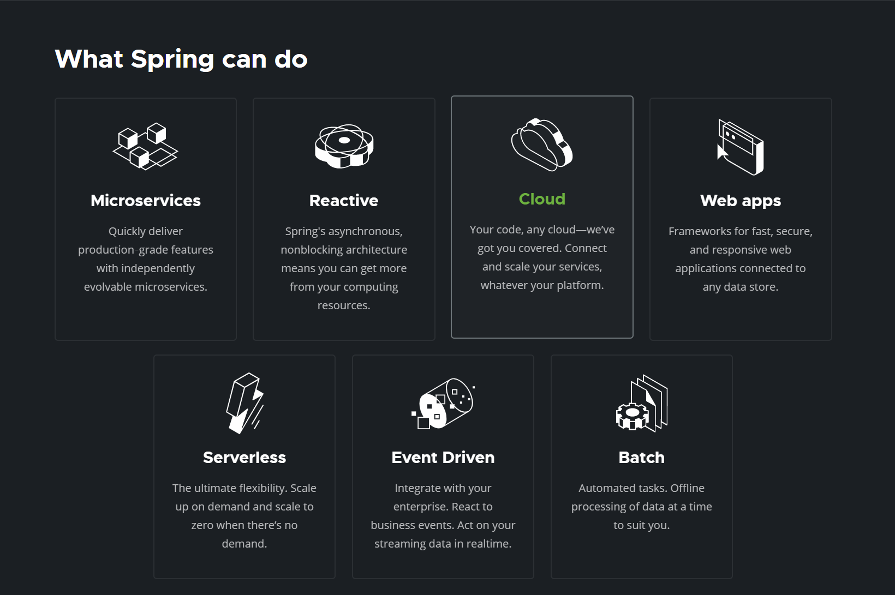
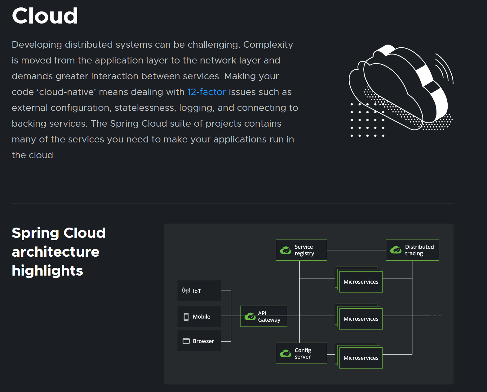
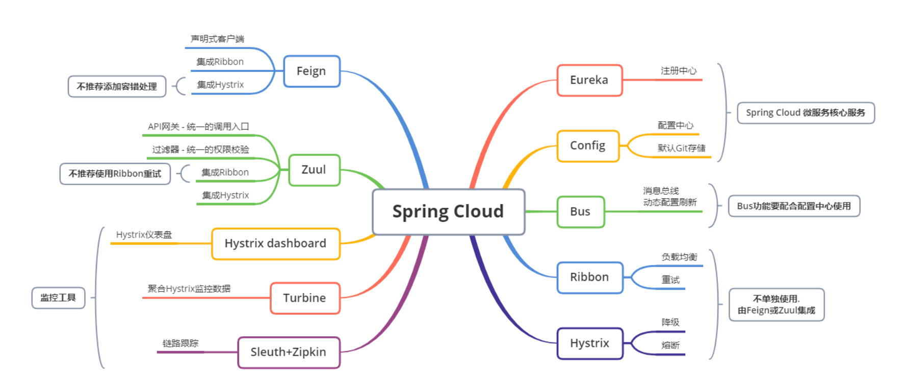
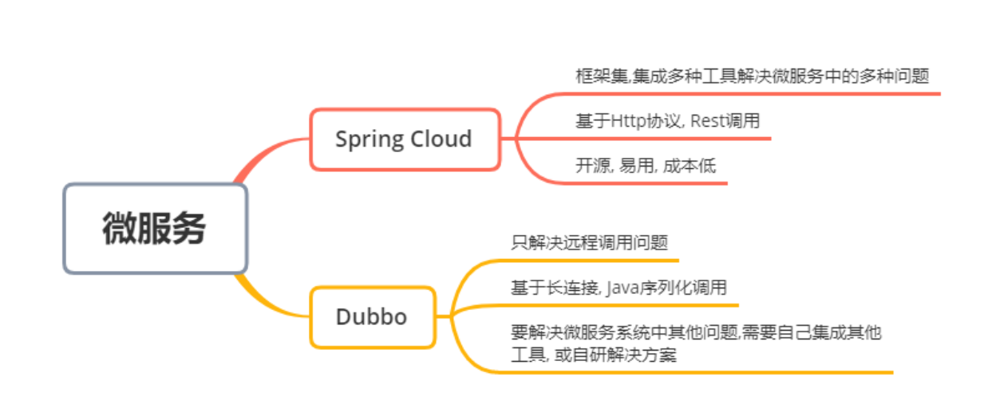
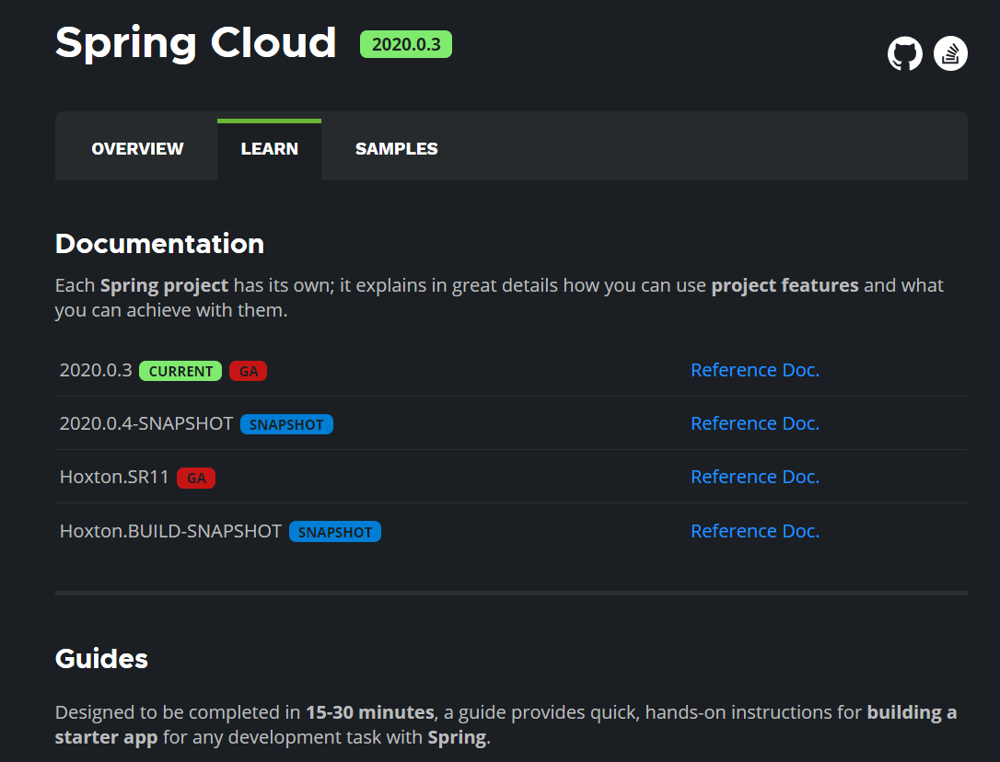

# 微服务简述

## 微服务优缺点

**优点**

- 单一职责原则；

- 每个服务足够内聚，足够小，代码容易理解，这样能聚焦一个指定的业务功能或业务需求；

- 开发简单，开发效率高，一个服务可能就是专一的只干一件事；

- 微服务能够被小团队单独开发，这个团队只需2-5个开发人员组成；

- 微服务是松耦合的，是有功能意义的服务，无论是在开发阶段或部署阶段都是独立的；

- 微服务能使用不同的语言开发；

- 易于和第三方集成，微服务允许容易且灵活的方式集成自动部署，通过持续集成工具，如jenkins，Hudson，bamboo；

- 微服务易于被一个开发人员理解，修改和维护，这样小团队能够更关注自己的工作成果，无需通过合作才能体现价值；

- 微服务允许利用和融合最新技术；

- 微服务只是业务逻辑的代码，不会和HTML，CSS，或其他的界面混合;

- 每个微服务都有自己的存储能力，可以有自己的数据库，也可以有统一的数据库；

**缺点**

- 开发人员要处理分布式系统的复杂性；
- 多服务运维难度，随着服务的增加，运维的压力也在增大；
- 系统部署依赖问题；
- 服务间通信成本问题；
- 数据一致性问题；
- 系统集成测试问题；
- 性能和监控问题；

## 微服务技术栈有那些？

| **微服务技术条目**                      | 落地技术                                                     |
| --------------------------------------- | ------------------------------------------------------------ |
| 服务开发                                | SpringBoot、Spring、SpringMVC 等                             |
| 服务配置与管理                          | Netfix 公司的 Archaius、阿里的 Diamond 等                    |
| 服务注册与发现                          | Eureka、Consul、Zookeeper 等                                 |
| 服务调用                                | Rest、PRC、gRPC                                              |
| 服务熔断器                              | Hystrix、Envoy 等                                            |
| 负载均衡                                | Ribbon、Nginx 等                                             |
| 服务接口调用 (客户端调用服务的简化工具) | Fegin 等                                                     |
| 消息队列                                | Kafka、RabbitMQ、ActiveMQ 等                                 |
| 服务配置中心管理                        | SpringCloudConfig、Chef 等                                   |
| 服务路由 (API 网关)                     | Zuul 等                                                      |
| 服务监控                                | Zabbix、Nagios、Metrics、Specatator 等                       |
| 全链路追踪                              | Zipkin、Brave、Dapper 等                                     |
| 数据流操作开发包                        | SpringCloud Stream(封装与 Redis，Rabbit，Kafka 等发送接收消息) |
| 时间消息总栈                            | SpringCloud Bus                                              |
| 服务部署                                | Docker、OpenStack、Kubernetes 等                             |

## 为什么选择 SpringCloud 作为微服务架构

1. 选型依据

   - 整体解决方案和框架成熟度
   - 社区热度
   - 可维护性
   - 学习曲线

2. 当前各大 IT 公司用的微服务架构有那些？

   - 阿里：dubbo+HFS

   - 京东：JFS

   - 新浪：Motan

   - 当当网：DubboX

     …

3. 各微服务框架对比

| **功能点 / 服务框架** | Netflix/SpringCloud                                          | Motan                                                        | gRPC                        | Thri t   | Dubbo/DubboX                           |
| --------------------- | ------------------------------------------------------------ | ------------------------------------------------------------ | --------------------------- | -------- | -------------------------------------- |
| 功能定位              | 完整的微服务框架                                             | RPC 框架，但整合了 ZK 或 Consul，实现集群环境的基本服务注册发现 | RPC 框架                    | RPC 框架 | 服务框架                               |
| 支持 Rest             | 是，Ribbon 支持多种可拔插的序列号选择                        | 否                                                           | 否                          | 否       | 否                                     |
| 支持 RPC              | 否                                                           | 是 (Hession2)                                                | 是                          | 是       | 是                                     |
| 支持多语言            | 是 (Rest 形式)                                               | 否                                                           | 是                          | 是       | 否                                     |
| 负载均衡              | 是 (服务端 zuul + 客户端 Ribbon)，zuul - 服务，动态路由，云端负载均衡 Eureka（针对中间层服务器） | 是 (客户端)                                                  | 否                          | 否       | 是 (客户端)                            |
| 配置服务              | Netfix Archaius，Spring Cloud Config Server 集中配置         | 是 (Zookeeper 提供)                                          | 否                          | 否       | 否                                     |
| 服务调用链监控        | 是 (zuul)，zuul 提供边缘服务，API 网关                       | 否                                                           | 否                          | 否       | 否                                     |
| 高可用 / 容错         | 是 (服务端 Hystrix + 客户端 Ribbon)                          | 是 (客户端)                                                  | 否                          | 否       | 是 (客户端)                            |
| 典型应用案例          | Netflix                                                      | Sina                                                         | Google                      | Facebook |                                        |
| 社区活跃程度          | 高                                                           | 一般                                                         | 高                          | 一般     | 2017 年后重新开始维护，之前中断了 5 年 |
| 学习难度              | 中等                                                         | 低                                                           | 高                          | 高       | 低                                     |
| 文档丰富程度          | 高                                                           | 一般                                                         | 一般                        | 一般     | 高                                     |
| 其他                  | Spring Cloud Bus 为我们的应用程序带来了更多管理端点          | 支持降级                                                     | Netflix 内部在开发集成 gRPC | IDL 定义 | 实践的公司比较多                       |

# SpringCloud 入门概述

## SpringCloud 是什么？

Spring [官网](https://spring.io/)

**SpringCloud**,基于SpringBoot提供了一套微服务解决方案，包括服务注册与发现，配置中心，全链路监控，服务网关，负载均衡，熔断器等组件，除了基于NetFlix的开源组件做高度抽象封装之外，还有一些选型中立的开源组件。
SpringCloud利用SpringBoot的开发便利性，巧妙地简化了分布式系统基础设施的开发，SpringCloud为开发人员提供了快速构建分布式系统的一些工具，**包括配置管理，服务发现，断路器，路由，微代理，事件总线，全局锁，决策竞选，分布式会话等等，**他们都可以用SpringBoot的开发风格做到一键启动和部署。
SpringBoot并没有重复造轮子，它只是将目前各家公司开发的比较成熟，经得起实际考研的服务框架组合起来通过SpringBoot风格进行再封装，屏蔽掉了复杂的配置和实现原理，**最终给开发者留出了一套简单易懂，易部署和易维护的分布式系统开发工具包。**
SpringCloud是分布式微服务架构下的一站式解决方案，是各个微服务架构落地技术的集合体，俗称**微服务全家桶**。

## SpringCloud 和 SpringBoot 的关系

- SpringBoot 专注于快速方便的开发单个个体微服务；
- SpringCloud 是关注全局的微服务协调整理治理框架，它将 SpringBoot 开发的一个个单体微服务，整合并管理起来，为各个微服务之间提供：配置管理、服务发现、断路器、路由、为代理、事件总栈、全局锁、决策竞选、分布式会话等等集成服务；
- SpringBoot 可以离开 SpringCloud 独立使用，开发项目，但 SpringCloud 离不开 SpringBoot，属于依赖关系；
- **SpringBoot 专注于快速、方便的开发单个个体微服务，SpringCloud 关注全局的服务治理框架；**

## Dubbo 和 SpringCloud 技术选型

**分布式 + 服务治理 Dubbo**

目前成熟的互联网架构，应用服务化拆分 + 消息中间件

**Dubbo 和 SpringCloud 对比**

可以看一下社区活跃度：

https://github.com/dubbo

https://github.com/spring-cloud

**对比结果：**

|              | Dubbo         | SpringCloud                  |
| ------------ | ------------- | ---------------------------- |
| 服务注册中心 | Zookeeper     | Spring Cloud Netfilx Eureka  |
| 服务调用方式 | RPC           | REST API                     |
| 服务监控     | Dubbo-monitor | Spring Boot Admin            |
| 断路器       | 不完善        | Spring Cloud Netfilx Hystrix |
| 服务网关     | 无            | Spring Cloud Netfilx Zuul    |
| 分布式配置   | 无            | Spring Cloud Config          |
| 服务跟踪     | 无            | Spring Cloud Sleuth          |
| 消息总栈     | 无            | Spring Cloud Bus             |
| 数据流       | 无            | Spring Cloud Stream          |
| 批量任务     | 无            | Spring Cloud Task            |

**最大区别：Spring Cloud 抛弃了 Dubbo 的 RPC 通信，采用的是基于 HTTP 的 REST 方式**

严格来说，这两种方式各有优劣。虽然从一定程度上来说，后者牺牲了服务调用的性能，但也避免了上面提到的原生 RPC 带来的问题。而且 REST 相比 RPC 更为灵活，服务提供方和调用方的依赖只依靠一纸契约，不存在代码级别的强依赖，这个优点在当下强调快速演化的微服务环境下，显得更加合适。

**品牌机和组装机的区别**

**社区支持与更新力度的区别**

**总结：** 二者解决的问题域不一样：Dubbo 的定位是一款 RPC 框架，而 SpringCloud 的目标是微服务架构下的一站式解决方案。

## SpringCloud 能干嘛？

- Distributed/versioned configuration 分布式 / 版本控制配置
- Service registration and discovery 服务注册与发现
- Routing 路由
- Service-to-service calls 服务到服务的调用
- Load balancing 负载均衡配置
- Circuit Breakers 断路器
- Distributed messaging 分布式消息管理
- …

## SpringCloud 下载

官网：https://spring.io/projects/spring-cloud

版本号有点特别：

SpringCloud 没有采用数字编号的方式命名版本号，而是采用了伦敦地铁站的名称，**同时根据字母表的顺序来对应版本时间顺序**，比如最早的 Realse 版本：Angel，第二个 Realse 版本：Brixton，然后是 Camden、Dalston、Edgware，目前最新的是 Hoxton SR4 CURRENT GA 通用稳定版。

==**自学参考书：**==

- SpringCloud Netflix 中文文档：https://springcloud.cc/spring-cloud-netflix.html
- SpringCloud 中文 API 文档 (官方文档翻译版)：https://springcloud.cc/spring-cloud-dalston.html
- SpringCloud 中国社区：http://blog.springcloud.cn/
- SpringCloud 中文网：https://springcloud.cc

