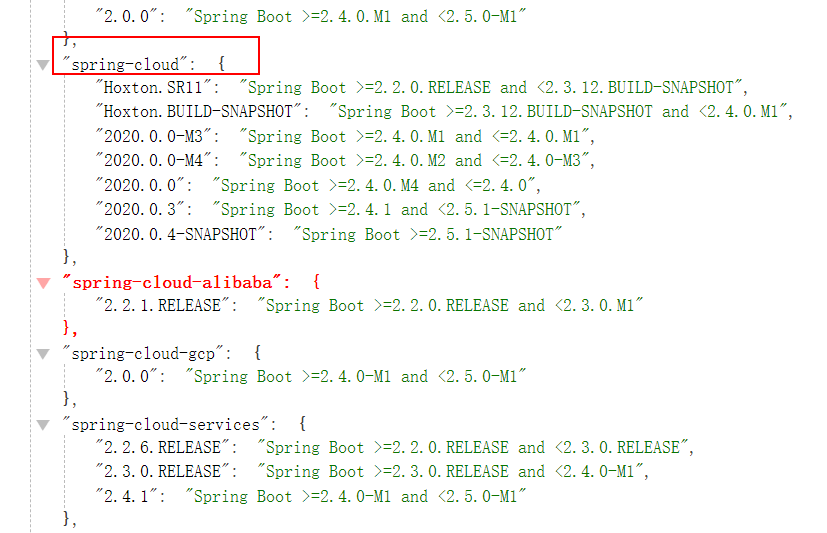
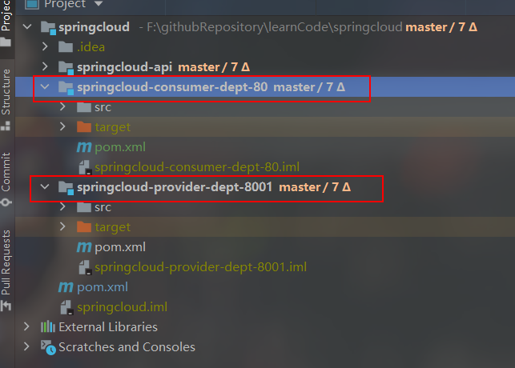
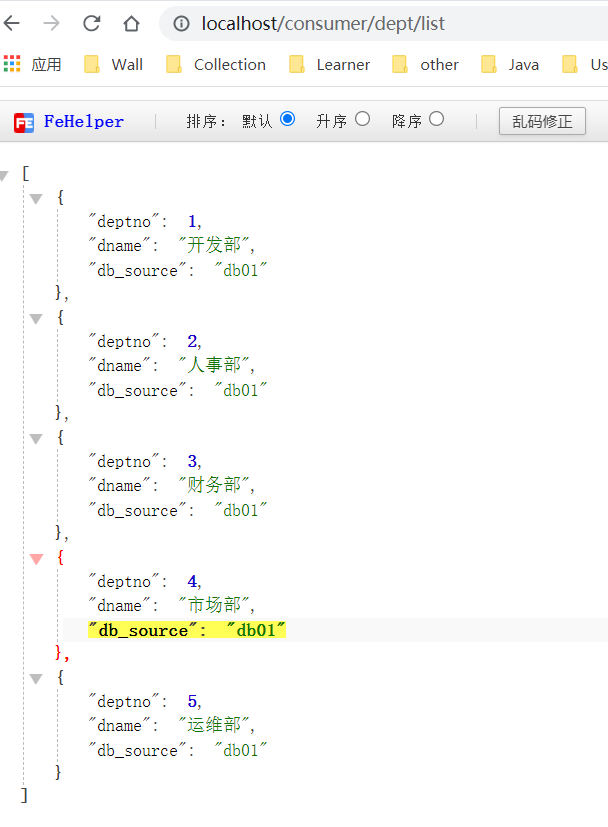

# SpringCloud Rest 学习环境搭建：服务提供者

> 本章主要参考B站up主遇见狂神说的笔记了，主要是流程，基本上是没太大差别，主要版本就行。


# 介绍

- 我们会使用一个 Dept 部门模块做一个微服务通用案例 **Consumer** 消费者 (**Client**) 通过 REST 调用 **Provider** 提供者 (**Server**) 提供的服务。
- 回顾 Spring，SpringMVC，Mybatis 等以往学习的知识。
- Maven 的分包分模块架构复习。

```
一个简单的Maven模块结构是这样的：

-- app-parent: 一个父项目(app-parent)聚合了很多子项目(app-util\app-dao\app-web...)
  |-- pom.xml
  |
  |-- app-core
  ||---- pom.xml
  |
  |-- app-web
  ||---- pom.xml
  ......
```

一个父工程带着多个 Module 子模块

springcloud 父工程 (Project) 下初次带着 3 个子模块(Module)

- springcloud -api 【封装的整体 entity / 接口 / 公共配置等】
- springcloud -consumer-dept-80 【服务提供者】
- springcloud -provider-dept-8001 【服务消费者】


# SpringCloud 版本选择

**大版本说明**

| SpringBoot                       | SpringCloud               | 关系                                       |
| -------------------------------- | ------------------------- | ------------------------------------------ |
| 1.2.x                            | Angel 版本 (天使)         | 兼容 SpringBoot1.2x                        |
| 1.3.x                            | Brixton 版本 (布里克斯顿) | 兼容 SpringBoot1.3x，也兼容 SpringBoot1.4x |
| 1.4.x                            | Camden 版本 (卡姆登)      | 兼容 SpringBoot1.4x，也兼容 SpringBoot1.5x |
| 1.5.x                            | Dalston 版本 (多尔斯顿)   | 兼容 SpringBoot1.5x，不兼容 SpringBoot2.0x |
| 1.5.x                            | Edgware 版本 (埃奇韦尔)   | 兼容 SpringBoot1.5x，不兼容 SpringBoot2.0x |
| 2.0.x                            | Finchley 版本 (芬奇利)    | 兼容 SpringBoot2.0x，不兼容 SpringBoot1.5x |
| 2.1.x                            | Greenwich 版本 (格林威治) |                                            |
| 2.2.x, 2.3.x (Starting with SR5) | Hoxton 版本(霍克斯顿)     |                                            |
| 2.4.x                            | 2020.0.x aka Ilford       |                                            |

……

**实际开发版本关系**



<!--依情况自行选择，本人怕出什么版本问题会很麻烦，就直接参考了教学视频里的版本。-->


# 创建父工程

- 新建父工程项目 springcloud，切记 **packaging 是 pom 模式**
- 主要是定义 POM 文件，将后续各个子模块公用的 jar 包等统一提取出来，类似一个抽象父类

**pom.xml**    (本人比较懒，没有将版本号统一成规范格式 :baby_chick:)

```xml
<?xml version="1.0" encoding="UTF-8"?>
<project xmlns="http://maven.apache.org/POM/4.0.0"
         xmlns:xsi="http://www.w3.org/2001/XMLSchema-instance"
         xsi:schemaLocation="http://maven.apache.org/POM/4.0.0 http://maven.apache.org/xsd/maven-4.0.0.xsd">
    <modelVersion>4.0.0</modelVersion>

    <groupId>cn.redblood</groupId>
    <artifactId>springcloud</artifactId>
    <version>1.0-SNAPSHOT</version>
    <modules>
        <module>springcloud-api</module>
        <module>springcloud-provider-dept-8001</module>
    </modules>

    <properties>
        <maven.compiler.source>8</maven.compiler.source>
        <maven.compiler.target>8</maven.compiler.target>
    </properties>

    <packaging>pom</packaging>

    <dependencyManagement>
        <dependencies>
            <dependency>
                <groupId>org.springframework.cloud</groupId>
                <artifactId>spring-cloud-dependencies</artifactId>
                <version>Greenwich.SR1</version>
                <type>pom</type>
                <scope>import</scope>
            </dependency>
            <dependency>
                <groupId>org.springframework.boot</groupId>
                <artifactId>spring-boot-dependencies</artifactId>
                <version>2.1.4.RELEASE</version>
                <type>pom</type>
                <scope>import</scope>
            </dependency>
            <dependency>
                <groupId>mysql</groupId>
                <artifactId>mysql-connector-java</artifactId>
                <version>8.0.21</version>
            </dependency>
            <dependency>
                <groupId>com.alibaba</groupId>
                <artifactId>druid</artifactId>
                <version>1.1.10</version>
            </dependency>
            <dependency>
                <groupId>org.mybatis.spring.boot</groupId>
                <artifactId>mybatis-spring-boot-starter</artifactId>
                <version>1.3.2</version>
            </dependency>
            <dependency>
                <groupId>junit</groupId>
                <artifactId>junit</artifactId>
                <version>4.13.1</version>
                <scope>test</scope>
            </dependency>
            <dependency>
                <groupId>org.projectlombok</groupId>
                <artifactId>lombok</artifactId>
                <version>1.18.16</version>
            </dependency>
            <dependency>
                <groupId>log4j</groupId>
                <artifactId>log4j</artifactId>
                <version>1.2.17</version>
            </dependency>
            <dependency>
                <groupId>ch.qos.logback</groupId>
                <artifactId>logback-core</artifactId>
                <version>1.2.3</version>
            </dependency>
        </dependencies>
    </dependencyManagement>

    <build>
        <plugins>
            <plugin>
                <groupId>org.apache.maven.plugins</groupId>
                <artifactId>maven-compiler-plugin</artifactId>
                <version>3.8.0</version>
                <configuration>
                    <source>1.8</source>
                    <target>1.8</target>
                </configuration>
            </plugin>
        </plugins>
    </build>

</project>
```

父工程为 springcloud，其下有多个子 module，详情参考完整代码了解()



springcloud-provider-dept-8001 的 dao 接口调用 springcloud-api 模块下的 pojo，可使用在 springcloud-provider-dept-8001 的 pom 文件导入 springcloud-api 模块依赖的方式：

```xml
<dependency>
    <groupId>cn.redblood</groupId>
    <artifactId>springcloud-api</artifactId>
    <version>1.0-SNAPSHOT</version>
</dependency>
```

<!--springcloud-consumer-dept-80 和 springcloud-provider-dept-8001 的 pom.xml 和父工程下的依赖基本一样，可直接参考完整代码。-->

springcloud-consumer-dept-80 访问 springcloud-provider-dept-8001 下的 controller 使用 REST 方式

如 **DeptConsumerController.java**

```java
package cn.redblood.springcloud.controller;

import cn.redblood.springcloud.pojo.Dept;
import org.springframework.web.bind.annotation.PathVariable;
import org.springframework.web.bind.annotation.RequestMapping;
import org.springframework.web.bind.annotation.RestController;
import org.springframework.web.client.RestTemplate;

import javax.annotation.Resource;
import java.util.List;

/**
 * @author wantao
 */
@RestController
public class DeptConsumerController {

    /**
     * 理解：消费者，不应该有service层
     * RestTemplate ... 供我们直接调用就可以！注册到spring中
     * （url，实体：map，Class<T> responseType）
     */

    private static final String REST_URL_PREFIX = "http://localhost:8001";

    /**
     * 提供多种便捷访问远程http服务的方法，简单的restful服务模板
     */
    @Resource
    private RestTemplate restTemplate;

    @RequestMapping("/consumer/dept/get/{id}")
    public Dept get(@PathVariable("id") Long id) {
        return restTemplate.getForObject(REST_URL_PREFIX + "/dept/get/" + id, Dept.class);

    }

    @RequestMapping("/consumer/dept/add")
    public boolean add(Dept dept) {
        return restTemplate.postForObject(REST_URL_PREFIX + "/dept/add", dept, Boolean.class);
    }

    @RequestMapping("/consumer/dept/list")
    public List<Dept> getList() {
        return restTemplate.getForObject(REST_URL_PREFIX + "/dept/list", List.class);
    }

}

```

**使用 RestTemplete 建议先放入 Spring 容器中**

**ConfigBean.java**

```java
package cn.redblood.springcloud.config;

import org.springframework.context.annotation.Bean;
import org.springframework.context.annotation.Configuration;
import org.springframework.web.client.RestTemplate;

/**
 * @author wantao
 * @Configuration => spring 里的 applicationContext.xml
 */
@Configuration
public class ConfigBean {

    //配置负载均衡实现RestTemplate
    // IRule
    // RoundRobinRule 轮询
    // RandomRule 随机
    // AvailabilityFilteringRule ： 会先过滤掉，跳闸，访问故障的服务~，对剩下的进行轮询~
    // RetryRule ： 会先按照轮询获取服务~，如果服务获取失败，则会在指定的时间内进行，重试
    
    @Bean
    public RestTemplate getRestTemplate() {
        return new RestTemplate();
    }

}

```


# 测试

直接使用远程调用



远程调用成功，表示没有问题。:hugs:

