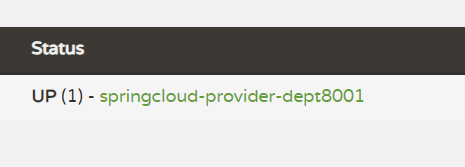

# 什么是Eureka

- Netflix 在涉及 Eureka 时，遵循的就是 API 原则.
- Eureka 是 Netflix 的有个子模块，也是核心模块之一。Eureka 是基于 REST 的服务，用于定位服务，以实现云端中间件层服务发现和故障转移，服务注册与发现对于微服务来说是非常重要的，有了服务注册与发现，只需要使用服务的标识符，就可以访问到服务，而不需要修改服务调用的配置文件了，功能类似于 Dubbo 的注册中心，比如 Zookeeper.


# 原理理解

- **Eureka 基本的架构**
  - Springcloud 封装了 Netflix 公司开发的 Eureka 模块来实现服务注册与发现 (对比 Zookeeper).
  - Eureka 采用了 C-S 的架构设计，EurekaServer 作为服务注册功能的服务器，他是**服务注册中心**.
  - 而系统中的其他微服务，使用 Eureka 的客户端连接到 EurekaServer 并维持心跳连接。这样系统的维护人员就可以通过 EurekaServer 来监控系统中各个微服务是否正常运行，Springcloud 的一些其他模块 (比如 Zuul) 就可以通过 EurekaServer 来发现系统中的其他微服务，并执行相关的逻辑.


- 和 Dubbo 架构对比.


- Eureka 包含两个组件：**Eureka Server** 和 **Eureka Client**.
- Eureka Server 提供服务注册，各个节点启动后，回在 EurekaServer 中进行注册，这样 Eureka Server 中的服务注册表中将会储存所有可用服务节点的信息，服务节点的信息可以在界面中直观的看到.
- Eureka Client 是一个 Java 客户端，用于简化 EurekaServer 的交互，客户端同时也具备一个内置的，使用**轮询负载算法**的**负载均衡器**。在应用启动后，将会向 EurekaServer 发送心跳 (默认周期为 30 秒) 。如果 Eureka Server 在多个心跳周期内没有接收到某个节点的心跳，EurekaServer 将会从服务注册表中把这个服务节点移除掉 (默认周期为 90s).
- **三大角色**
  - Eureka Server：提供服务的注册与发现
  - Service Provider：服务生产方，将自身服务注册到 Eureka 中，从而使服务消费方能够找到
  - Service Consumer：服务消费方，从 Eureka 中获取注册服务列表，从而找到消费服务
- 目前工程状况


# 构建步骤

## eureka-server

1. springcloud-eureka-7001 模块建立
2. pom.xml 配置

```xml
<!--导包~-->
<dependencies>
    <!-- https://mvnrepository.com/artifact/org.springframework.cloud/spring-cloud-starter-eureka-server -->
    <!--导入Eureka Server依赖-->
    <dependency>
        <groupId>org.springframework.cloud</groupId>
        <artifactId>spring-cloud-starter-eureka-server</artifactId>
        <version>1.4.6.RELEASE</version>
    </dependency>
    <!--热部署工具-->
    <dependency>
        <groupId>org.springframework.boot</groupId>
        <artifactId>spring-boot-devtools</artifactId>
    </dependency>
</dependencies>
```

3. application.yml

```yml
server:
  port: 7001

# Eureka配置
eureka:
  instance:
    # Eureka服务端的实例名字
    hostname: 127.0.0.1
  client:
    # 表示是否向 Eureka 注册中心注册自己(这个模块本身是服务器,所以不需要)
    register-with-eureka: false
    # fetch-registry如果为false,则表示自己为注册中心,客户端的话为 ture
    fetch-registry: false
    # Eureka监控页面~
    service-url:
      defaultZone: http://${eureka.instance.hostname}:${server.port}/eureka/
```

> **扩展：**Eureka的一些其它配置信息（此处参阅“听到微笑”的笔记:happy:）
>
> ```yaml
> spring:
>   application:
>     #spring的应用名称，这里需要指定，不然在Eureka管理页面，Application name 则会显示“UNKNOW”，注意与eureka.instance.instance-id区分，
>     name: admin-dl
> eureka:
>   instance:
>     #每间隔2s，向服务端发送一次心跳，证明自己依然"存活"
>     lease-renewal-interval-in-seconds: 2
>     #告诉服务端，如果我10s之内没有给你发心跳，就代表我故障了，将我踢出掉
>     lease-expiration-duration-in-seconds: 10
>     #告诉服务端，服务实例以IP作为链接，而不是取机器名
>     prefer-ip-address: true
>     #告诉服务端，服务实例的ID，实例ID必须保证全局唯一，同一服务的多个实例之间也需要保证ID唯一。
>     instance-id: admin-dl
>   client:
>     service-url:
>       defaultZone: http://localhost:8761/eureka
> ```

源码中 Eureka 的默认端口以及访问路径:


4. 主启动类

```java
package cn.redblood.springcloud;

import org.springframework.boot.SpringApplication;
import org.springframework.boot.autoconfigure.SpringBootApplication;
import org.springframework.cloud.netflix.eureka.server.EnableEurekaServer;

/**
 * @author wantao
 */
@SpringBootApplication
@EnableEurekaServer // 服务端的启动类，可以接受别人注册进来
public class EurekaServer_7001 {

    public static void main(String[] args) {
        SpringApplication.run(EurekaServer_7001.class, args);
    }
}

```

5. 启动成功后访问 http://localhost:7001/ 得到以下页面:下图中是已经提前注册好了一个服务


## eureka-client

**调整之前创建的 springlouc-provider-dept-8001**

1. 导入 Eureka 依赖

```xml
<!--Eureka依赖-->
<!-- https://mvnrepository.com/artifact/org.springframework.cloud/spring-cloud-starter-eureka -->
<dependency>
    <groupId>org.springframework.cloud</groupId>
    <artifactId>spring-cloud-starter-eureka</artifactId>
    <version>1.4.6.RELEASE</version>
</dependency>
```

2. application 中新增 Eureka配置

```yml
# Eureka配置：配置服务注册中心地址
eureka:
  client:
    service-url:
      defaultZone: http://localhost:7001/eureka/
```

3. 为主启动类添加 @EnableEurekaClient 注解

```java
package cn.redblood.springcloud;

import org.springframework.boot.SpringApplication;
import org.springframework.boot.autoconfigure.SpringBootApplication;
import org.springframework.cloud.client.discovery.EnableDiscoveryClient;
import org.springframework.cloud.netflix.eureka.EnableEurekaClient;

/**
 * 启动类
 *
 * @author wantao
 */
@SpringBootApplication
@EnableDiscoveryClient
@EnableEurekaClient //在服务启动会后自动注册到Eureka中！
public class DeptProvider_8001 {

    public static void main(String[] args) {
        SpringApplication.run(DeptProvider_8001.class, args);
    }
}
```

4. 先启动 7001 服务端后启动 8001 客户端进行测试，然后访问监控页 http://localhost:7001/ 查看结果如图，**成功**

<!--这里继续沿用上面的图-->


5. 修改 Eureka 上的默认描述信息 （图略:beetle:）

```yaml
# Eureka配置：配置服务注册中心地址
eureka:
  client:
    service-url:
      defaultZone: http://localhost:7001/eureka/
  instance:
    instance-id: springcloud-provider-dept-8001 #修改Eureka上的默认描述信息
```

如果此时停掉 springcloud-provider-dept-8001 等 **30s** 后 监控会开启保护机制：

上图的红色警告就是这个 :point_up:

6. 配置关于服务加载的监控信息


pom.xml 中添加依赖

```xml
<!--actuator完善监控信息-->
<dependency>
 <groupId>org.springframework.boot</groupId>
 <artifactId>spring-boot-starter-actuator</artifactId>
</dependency>
```

application.yml 中添加配置

```yaml
#info配置
info:
  app.name: redblood-springcloud
  company.name: www.redblood.cn
```

此时刷新监控页，点击进入



跳转新页面显示如下内容：


# EureKa 自我保护机制

> 一句话总结就是：**某时刻某一个微服务不可用，eureka 不会立即清理，依旧会对该微服务的信息进行保存！**


==关于保护机制简述：==

Eureka Server 在运行期间会去统计心跳失败比例在 15 分钟之内是否低于 85%，如果低于 85%，Eureka Server 会将这些实例保护起来，让这些实例不会过期，但是在保护期内如果服务刚好这个服务提供者非正常下线了，此时服务消费者就会拿到一个无效的服务实例，此时会调用失败，对于这个问题需要服务消费者端要有一些容错机制，如重试，断路器等。

我们在单机测试的时候很容易满足心跳失败比例在 15 分钟之内低于 85%，这个时候就会触发 Eureka 的保护机制，一旦开启了保护机制，则服务注册中心维护的服务实例就不是那么准确了，此时我们可以使用`eureka.server.enable-self-preservation=false`来关闭保护机制，这样可以确保注册中心中不可用的实例被及时的剔除（**不推荐**）。

自我保护模式被激活的条件是：在 1 分钟后，`Renews (last min) < Renews threshold`。

这两个参数的意思：

- `Renews threshold`：**Eureka Server 期望每分钟收到客户端实例续约的总数**。
- `Renews (last min)`：**Eureka Server 最后 1 分钟收到客户端实例续约的总数**。

---


- 默认情况下，当 eureka server 在一定时间内没有收到实例的心跳，便会把该实例从注册表中删除（**默认是 90 秒**），但是，如果短时间内丢失大量的实例心跳，便会触发 eureka server 的自我保护机制，比如在开发测试时，需要频繁地重启微服务实例，但是我们很少会把 eureka server 一起重启（因为在开发过程中不会修改 eureka 注册中心），**当一分钟内收到的心跳数大量减少时，会触发该保护机制**。可以在 eureka 管理界面看到 Renews threshold 和 Renews(last min)，当后者（最后一分钟收到的心跳数）小于前者（心跳阈值）的时候，触发保护机制，会出现红色的警告：`EMERGENCY!EUREKA MAY BE INCORRECTLY CLAIMING INSTANCES ARE UP WHEN THEY'RE NOT.RENEWALS ARE LESSER THAN THRESHOLD AND HENCE THE INSTANCES ARE NOT BEGING EXPIRED JUST TO BE SAFE.`从警告中可以看到，eureka 认为虽然收不到实例的心跳，但它认为实例还是健康的，eureka 会保护这些实例，不会把它们从注册表中删掉。
- 该保护机制的目的是避免网络连接故障，在发生网络故障时，微服务和注册中心之间无法正常通信，但服务本身是健康的，不应该注销该服务，如果 eureka 因网络故障而把微服务误删了，那即使网络恢复了，该微服务也不会重新注册到 eureka server 了，因为只有在微服务启动的时候才会发起注册请求，后面只会发送心跳和服务列表请求，这样的话，该实例虽然是运行着，但永远不会被其它服务所感知。所以，eureka server 在短时间内丢失过多的客户端心跳时，会进入自我保护模式，该模式下，eureka 会保护注册表中的信息，不在注销任何微服务，当网络故障恢复后，eureka 会自动退出保护模式。自我保护模式可以让集群更加健壮。
- 但是我们在开发测试阶段，需要频繁地重启发布，如果触发了保护机制，则旧的服务实例没有被删除，这时请求有可能跑到旧的实例中，而该实例已经关闭了，这就导致请求错误，影响开发测试。所以，在开发测试阶段，我们可以把自我保护模式关闭，只需在 eureka server 配置文件中加上如下配置即可：`eureka.server.enable-self-preservation=false`【不推荐关闭自我保护机制】

---

1. 注册进来的微服务，获取一些消息（团队开发会用到）

```java
/**
 * DiscoveryClient 可以用来获取一些配置的信息，得到具体的微服务！
 */
@Resource
private DiscoveryClient client;

@GetMapping("discovery")
public Object discovery() {
     List<String> services = client.getServices();
     log.warn("微服务列表清单: {}", services);

      List<ServiceInstance> instances = client.getInstances("SPRINGCLOUD-PROVIDER-DEPT");
      int i = 0;
      for (ServiceInstance instance : instances) {
      	i++;
        System.out.println("第" + i + "个实例的Host: {}" + instance.getHost());
        System.out.println("第" + i + "个实例的Post: {}" + instance.getPort());
        System.out.println("第" + i + "个实例的Uri: {}" + instance.getUri());
        System.out.println("第" + i + "个实例的ServiceId: {}" + instance.getServiceId());
        }
     return this.client;
}
```


主启动类中加入 @EnableDiscoveryClient 注解

```java
@SpringBootApplication
// @EnableEurekaClient 开启Eureka客户端注解，在服务启动后自动向注册中心注册服务
@EnableEurekaClient
// @EnableEurekaClient 开启服务发现客户端的注解，可以用来获取一些配置的信息，得到具体的微服务
@EnableDiscoveryClient
public class DeptProvider_8001 {
    ...
}
```

结果如图：


# 集群环境配置


## 初始化

新建 springcloud-eureka-7002、springcloud-eureka-7003 模块

1. 为 pom.xml 添加依赖 (与 springcloud-eureka-7001 相同)

```xml
<!--导包~-->
<dependencies>
    <!-- https://mvnrepository.com/artifact/org.springframework.cloud/spring-cloud-starter-eureka-server -->
    <!--导入Eureka Server依赖-->
    <dependency>
        <groupId>org.springframework.cloud</groupId>
        <artifactId>spring-cloud-starter-eureka-server</artifactId>
        <version>1.4.6.RELEASE</version>
    </dependency>
    <!--热部署工具-->
    <dependency>
        <groupId>org.springframework.boot</groupId>
        <artifactId>spring-boot-devtools</artifactId>
    </dependency>
</dependencies>
```

2. application.yml 配置 (与 springcloud-eureka-7001 相同)

```yaml
server:
  port: 7003

# Eureka配置
eureka:
  instance:
    hostname: localhost # Eureka服务端的实例名字
  client:
    register-with-eureka: false # 表示是否向 Eureka 注册中心注册自己(这个模块本身是服务器,所以不需要)
    fetch-registry: false # fetch-registry如果为false,则表示自己为注册中心
    service-url: # 监控页面~
      # 重写Eureka的默认端口以及访问路径 --->http://localhost:7001/eureka/
      defaultZone: http://${eureka.instance.hostname}:${server.port}/eureka/
```

3. 主启动类 (与 springcloud-eureka-7001 相同)

```java
package cn.redblood.springcloud;

import org.springframework.boot.SpringApplication;
import org.springframework.boot.autoconfigure.SpringBootApplication;
import org.springframework.cloud.netflix.eureka.server.EnableEurekaServer;

/**
 * @author wantao
 */
@SpringBootApplication
@EnableEurekaServer // 服务端的启动类，可以接受别人注册进来
public class EurekaServer_7003 {

    public static void main(String[] args) {
        SpringApplication.run(EurekaServer_7003.class, args);
    }
}

```


## 集群成员相互关联

配置一些自定义本机名字，找到本机 hosts 文件并打开


在 hosts 文件最后加上，要访问的本机名称，默认是 localhost


修改 application.yml 的配置，如图为 springcloud-eureka-7001 配置，springcloud-eureka-7002/springcloud-eureka-7003 同样分别修改为其对应的名称即可 ,  在集群中使 springcloud-eureka-7001 关联 springcloud-eureka-7002、springcloud-eureka-7003。完整的 springcloud-eureka-7001 下的 application.yml 如下：

```yaml
server:
  port: 7001

#Eureka配置
eureka:
  instance:
    hostname: eureka7001.com #Eureka服务端的实例名称
  client:
    register-with-eureka: false # 表示是否向eureka注册中心注册自己
    fetch-registry: false # fetch-registry如果为false，则表示自己为注册中心
    service-url: # 监控页面
      # 重写Eureka的默认端口以及访问路径 --->http://localhost:7001/eureka/
      # 单机： defaultZone: http://${eureka.instance.hostname}:${server.port}/eureka/
      # 集群（关联）：
      defaultZone: http://eureka7002.com:7002/eureka/,http://eureka7003.com:7003/eureka/

```

springcloud-eureka-7002、springcloud-eureka-7003 配置方式同理可得.

```yaml
server:
  port: 7002

#Eureka配置
eureka:
  instance:
    hostname: eureka7002.com #Eureka服务端的实例名称
  client:
    register-with-eureka: false # 表示是否向eureka注册中心注册自己
    fetch-registry: false # fetch-registry如果为false，则表示自己为注册中心
    service-url: # 监控页面
      defaultZone: http://eureka7001.com:7001/eureka/,http://eureka7003.com:7003/eureka/
```

```yaml
server:
  port: 7003

#Eureka配置
eureka:
  instance:
    hostname: eureka7003.com #Eureka服务端的实例名称
  client:
    register-with-eureka: false # 表示是否向eureka注册中心注册自己
    fetch-registry: false # fetch-registry如果为false，则表示自己为注册中心
    service-url: # 监控页面
      defaultZone: http://eureka7001.com:7001/eureka/,http://eureka7002.com:7002/eureka/

```

通过 springcloud-provider-dept-8001 下的 yml 配置文件，修改 **Eureka 配置：配置服务注册中心地址**

```yaml
#Eureka配置，服务注册到哪里
eureka:
  client:
    service-url:
      # 注册中心地址7001-7003
      defaultZone: http://eureka7001.com:7001/eureka/,http://eureka7002.com:7002/eureka/,http://eureka7003.com:7003/eureka/
  instance:
    instance-id: springcloud-provider-dept8001 #修改Eureka上的默认描述信息

#info配置
info:
  app.name: redblood-springcloud
  company.name: www.redblood.cn


```

这样模拟集群就搭建好了，就可以把一个项目挂载到三个服务器上了


