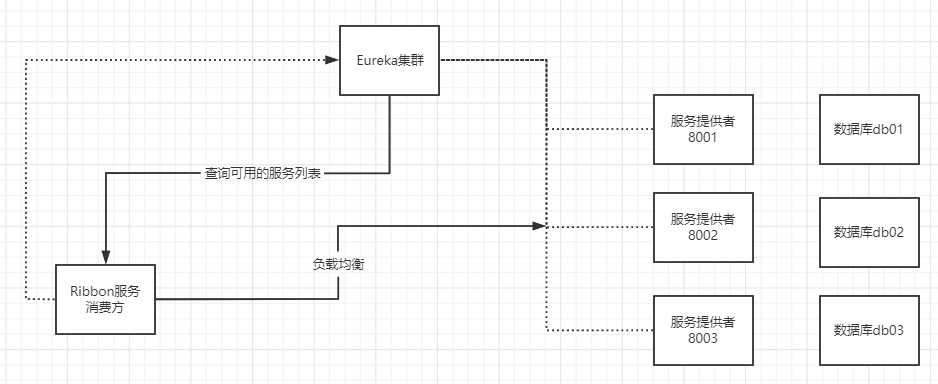

Ribbon：负载均衡 (基于客户端)

# 一、负载均衡以及 Ribbon

**Ribbon 是什么？**

- Spring Cloud Ribbon 是基于 Netflix Ribbon 实现的一套**客户端负载均衡的工具**。
- 简单的说，Ribbon 是 Netflix 发布的开源项目，主要功能是提供客户端的软件负载均衡算法，将 Netflix 的中间层服务连接在一起。Ribbon 的客户端组件提供一系列完整的配置项，如：连接超时、重试等。简单的说，就是在配置文件中列出 LoadBalancer (简称 LB：负载均衡) 后面所有的及其，Ribbon 会自动的帮助你基于某种规则 (如简单轮询，随机连接等等) 去连接这些机器。我们也容易使用 Ribbon 实现自定义的负载均衡算法！

**Ribbon 能干嘛？**

- Spring Cloud Ribbon 是基于 Netflix Ribbon 实现的一套**客户端负载均衡的工具**。
- 简单的说，Ribbon 是 Netflix 发布的开源项目，主要功能是提供客户端的软件负载均衡算法，将 Netflix 的中间层服务连接在一起。Ribbon 的客户端组件提供一系列完整的配置项，如：连接超时、重试等。简单的说，就是在配置文件中列出 LoadBalancer (简称 LB：负载均衡) 后面所有的及其，Ribbon 会自动的帮助你基于某种规则 (如简单轮询，随机连接等等) 去连接这些机器。我们也容易使用 Ribbon 实现自定义的负载均衡算法！

Ribbon 能干嘛？


- LB，即负载均衡 (LoadBalancer) ，在微服务或分布式集群中经常用的一种应用。
- 负载均衡简单的说就是将用户的请求平摊的分配到多个服务上，从而达到系统的 HA (高用)。
- 常见的负载均衡软件有 Nginx、Lvs 等等。
- Dubbo、SpringCloud 中均给我们提供了负载均衡，**SpringCloud 的负载均衡算法可以自定义**。
- 负载均衡简单分类：
  - 集中式 LB
    - 即在服务的提供方和消费方之间使用独立的 LB 设施，如 **Nginx(反向代理服务器)**，由该设施负责把访问请求通过某种策略转发至服务的提供方！
  - 进程式 LB
    - 将 LB 逻辑集成到消费方，消费方从服务注册中心获知有哪些地址可用，然后自己再从这些地址中选出一个合适的服务器。
    - **Ribbon 就属于进程内 LB**，它只是一个类库，集成于消费方进程，消费方通过它来获取到服务提供方的地址！


# 二、集成 Ribbon

**springcloud-consumer-dept-80** 向 pom.xml 中添加 Ribbon 和 Eureka 依赖

```xml
<!--Ribbon-->
<dependency>
    <groupId>org.springframework.cloud</groupId>
    <artifactId>spring-cloud-starter-ribbon</artifactId>
    <version>1.4.6.RELEASE</version>
</dependency>
<!--Eureka: Ribbon需要从Eureka服务中心获取要拿什么-->
<dependency>
    <groupId>org.springframework.cloud</groupId>
    <artifactId>spring-cloud-starter-eureka</artifactId>
    <version>1.4.6.RELEASE</version>
</dependency>
```

在 application.yml 文件中配置 Eureka

``` yaml
# Eureka配置
eureka:
  client:
    register-with-eureka: false # 不向 Eureka注册自己
    service-url: # 从三个注册中心中随机取一个去访问
      defaultZone: http://eureka7001.com:7001/eureka/,http://eureka7002.com:7002/eureka/,http://eureka7003.com:7003/eureka/
```

主启动类加上 @EnableEurekaClient 注解，开启 Eureka

```java
//Ribbon 和 Eureka 整合以后，客户端可以直接调用，不用关心IP地址和端口号
@SpringBootApplication
@EnableEurekaClient //开启Eureka 客户端
public class DeptConsumer_80 {
    public static void main(String[] args) {
        SpringApplication.run(DeptConsumer_80.class, args);
    }
}
```

自定义 Spring 配置类：ConfigBean.java 配置负载均衡实现 RestTemplate

```java
@Configuration
public class ConfigBean {//@Configuration -- spring  applicationContext.xml

    @LoadBalanced //配置负载均衡实现RestTemplate
    @Bean
    public RestTemplate getRestTemplate() {
        return new RestTemplate();
    }
}
```

修改 conroller：DeptConsumerController.java

```java
//Ribbon:我们这里的地址，应该是一个变量，通过服务名来访问
//private static final String REST_URL_PREFIX = "http://localhost:8001";
private static final String REST_URL_PREFIX = "http://SPRINGCLOUD-PROVIDER-DEPT";
```


# 三、使用 Ribbon 实现负载均衡

流程图：



1. 新建两个服务提供者 Moudle：springcloud-provider-dept-8003、springcloud-provider-dept-8002

2. 参照 springcloud-provider-dept-8001 依次为另外两个 Moudle 添加 pom.xml 依赖 、resourece 下的 mybatis 和 application.yml 配置，Java 代码

3. 启动所有服务测试 (根据自身电脑配置决定启动服务的个数)，访问 http://eureka7001.com:7002 / 查看结果


测试访问 http://localhost/consumer/dept/list 这时候随机访问的是服务提供者 8003


再次访问 http://localhost/consumer/dept/list 这时候随机的是服务提供者 8001


以上这种**每次访问 http://localhost/consumer/dept/list 随机访问集群中某个服务提供者，这种情况叫做轮询**，轮询算法在 SpringCloud 中可以自定义。

**如何切换或者自定义规则呢？**

在 springcloud-provider-dept-80 模块下的 ConfigBean 中进行配置，切换使用不同的规则

```java
public class ConfigBean {//@Configuration -- spring  applicationContext.xml

    /**
     * IRule:
     * RoundRobinRule 轮询策略
     * RandomRule 随机策略
     * AvailabilityFilteringRule ： 会先过滤掉，跳闸，访问故障的服务~，对剩下的进行轮询~
     * RetryRule ： 会先按照轮询获取服务~，如果服务获取失败，则会在指定的时间内进行，重试
     */
    @Bean
    public IRule myRule() {
        return new RandomRule();//使用随机策略
        //return new RoundRobinRule();//使用轮询策略
        //return new AvailabilityFilteringRule();//使用轮询策略
        //return new RetryRule();//使用轮询策略
    }
}
```

也可以自定义规则，在 myrule 包下自定义一个配置类 RedBloodRule.java，注意：**该包不要和主启动类所在的包同级，要跟启动类所在包同级**：


RedBloodRule.java:

```java
public class RedBloodRule {

    @Bean
    public IRule myRule(){
        return new MyRandomRule();
    }
}
```

主启动类开启负载均衡并指定自定义的 RedBloodRule 配置类

```java
/**
 * @author wantao
 */
@SpringBootApplication
@EnableEurekaClient
// 在微服务启动的时候就能去加载我们自定义的Ribbon类
@RibbonClient(name = "SPRINGCLOUD-PROVIDER-DEPT",configuration = RedBloodRule.class)
public class DeptConsumer_80 {

    public static void main(String[] args) {
        SpringApplication.run(DeptConsumer_80.class, args);
    }
}
```

自定义的规则 (这里我们参考 Ribbon 中默认的规则代码自己稍微改动)：MyRandomRule.java

```java
public class MyRandomRule extends AbstractLoadBalancerRule {

    /**
     * 每个服务访问5次则换下一个服务(总共3个服务)
     * <p>
     * total=0,默认=0,如果=5,指向下一个服务节点
     * index=0,默认=0,如果total=5,index+1
     */
    private int total = 0;//被调用的次数
    private int currentIndex = 0;//当前是谁在提供服务

    //@edu.umd.cs.findbugs.annotations.SuppressWarnings(value = "RCN_REDUNDANT_NULLCHECK_OF_NULL_VALUE")
    public Server choose(ILoadBalancer lb, Object key) {
        if (lb == null) {
            return null;
        }
        Server server = null;

        while (server == null) {
            if (Thread.interrupted()) {
                return null;
            }
            List<Server> upList = lb.getReachableServers();//获得当前活着的服务
            List<Server> allList = lb.getAllServers();//获取所有的服务

            int serverCount = allList.size();
            if (serverCount == 0) {
                /*
                 * No servers. End regardless of pass, because subsequent passes
                 * only get more restrictive.
                 */
                return null;
            }

            //int index = chooseRandomInt(serverCount);//生成区间随机数
            //server = upList.get(index);//从或活着的服务中,随机获取一个

            //=====================自定义代码=========================

            if (total < 5) {
                server = upList.get(currentIndex);
                total++;
            } else {
                total = 0;
                currentIndex++;
                if (currentIndex > upList.size()) {
                    currentIndex = 0;
                }
                server = upList.get(currentIndex);//从活着的服务中,获取指定的服务来进行操作
            }
            
            //======================================================
            
            if (server == null) {
                /*
                 * The only time this should happen is if the server list were
                 * somehow trimmed. This is a transient condition. Retry after
                 * yielding.
                 */
                Thread.yield();
                continue;
            }
            if (server.isAlive()) {
                return (server);
            }
            // Shouldn't actually happen.. but must be transient or a bug.
            server = null;
            Thread.yield();
        }
        return server;
    }

    protected int chooseRandomInt(int serverCount) {
        return ThreadLocalRandom.current().nextInt(serverCount);
    }

    @Override
    public Server choose(Object key) {
        return choose(getLoadBalancer(), key);
    }

    @Override
    public void initWithNiwsConfig(IClientConfig clientConfig) {
        // TODO Auto-generated method stub
    }
}
```


