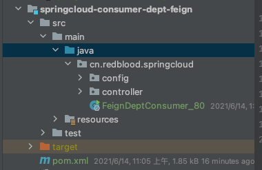
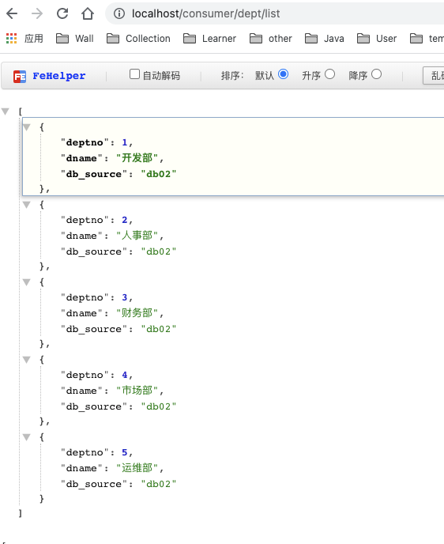

# 一、Feign 简介

> Feign 是 Netflix 公司开发的一个声明式的 REST 调用客户端。 Spring Cloud Feign 对 Ribbon 负载均衡进行了简化，在其基础上进行了进一步的封装，它是一种声明式的调用方式，它的使用方法是定义一个接口，然后在接口上添加注解，使其支持了Spring MVC标准注解和HttpMessageConverters，Feign可以与Eureka和Ribbon组合使用以支持负载均衡。
>
> Spring Cloud Feign 对 Ribbon 负载均衡进行了简化，在其基础上进行了进一步的封装，在配置上大大简化了开发工作，它是一种声明式的调用方式，它的使用方法是定义一个接口，然后在接口上添加注解，使其支持了Spring MVC标准注解和HttpMessageConverters，Feign可以与Eureka和Ribbon组合使用以支持负载均衡。

Feign 是声明式 Web Service 客户端，它让微服务之间的调用变得更简单，类似 controller 调用 service。SpringCloud 集成了 Ribbon 和 Eureka，可以使用 Feigin 提供负载均衡的 http 客户端

**只需要创建一个接口，然后添加注解即可~**

Feign，主要是社区版，大家都习惯面向接口编程。这个是很多开发人员的规范。调用微服务访问两种方法

1. 微服务名字 【ribbon】
2. 接口和注解 【feign】

**Feign 能干什么？**

- Feign 旨在使编写 Java Http 客户端变得更容易
- 前面在使用 **Ribbon** + **RestTemplate** 时，利用 **RestTemplate** 对 Http 请求的封装处理，形成了一套模板化的调用方法。但是在实际开发中，由于对服务依赖的调用可能不止一处，往往一个接口会被多处调用，所以通常都会针对每个微服务自行封装一个客户端类来包装这些依赖服务的调用。所以，**Feign** 在此基础上做了进一步的封装，由他来帮助我们定义和实现依赖服务接口的定义，在 Feign 的实现下，我们只需要创建一个接口并使用注解的方式来配置它 (类似以前 Dao 接口上标注 Mapper 注解，现在是一个微服务接口上面标注一个 Feign 注解)，即可完成对服务提供方的接口绑定，简化了使用 Spring Cloud Ribbon 时，自动封装服务调用客户端的开发量。

**Feign 默认集成了 Ribbon**

- 利用 **Ribbon** 维护了 MicroServiceCloud-Dept 的服务列表信息，并且通过轮询实现了客户端的负载均衡，而与 **Ribbon** 不同的是，通过 **Feign** 只需要定义服务绑定接口且以声明式的方法，优雅而简单的实现了服务调用。


# 二、Feign 的使用步骤

1. **创建 springcloud-consumer-dept-feign 模块**:新建一个基于feign的消费方，和原来的80端口的消费方形成对比。



拷贝 springcloud-consumer-dept-80 模块下的 pom.xml，resource，以及 java 代码到 springcloud-consumer-feign 模块，并添加 feign 依赖。

```xml
<!--Feign的依赖-->
<dependency>
    <groupId>org.springframework.cloud</groupId>
    <artifactId>spring-cloud-starter-feign</artifactId>
    <version>1.4.6.RELEASE</version>
</dependency>
```

**对比原来Ribbon实现的controller和Feign实现的controller**

Ribbon --> **DeptConsumerController.java**

```java
package cn.redblood.springcloud.controller;

import cn.redblood.springcloud.pojo.Dept;
import org.springframework.web.bind.annotation.PathVariable;
import org.springframework.web.bind.annotation.RequestMapping;
import org.springframework.web.bind.annotation.RestController;
import org.springframework.web.client.RestTemplate;

import javax.annotation.Resource;
import java.util.List;

/**
 * @author wantao
 */
@RestController
public class DeptConsumerController {

    /**
     * 理解：消费者，不应该有service层
     * RestTemplate ... 供我们直接调用就可以！注册到spring中
     * （url，实体：map，Class<T> responseType）
     */

    // Ribbon: 我们这里的地址，应该是一个变量，通过服务名来访问
//    private static final String REST_URL_PREFIX = "http://localhost:8001";
    private static final String REST_URL_PREFIX = "http://SPRINGCLOUD-PROVIDER-DEPT";

    /**
     * 提供多种便捷访问远程http服务的方法，简单的restful服务模板
     */
    @Resource
    private RestTemplate restTemplate;

    @RequestMapping("/consumer/dept/get/{id}")
    public Dept get(@PathVariable("id") Long id) {
        return restTemplate.getForObject(REST_URL_PREFIX + "/dept/get/" + id, Dept.class);

    }

    @RequestMapping("/consumer/dept/add")
    public boolean add(Dept dept) {
        return restTemplate.postForObject(REST_URL_PREFIX + "/dept/add", dept, Boolean.class);
    }

    @RequestMapping("/consumer/dept/list")
    public List<Dept> getList() {
        return restTemplate.getForObject(REST_URL_PREFIX + "/dept/list", List.class);
    }

}
```

Feign --> 改造后 controller：**DeptConsumerController.java**

```java
package cn.redblood.springcloud.controller;

import cn.redblood.springcloud.pojo.Dept;
import cn.redblood.springcloud.service.DeptClientService;
import org.springframework.web.bind.annotation.PathVariable;
import org.springframework.web.bind.annotation.RequestMapping;
import org.springframework.web.bind.annotation.RestController;
import org.springframework.web.client.RestTemplate;

import javax.annotation.Resource;
import java.util.List;

/**
 * @author wantao
 */
@RestController
public class DeptConsumerController {


    @Resource
    private DeptClientService service;

    @RequestMapping("/consumer/dept/get/{id}")
    public Dept get(@PathVariable("id") Long id) {
        return service.queryById(id);
    }

    @RequestMapping("/consumer/dept/add")
    public boolean add(Dept dept) {
        return service.addDept(dept);
    }

    @RequestMapping("/consumer/dept/list")
    public List<Dept> getList() {
        return service.queryAll();
    }

}

```

> Feign 和 Ribbon 二者对比，前者显现出面向接口编程特点，代码看起来更清爽，而且 Feign 调用方式更符合我们之前在做 SSM 或者 SprngBoot 项目时，Controller 层调用 Service 层的编程习惯！

**主配置类**：

```java
package cn.redblood.springcloud;

import org.springframework.boot.SpringApplication;
import org.springframework.boot.autoconfigure.SpringBootApplication;
import org.springframework.cloud.netflix.eureka.EnableEurekaClient;
import org.springframework.cloud.openfeign.EnableFeignClients;

/**
 * @author wantao
 */
@SpringBootApplication
@EnableEurekaClient
// feign客户端注解,并指定要扫描的包以及配置接口DeptClientService
@EnableFeignClients(basePackages = {"cn.redblood.springcloud"})
// 切记不要加这个注解，不然会出现404访问不到,@SpringBootApplication里包含该注解
//@ComponentScan("com.haust.springcloud")
public class FeignDeptConsumer_80 {

    public static void main(String[] args) {
        SpringApplication.run(FeignDeptConsumer_80.class, args);
    }
}

```

需要注意的是`@EnableFeignClients`需要指定接口扫描包路径，不然会出现如下错误：

```java
Field articleService in cn.bigcoder.springcloud.qa.admin.web.adminweb.controller.AdminController required a bean of type 'cn.bigcoder.springcloud.qa.admin.service.IArticleService' that could not be found.

```


2. **改造 springcloud-api 模块**

pom.xml 添加 feign 依赖

```xml
<!--Feign的依赖-->
<dependency>
    <groupId>org.springframework.cloud</groupId>
    <artifactId>spring-cloud-starter-feign</artifactId>
    <version>1.4.6.RELEASE</version>
</dependency>
```

新建 service 包，并新建 DeptClientService.java 接口:

**使用`@FeignClient`注解来指定服务名称，进行服务绑定，使用`@RequestMapping`指定接口方法与服务提供者的那个服务进行绑定。**

```java
package cn.redblood.springcloud.service;

import cn.redblood.springcloud.pojo.Dept;
import org.springframework.cloud.openfeign.FeignClient;
import org.springframework.stereotype.Component;
import org.springframework.web.bind.annotation.GetMapping;
import org.springframework.web.bind.annotation.PathVariable;
import org.springframework.web.bind.annotation.PostMapping;

import java.util.List;

/**
 * @author charlie
 */
@Component
// @FeignClient:微服务客户端注解,value:指定微服务的名字,这样就可以使Feign客户端直接找到对应的微服务
@FeignClient(value = "SPRINGCLOUD-PROVIDER-DEPT")
public interface DeptClientService {

    @GetMapping("dept/get/{id}")
    Dept queryById(@PathVariable("id") Long id);

    @GetMapping("dept/list")
    List<Dept> queryAll();

    @PostMapping("dept/add")
    boolean addDept(Dept dept);
}

```


# 三、Feign 和 Ribbon 如何选择？

**根据个人习惯而定，如果喜欢 REST 风格使用 Ribbon；如果喜欢社区版的面向接口风格使用 Feign.**

Feign 本质上也是实现了 Ribbon，只不过后者是在调用方式上，为了满足一些开发者习惯的接口调用习惯！

下面我们关闭 springcloud-consumer-dept-80 这个服务消费方，换用 springcloud-consumer-dept-feign(端口还是 80) 来代替：(依然可以正常访问，就是调用方式相比于 Ribbon 变化了)




