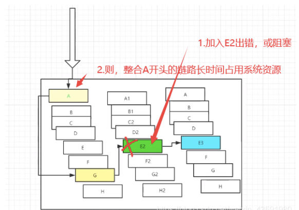
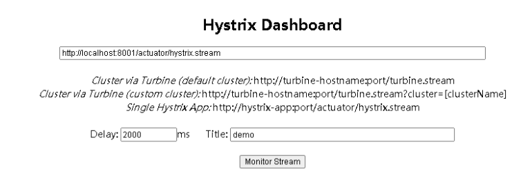
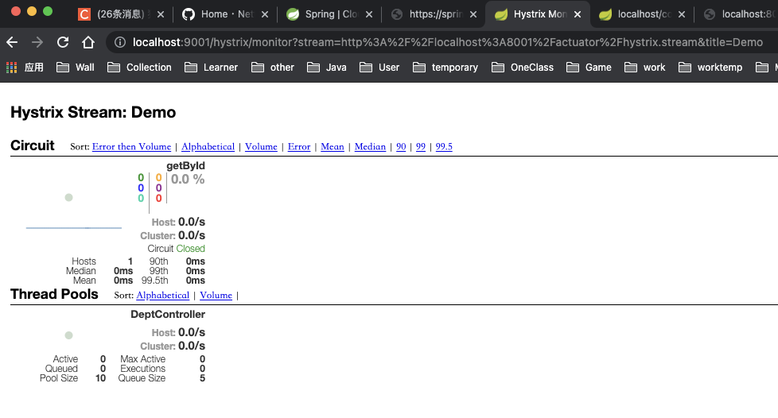

# 一、服务雪崩

多个微服务之间调用的时候，假设微服务 A 调用微服务 B 和微服务 C，微服务 B 和微服务 C 又调用其他的微服务，这就是所谓的 “扇出”，如果扇出的链路上**某个微服务的调用响应时间过长，或者不可用**，对微服务 A 的调用就会占用越来越多的系统资源，进而引起系统崩溃，所谓的 “雪崩效应”。



对于高流量的应用来说，单一的后端依赖可能会导致所有服务器上的所有资源都在几十秒内饱和。比失败更糟糕的是，这些应用程序还可能导致服务之间的延迟增加，备份队列，线程和其他系统资源紧张，导致整个系统发生更多的级联故障，**这些都表示需要对故障和延迟进行隔离和管理，以达到单个依赖关系的失败而不影响整个应用程序或系统运行**。

 我们需要，**弃车保帅**！


# 二、什么是 Hystrix？

> ## What Is Hystrix?
>
> In a distributed environment, inevitably some of the many service dependencies will fail. Hystrix is a library that helps you control the interactions between these distributed services by adding latency tolerance and fault tolerance logic. Hystrix does this by isolating points of access between the services, stopping cascading failures across them, and providing fallback options, all of which improve your system’s overall resiliency.
>
> #### History of Hystrix
>
> Hystrix evolved out of resilience engineering work that the Netflix API team began in 2011. In 2012, Hystrix continued to evolve and mature, and many teams within Netflix adopted it. Today tens of billions of thread-isolated, and hundreds of billions of semaphore-isolated calls are executed via Hystrix every day at Netflix. This has resulted in a dramatic improvement in uptime and resilience.

**Hystrix** 是一个应用于处理分布式系统的延迟和容错的开源库，在分布式系统里，许多依赖不可避免的会调用失败，比如超时，异常等，**Hystrix** 能够保证在一个依赖出问题的情况下，不会导致整个体系服务失败，避免级联故障，以提高分布式系统的弹性。

 “**断路器**” 本身是一种开关装置，当某个服务单元发生故障之后，通过断路器的故障监控 (类似熔断保险丝) ，**向调用方返回一个服务预期的，可处理的备选响应 (FallBack) ，而不是长时间的等待或者抛出调用方法无法处理的异常，这样就可以保证了服务调用方的线程不会被长时间，不必要的占用**，从而避免了故障在分布式系统中的蔓延，乃至雪崩。

**官网资料**：https://github.com/Netflix/Hystrix/wiki


# 三、Hystrix 能干嘛？

> ## What Is Hystrix For?
>
> Hystrix is designed to do the following:
>
> - Give protection from and control over latency and failure from dependencies accessed (typically over the network) via third-party client libraries.
> - Stop cascading failures in a complex distributed system.
> - Fail fast and rapidly recover.
> - Fallback and gracefully degrade when possible.
> - Enable near real-time monitoring, alerting, and operational control.

- 服务降级
- 服务熔断
- 服务限流
- 接近实时的监控
- …

> ## What Problem Does Hystrix Solve?
>
> Applications in complex distributed architectures have dozens of dependencies, each of which will inevitably fail at some point. If the host application is not isolated from these external failures, it risks being taken down with them.
>
> For example, for an application that depends on 30 services where each service has 99.99% uptime, here is what you can expect:
>
> > 99.9930 = 99.7% uptime
> > 0.3% of 1 billion requests = 3,000,000 failures
> > 2+ hours downtime/month even if all dependencies have excellent uptime.
>
> Reality is generally worse.
>
> Even when all dependencies perform well the aggregate impact of even 0.01% downtime on each of dozens of services equates to potentially hours a month of downtime **if you do not engineer the whole system for resilience**.
>
> ------
>
> When everything is healthy the request flow can look like this:

**当一切正常时，请求流可以如下所示：**


> When one of many backend systems becomes latent it can block the entire user request:

**当许多后端系统中有一个潜在阻塞服务时，它可以阻止整个用户请求：**


> With high volume traffic a single backend dependency becoming latent can cause all resources to become saturated in seconds on all servers.
>
> Every point in an application that reaches out over the network or into a client library that might result in network requests is a source of potential failure. Worse than failures, these applications can also result in increased latencies between services, which backs up queues, threads, and other system resources causing even more cascading failures across the system.

**随着大容量通信量的增加，单个后端依赖项的潜在性会导致所有服务器上的所有资源在几秒钟内饱和。**

**应用程序中通过网络或客户端库可能导致网络请求的每个点都是潜在故障的来源。比失败更糟糕的是，这些应用程序还可能导致服务之间的延迟增加，从而备份队列、线程和其他系统资源，从而导致更多跨系统的级联故障。**


> These issues are exacerbated when network access is performed through a third-party client — a “black box” where implementation details are hidden and can change at any time, and network or resource configurations are different for each client library and often difficult to monitor and change.
>
> Even worse are transitive dependencies that perform potentially expensive or fault-prone network calls without being explicitly invoked by the application.
>
> Network connections fail or degrade. Services and servers fail or become slow. New libraries or service deployments change behavior or performance characteristics. Client libraries have bugs.
>
> All of these represent failure and latency that needs to be isolated and managed so that a single failing dependency can’t take down an entire application or system.
>
> \## What Design Principles Underlie Hystrix?
>
> Hystrix works by:
>
> - Preventing any single dependency from using up all container (such as Tomcat) user threads.
> - Shedding load and failing fast instead of queueing.
> - Providing fallbacks wherever feasible to protect users from failure.
> - Using isolation techniques (such as bulkhead, swimlane, and circuit breaker patterns) to limit the impact of any one dependency.
> - Optimizing for time-to-discovery through near real-time metrics, monitoring, and alerting
> - Optimizing for time-to-recovery by means of low latency propagation of configuration changes and support for dynamic property changes in most aspects of Hystrix, which allows you to make real-time operational modifications with low latency feedback loops.
> - Protecting against failures in the entire dependency client execution, not just in the network traffic.

---

> ## How Does Hystrix Accomplish Its Goals?
>
> Hystrix does this by:
>
> - Wrapping all calls to external systems (or “dependencies”) in a `HystrixCommand` or `HystrixObservableCommand` object which typically executes within a separate thread (this is an example of the [command pattern](http://en.wikipedia.org/wiki/Command_pattern)).
> - Timing-out calls that take longer than thresholds you define. There is a default, but for most dependencies you custom-set these timeouts by means of “properties” so that they are slightly higher than the measured 99.5th percentile performance for each dependency.
> - Maintaining a small thread-pool (or semaphore) for each dependency; if it becomes full, requests destined for that dependency will be immediately rejected instead of queued up.
> - Measuring successes, failures (exceptions thrown by client), timeouts, and thread rejections.
> - Tripping a circuit-breaker to stop all requests to a particular service for a period of time, either manually or automatically if the error percentage for the service passes a threshold.
> - Performing fallback logic when a request fails, is rejected, times-out, or short-circuits.
> - Monitoring metrics and configuration changes in near real-time.
>
> When you use Hystrix to wrap each underlying dependency, the architecture as shown in diagrams above changes to resemble the following diagram. Each dependency is isolated from one other, restricted in the resources it can saturate when latency occurs, and covered in fallback logic that decides what response to make when any type of failure occurs in the dependency:

当使用 **Hystrix** 包装每个基础依赖项时，上面的图表中所示的体系结构会发生类似于以下关系图的变化。**每个依赖项是相互隔离的**，限制在延迟发生时它可以填充的资源中，并包含在回退逻辑中，该逻辑决定在依赖项中发生任何类型的故障时要做出什么样的响应：


# 四、服务熔断

## 4.1 什么是服务熔断?

**熔断机制是赌赢雪崩效应的一种微服务链路保护机制**。

 当扇出链路的某个微服务不可用或者响应时间太长时，会进行服务的降级，**进而熔断该节点微服务的调用，快速返回错误的响应信息**。检测到该节点微服务调用响应正常后恢复调用链路。在 SpringCloud 框架里熔断机制通过 Hystrix 实现。Hystrix 会监控微服务间调用的状况，当失败的调用到一定阀值缺省是 **5 秒内 20 次调用失败，就会启动熔断机制**。熔断机制的注解是：`@HystrixCommand`。

服务熔断解决如下问题：

- 当所依赖的对象不稳定时，能够起到快速失败的目的；
- 快速失败后，能够根据一定的算法动态试探所依赖对象是否恢复。


## 4.2 入门案例

新建 springcloud-provider-dept-hystrix-8001 模块并拷贝 springcloud-provider-dept–8001 内的 **pom.xml、resource** 和 Java 代码进行初始化并调整。

```xml
<!--导入Hystrix依赖-->
<dependency>
    <groupId>org.springframework.cloud</groupId>
    <artifactId>spring-cloud-starter-hystrix</artifactId>
    <version>1.4.6.RELEASE</version>
</dependency>
```

**调整 yml 配置文件**

```yaml
server:
  port: 8001

# mybatis配置
mybatis:
  # springcloud-api 模块下的pojo包
  type-aliases-package: com.haust.springcloud.pojo
  # 本模块下的mybatis-config.xml核心配置文件类路径
  config-location: classpath:mybatis/mybatis-config.xml
  # 本模块下的mapper配置文件类路径
  mapper-locations: classpath:mybatis/mapper/*.xml

# spring配置
spring:
  application:
    #项目名
    name: springcloud-provider-dept
  datasource:
    # 德鲁伊数据源
    type: com.alibaba.druid.pool.DruidDataSource
    driver-class-name: com.mysql.jdbc.Driver
    url: jdbc:mysql://localhost:3306/db01?useUnicode=true&characterEncoding=utf-8
    username: root
    password: root

# Eureka配置：配置服务注册中心地址
eureka:
  client:
    service-url:
      # 注册中心地址7001-7003
      defaultZone: http://eureka7001.com:7001/eureka/,http://eureka7002.com:7002/eureka/,http://eureka7003.com:7003/eureka/
  instance:
    instance-id: springcloud-provider-dept-hystrix-8001 #修改Eureka上的默认描述信息
    prefer-ip-address: true #改为true后默认显示的是ip地址而不再是localhost

#info配置
info:
  app.name: redblood-springcloud
  company.name: www.redblood.cn
```

**prefer-ip-address: false**:


**prefer-ip-address: true**：true可以显示服务ip


**修改 controller**

```java
package cn.redblood.springcloud.controller;

import cn.redblood.springcloud.pojo.Dept;
import cn.redblood.springcloud.service.DeptService;
import com.netflix.hystrix.contrib.javanica.annotation.HystrixCommand;
import lombok.extern.slf4j.Slf4j;
import org.springframework.cloud.client.ServiceInstance;
import org.springframework.cloud.client.discovery.DiscoveryClient;
import org.springframework.web.bind.annotation.*;

import javax.annotation.Resource;
import java.util.List;

/**
 * @author wantao
 */
@Slf4j
@RestController
@RequestMapping("dept")
public class DeptController {

    @Resource
    private DeptService deptService;

    @GetMapping("get/{id}")
    @HystrixCommand(fallbackMethod = "hystrixById")
    public Dept getById(@PathVariable("id") Long id) {
        Dept dept = deptService.queryById(id);
        if (dept == null) {
            throw new RuntimeException("deptService.queryById(id)存在错误！==>" + id);
        }
        return dept;
    }

     /**
     * 根据id查询备选方案(熔断)
     * @param id
     * @return
     */
    public Dept hystrixById(@PathVariable("id") Long id){
        return new Dept()
                .setDeptno(id)
                .setDname("id=>" + "没有对应的信息，null--@Hystrix")
                .setDb_source("no this database in Mysql");
    }
}
```

> **注意：此处参考他人配置进行扩充讲解**
>
> ```java
> @RequestMapping("/getArticleById2")
> @HystrixCommand(fallbackMethod = "articleFallback",commandProperties = {
>         @HystrixProperty(name = "execution.timeout.enabled",value = "true"),
>         @HystrixProperty(name = "execution.isolation.thread.timeoutInMilliseconds",value = "5000")
> })
> public ArticleDTO getArticleById2(Integer id) {
>     ArticleDTO articleDTO = articleService.getById(id);
>     return articleDTO;
> }
> ```
>
> 需要注意的是：如果`hystrix.command.default.execution.timeout.enabled`为`true`，则会有两个配置方法超时的配置，一个就是ribbon的`ReadTimeout`，一个就是熔断器`hystrix`的`timeoutInMilliseconds`，此时谁的值小谁生效；如果`hystrix.command.default.execution.timeout.enabled`为false，则熔断器不进行超时熔断，而是根据ribbon的`ReadTimeout`抛出的异常而熔断，也就是取决于ribbon的`ConnectTimeout`，配置的是请求服务的超时时间，除非服务找不到，或者网络原因，这个时间才会生效；
>
> ```yaml
> ribbon.ReadTimeout=6000
> ribbon.ConnectTimeout=3000
> ```
>
> `hystrix`还有很多其它配置，配置名称可以参考**`com.netflix.hystrix.contrib.javanica.conf.HystrixPropertiesManager`**类。
>
> 我们还可以通过注解修改服务的超时时间，我们还可以有个配置文件设置服务默认的超时时间：
>
> ```yaml
> ribbon.ReadTimeout=6000
> ribbon.ConnectTimeout=3000
> hystrix.command.default.execution.timeout.enabled=true
> hystrix.command.default.execution.isolation.thread.timeoutInMilliseconds=5000
> ```


**为主启动类添加对熔断的支持注解 @EnableCircuitBreaker**

```java
package cn.redblood.springcloud;

import com.netflix.hystrix.contrib.metrics.eventstream.HystrixMetricsStreamServlet;
import org.springframework.boot.SpringApplication;
import org.springframework.boot.autoconfigure.SpringBootApplication;
import org.springframework.boot.web.servlet.ServletRegistrationBean;
import org.springframework.cloud.client.circuitbreaker.EnableCircuitBreaker;
import org.springframework.cloud.client.discovery.EnableDiscoveryClient;
import org.springframework.cloud.netflix.eureka.EnableEurekaClient;
import org.springframework.context.annotation.Bean;

/**
 * 启动类
 *
 * @author wantao
 */
@SpringBootApplication
@EnableDiscoveryClient // 服务发现~
@EnableEurekaClient // 在服务启动会后自动注册到Eureka中！
@EnableCircuitBreaker // 添加对熔断的支持
public class DeptProviderHystrix_8001 {

    public static void main(String[] args) {
        SpringApplication.run(DeptProviderHystrix_8001.class, args);
    }
}

```

**测试**：

使用熔断后，当访问一个不存在的 id 时，页面展示数据如下:


而不适用熔断的 springcloud-provider-dept–8001 模块访问相同地址会出现下面状况:


因此，**为了避免因某个微服务后台出现异常或错误而导致整个应用或网页报错，使用熔断是必要的**。


# 五、服务降级

## 5.1 什么是服务降级?

服务降级是指 当服务器压力剧增的情况下，根据实际业务情况及流量，对一些服务和页面有策略的不处理，或换种简单的方式处理，从而释放服务器资源以保证核心业务正常运作或高效运作。说白了，**就是尽可能的把系统资源让给优先级高的服务**。

资源有限，而请求是无限的。如果在并发高峰期，不做服务降级处理，一方面肯定会影响整体服务的性能，严重的话可能会导致宕机某些重要的服务不可用。所以，一般在高峰期，为了保证核心功能服务的可用性，都要对某些服务降级处理。比如当双 11 活动时，把交易无关的服务统统降级，如查看蚂蚁深林，查看历史订单等等。

服务降级主要用于什么场景呢？当整个微服务架构整体的负载超出了预设的上限阈值或即将到来的流量预计将会超过预设的阈值时，为了保证重要或基本的服务能正常运行，可以将一些 不重要 或 不紧急 的服务或任务进行服务的 延迟使用 或 暂停使用。

降级的方式可以根据业务来，可以延迟服务，比如延迟给用户增加积分，只是放到一个缓存中，等服务平稳之后再执行 ；或者在粒度范围内关闭服务，比如关闭相关文章的推荐。


由上图可得，**当某一时间内服务 A 的访问量暴增，而 B 和 C 的访问量较少，为了缓解 A 服务的压力，这时候需要 B 和 C 暂时关闭一些服务功能，去承担 A 的部分服务，从而为 A 分担压力，叫做服务降级**。


## 5.2 服务降级需要考虑的问题

- 1）那些服务是核心服务，哪些服务是非核心服务
- 2）那些服务可以支持降级，那些服务不能支持降级，降级策略是什么
- 3）除服务降级之外是否存在更复杂的业务放通场景，策略是什么？


## 5.3 自动降级分类

1）超时降级：主要配置好超时时间和超时重试次数和机制，并使用异步机制探测回复情况

2）失败次数降级：主要是一些不稳定的 api，当失败调用次数达到一定阀值自动降级，同样要使用异步机制探测回复情况

3）故障降级：比如要调用的远程服务挂掉了（网络故障、DNS 故障、http 服务返回错误的状态码、rpc 服务抛出异常），则可以直接降级。降级后的处理方案有：默认值（比如库存服务挂了，返回默认现货）、兜底数据（比如广告挂了，返回提前准备好的一些静态页面）、缓存（之前暂存的一些缓存数据）

4）限流降级：秒杀或者抢购一些限购商品时，此时可能会因为访问量太大而导致系统崩溃，此时会使用限流来进行限制访问量，当达到限流阀值，后续请求会被降级；降级后的处理方案可以是：排队页面（将用户导流到排队页面等一会重试）、无货（直接告知用户没货了）、错误页（如活动太火爆了，稍后重试）。


## 5.4 入门案例

在 springcloud-api 模块下的 service 包中新建降级配置类 DeptClientServiceFallBackFactory.java

```java
package cn.redblood.springcloud.service;

import cn.redblood.springcloud.pojo.Dept;
import feign.hystrix.FallbackFactory;
import org.springframework.stereotype.Component;

import java.util.List;

/**
 * @author charlie
 */
// 降级~
@Component
public class DeptClientServiceFallbackFactory implements FallbackFactory {

    @Override
    public DeptClientService create(Throwable throwable) {
        return new DeptClientService() {
            @Override
            public Dept queryById(Long id) {
                return new Dept()
                        .setDeptno(id)
                        .setDname("id => " + id + "没有对应数据，客户端提供了降级的信息，该服务已被关闭!")
                        .setDb_source("没有数据~");
            }

            @Override
            public List<Dept> queryAll() {
                return null;
            }

            @Override
            public boolean addDept(Dept dept) {
                return false;
            }
        };
    }
}
```

在 DeptClientService 中指定降级配置类 DeptClientServiceFallBackFactory

```java
@Component //注册到spring容器中
//@FeignClient:微服务客户端注解,value:指定微服务的名字,这样就可以使Feign客户端直接找到对应的微服务
@FeignClient(value = "SPRINGCLOUD-PROVIDER-DEPT",fallbackFactory = DeptClientServiceFallBackFactory.class)//fallbackFactory指定降级配置类
public interface DeptClientService {

    @GetMapping("/dept/get/{id}")
    public Dept queryById(@PathVariable("id") Long id);

    @GetMapping("/dept/list")
    public List<Dept> queryAll();

    @GetMapping("/dept/add")
    public Boolean addDept(Dept dept);
}
```

在 **springcloud-consumer-dept-feign** 模块中开启降级：(配置yml)

```yaml
server:
  port: 80

# Eureka配置
eureka:
  client:
    register-with-eureka: false # 不向 Eureka注册自己
    service-url: # 从三个注册中心中随机取一个去访问
      defaultZone: http://eureka7001.com:7001/eureka/,http://eureka7002.com:7002/eureka/,http://eureka7003.com:7003/eureka/

# 开启降级feign.hystrix
feign:
  hystrix:
    enabled: true
```


---

:ballot_box_with_check: 此处参考他人配置讲解**Hystrix限流：**

hystrix限流就是限制你某个微服务的使用量（可用线程数、缓存任务量）。hystrix通过线程池的方式来管理微服务的调用，它默认是一个线程池（大小10个） 管理你的所有微服务，你可以给某个微服务开辟新的线程池：

```java
@RequestMapping("/getArticleById3")
@HystrixCommand(fallbackMethod = "articleFallback",
        threadPoolKey = "article",
        threadPoolProperties = {
                @HystrixProperty(name = "coreSize", value = "2"),
                @HystrixProperty(name = "maxQueueSize", value = "1")},
        commandProperties = {
                @HystrixProperty(name = "execution.timeout.enabled", value = "true"),
                @HystrixProperty(name = "execution.isolation.thread.timeoutInMilliseconds", value = "5000")
        })
public ArticleDTO getArticleById3(Integer id) throws InterruptedException {
    ArticleDTO articleDTO = articleService.getById(id);
    Thread.sleep(4000);
    return articleDTO;
}

public ArticleDTO articleFallback(Integer id, Throwable throwable) {
    ArticleDTO articleDTO = new ArticleDTO();
    articleDTO.setId(id);
    articleDTO.setTitle("服务降级！！！！,error：" + throwable.getMessage());
    return articleDTO;
}
```

上面接口中我们将超时时间设置5s，并在代码中sleep 4s，这样我们可以模拟用户请求，我们快速访问该接口，当访问第四次时，触发限流降级：

```json
{
	"id": 3,
	"title": "服务降级！！！！,error：Task java.util.concurrent.FutureTask@665bf6c4 rejected from java.util.concurrent.ThreadPoolExecutor@235ef23d[Running, pool size = 2, active threads = 2, queued tasks = 1, completed tasks = 4]",
	"content": null
}
```


# 六、服务熔断和降级的区别

- **服务熔断—> 服务端**：某个服务超时或异常，引起熔断~，类似于保险丝 (自我熔断)
- **服务降级—> 客户端**：从整体网站请求负载考虑，当某个服务熔断或者关闭之后，服务将不再被调用，此时在客户端，我们可以准备一个 FallBackFactory ，返回一个默认的值 (缺省值)。会导致整体的服务下降，但是好歹能用，比直接挂掉强。
- 触发原因不太一样，服务熔断一般是某个服务（下游服务）故障引起，而服务降级一般是从整体负荷考虑；管理目标的层次不太一样，熔断其实是一个框架级的处理，每个微服务都需要（无层级之分），而降级一般需要对业务有层级之分（比如降级一般是从最外围服务开始）
- 实现方式不太一样，服务降级具有代码侵入性 (由控制器完成 / 或自动降级)，熔断一般称为**自我熔断**。

**熔断，降级，限流**：

限流：限制并发的请求访问量，超过阈值则拒绝；

降级：服务分优先级，牺牲非核心服务（不可用），保证核心服务稳定；从整体负荷考虑；

熔断：依赖的下游服务故障触发熔断，避免引发本系统崩溃；系统自动执行和恢复。


# 七、Dashboard 流监控

新建 springcloud-consumer-hystrix-dashboard 模块

**添加依赖**

```xml
<!--Hystrix依赖-->
<dependency>
    <groupId>org.springframework.cloud</groupId>
    <artifactId>spring-cloud-starter-hystrix</artifactId>
    <version>1.4.6.RELEASE</version>
</dependency>
<!--dashboard依赖-->
<dependency>
    <groupId>org.springframework.cloud</groupId>
    <artifactId>spring-cloud-starter-hystrix-dashboard</artifactId>
    <version>1.4.6.RELEASE</version>
</dependency>
<!--Ribbon-->
<dependency>
    <groupId>org.springframework.cloud</groupId>
    <artifactId>spring-cloud-starter-ribbon</artifactId>
    <version>1.4.6.RELEASE</version>
</dependency>
<!--Eureka-->
<dependency>
    <groupId>org.springframework.cloud</groupId>
    <artifactId>spring-cloud-starter-eureka</artifactId>
    <version>1.4.6.RELEASE</version>
</dependency>
<!--实体类+web-->
<dependency>
    <groupId>com.haust</groupId>
    <artifactId>springcloud-api</artifactId>
    <version>1.0-SNAPSHOT</version>
</dependency>
<dependency>
    <groupId>org.springframework.boot</groupId>
    <artifactId>spring-boot-starter-web</artifactId>
</dependency>
<!--热部署-->
<dependency>
    <groupId>org.springframework.boot</groupId>
    <artifactId>spring-boot-devtools</artifactId>
</dependency>
```

**主启动类**

```java
@SpringBootApplication
// 开启Dashboard
@EnableHystrixDashboard
public class DeptConsumerDashboard_9001 {
    public static void main(String[] args) {
        SpringApplication.run(DeptConsumerDashboard_9001.class,args);
    }
}
```

给 springcloud-provider-dept-hystrix-8001 模块下的主启动类添加如下代码, 添加监控

```java
@SpringBootApplication
@EnableEurekaClient //EnableEurekaClient 客户端的启动类，在服务启动后自动向注册中心注册服务
public class DeptProvider_8001 {
    public static void main(String[] args) {
        SpringApplication.run(DeptProvider_8001.class,args);
    }

    //增加一个 Servlet
    @Bean
    public ServletRegistrationBean hystrixMetricsStreamServlet(){
        ServletRegistrationBean registrationBean = new ServletRegistrationBean(new HystrixMetricsStreamServlet());
        //访问该页面就是监控页面
        registrationBean.addUrlMappings("/actuator/hystrix.stream");
       
        return registrationBean;
    }
}
```

访问：http://localhost:9001/hystrix


访问：http://localhost:8001/actuator/hystrix.stream


进入监控页面：



效果如下图：




# 八、Hystrix相关配置（扩展）

## 8.1 Execution相关的属性的配置

- hystrix.command.default.execution.isolation.strategy：隔离策略，默认是`Thread`, 可选`Thread｜Semaphore（信号量）`
- hystrix.command.default.execution.isolation.thread.timeoutInMilliseconds：执行的超时时间，默认1000ms
- hystrix.command.default.execution.timeout.enabled：执行是否启用超时，默认启用true
- hystrix.command.default.execution.isolation.thread.interruptOnTimeout：发生超时是是否中断，默认true
- hystrix.command.default.execution.isolation.semaphore.maxConcurrentRequests 最大并发请求数，默认10，该参数当使用ExecutionIsolationStrategy.SEMAPHORE策略时才有效。如果达到最大并发请求数，请求会被拒绝。理论上选择semaphore size的原则和选择thread size一致，但选用semaphore时每次执行的单元要比较小且执行速度快（ms级别），否则的话应该用thread。semaphore应该占整个容器（tomcat）的线程池的一小部分。 Fallback相关的属性 这些参数可以应用于Hystrix的THREAD和SEMAPHORE策略；
- hystrix.command.default.fallback.isolation.semaphore.maxConcurrentRequest：如果并发数达到该设置值，请求会被拒绝和抛出异常并且fallback不会被调用。默认10
- hystrix.command.default.fallback.enabled：当执行失败或者请求被拒绝，是否会尝试调用hystrixCommand.getFallback() 。默认true


## 8.2 Circuit Breaker相关的属性

- hystrix.command.default.circuitBreaker.enabled：用来跟踪circuit的健康性，如果未达标则让request短路。默认true
- hystrix.command.default.circuitBreaker.requestVolumeThreshold：一个rolling window内最小的请求数。如果设为20，那么当一个rolling window的时间内（比如说1个rolling window是10秒）收到19个请求， 即使19个请求都失败，也不会触发circuit break。默认20 hystrix.command.default.circuitBreaker.sleepWindowInMilliseconds 触发短路的时间值，当该值设为5000时，则当触发circuit break后的5000毫秒内都会拒绝request，也就是5000毫秒后才会关闭circuit。 默认5000
- hystrix.command.default.circuitBreaker.errorThresholdPercentage：错误比率阀值，如果错误率>=该 值，circuit会被打开，并短路所有请求触发fallback。默认50
- hystrix.command.default.circuitBreaker.forceOpen：强制打开熔断器，如果打开这个开关，那么拒绝所有request，默认false
- hystrix.command.default.circuitBreaker.forceClosed：强制关闭熔断器，如果这个开关打开，circuit将 一直关闭且忽略circuitBreaker.errorThresholdPercentage


## 8.3 Metrics相关参数

- hystrix.command.default.metrics.rollingStats.timeInMilliseconds：设置统计的时间窗口值的，毫秒值，circuit break 的打开会根据1个rolling window的统计来计算。若rolling window被设为10000毫秒，则rolling window会被分成n个buckets，每个bucket包含success，failure，timeout，rejection的次数的统计信息。默认10000
- hystrix.command.default.metrics.rollingStats.numBuckets：设置一个rolling window被划分的数 量，若numBuckets＝10，rolling window＝10000，那么一个bucket的时间即1秒。必须符合rolling window % numberBuckets == 0。默认10
- hystrix.command.default.metrics.rollingPercentile.enabled：执行时是否enable指标的计算和跟踪， 默认true
- hystrix.command.default.metrics.rollingPercentile.timeInMilliseconds：设置rolling percentile window的时间，默认60000
- hystrix.command.default.metrics.rollingPercentile.numBuckets：设置rolling percentile window的numberBuckets。逻辑同上。默认6
- hystrix.command.default.metrics.rollingPercentile.bucketSize：如果bucket size＝100，window ＝10s，若这10s里有500次执行，只有最后100次执行会被统计到bucket里去。增加该值会增加内存开销以及排序 的开销。默认100
- hystrix.command.default.metrics.healthSnapshot.intervalInMilliseconds：记录health 快照（用 来统计成功和错误绿）的间隔，默认500ms


## 8.4 Request Context 相关参数

- hystrix.command.default.requestCache.enabled：默认true，需要重载getCacheKey()，返回null时不缓存
- hystrix.command.default.requestLog.enabled：记录日志到HystrixRequestLog，默认true


## 8.5 Collapser Properties 相关参数

- hystrix.collapser.default.maxRequestsInBatch：单次批处理的最大请求数，达到该数量触发批处理，默认 Integer.MAX_VALUE
- hystrix.collapser.default.timerDelayInMilliseconds：触发批处理的延迟，也可以为创建批处理的时间 ＋该值，默认10
- hystrix.collapser.default.requestCache.enabled：是否对HystrixCollapser.execute() and HystrixCollapser.queue()的cache，默认true ThreadPool 相关参数


## 8.6 ThreadPool相关参数

线程数默认值10适用于大部分情况（有时可以设置得更小），如果需要设置得更大，那有个基本得公式可以 follow： requests per second at peak when healthy × 99th percentile latency in seconds + some breathing room 每秒最大支撑的请求数 (99%平均响应时间 + 缓存值) 比如：每秒能处理1000个请求，99%的请求响应时间是60ms，那么公式是： 1000 （0.060+0.012）基本得原则时保持线程池尽可能小，他主要是为了释放压力，防止资源被阻塞。 当一切都是正常的时候，线程池一般仅会有1到2个线程激活来提供服务

- hystrix.threadpool.default.coreSize：并发执行的最大线程数，默认10
- hystrix.threadpool.default.maxQueueSize：BlockingQueue的最大队列数，当设为－1，会使用SynchronousQueue，值为正时使用LinkedBlcokingQueue。该设置只会在初始化时有效，之后不能修改threadpool的queue size，除非reinitialising thread executor。默认－1。
- hystrix.threadpool.default.queueSizeRejectionThreshold：即使maxQueueSize没有达到，达到 queueSizeRejectionThreshold该值后，请求也会被拒绝。因为maxQueueSize不能被动态修改，这个参数将允 许我们动态设置该值。if maxQueueSize == ­1，该字段将不起作用
- hystrix.threadpool.default.keepAliveTimeMinutes：如果corePoolSize和maxPoolSize设成一样（默认 实现）该设置无效。如果通过plugin（https://github.com/Netflix/Hystrix/wiki/Plugins）使用自定义 实现，该设置才有用，默认1.
- hystrix.threadpool.default.metrics.rollingStats.timeInMilliseconds：线程池统计指标的时间，默 认10000
- hystrix.threadpool.default.metrics.rollingStats.numBuckets：将rolling window划分为n个 buckets，默认10；


