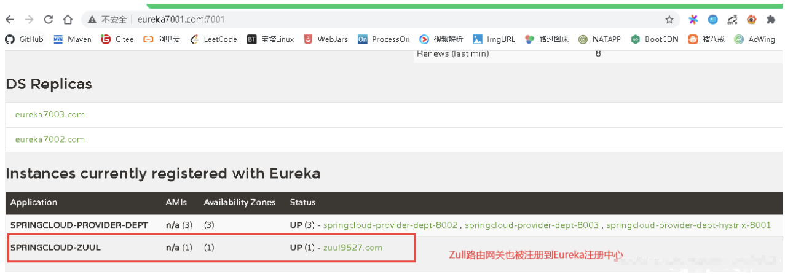
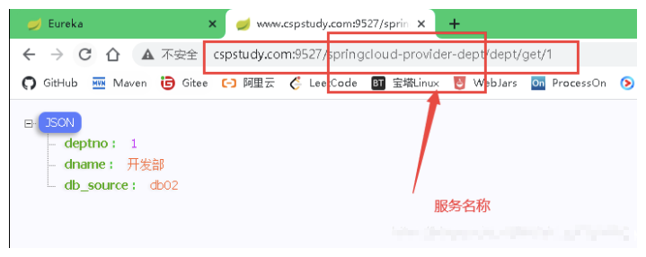
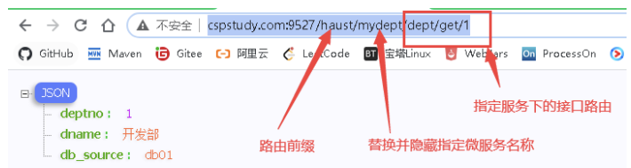

# 一、概述

> 什么是 zuul?
>
> Eureka用于服务的注册于发现，Feign支持服务的调用以及均衡负载，Hystrix处理服务的熔断防止故障扩散，Spring Cloud Config服务集群配置中心，似乎一个微服务框架已经完成了。
>
> 我们还是少考虑了一个问题，外部的应用如何来访问内部各种各样的微服务呢？在微服务架构中，后端服务往往不直接开放给调用端，而是通过一个API网关根据请求的url，路由到相应的服务。当添加API网关后，在第三方调用端和服务提供方之间就创建了一面墙，这面墙直接与调用方通信进行权限控制，后将请求均衡分发给后台服务端。

 Zull 包含了对请求的**路由** (用来跳转的) 和**过滤**两个最主要功能：

 其中**路由功能负责将外部请求转发到具体的微服务实例上，是实现外部访问统一入口的基础**，而过**滤器功能则负责对请求的处理过程进行干预，是实现请求校验，服务聚合等功能的基础**。Zuul 和 Eureka 进行整合，将 Zuul 自身注册为 Eureka 服务治理下的应用，同时从 Eureka 中获得其他服务的消息，也即以后的访问微服务都是通过 Zuul 跳转后获得。

**注意**：Zuul 服务最终还是会注册进 Eureka

**提供**：代理 + 路由 + 过滤 三大功能！

Zuul 能干嘛？

- 路由
- 过滤

官方文档：https://github.com/Netflix/zuul/


> ## 为什么需要API Gateway

### 1.1 简化客户端调用复杂度

在微服务架构模式下后端服务的实例数一般是动态的，对于客户端而言很难发现动态改变的服务实例的访问地址信息。因此在基于微服务的项目中为了简化前端的调用逻辑，通常会引入API Gateway作为轻量级网关，同时API Gateway中也会实现相关的认证逻辑从而简化内部服务之间相互调用的复杂度。

### 1.2 数据裁剪以及聚合

通常而言不同的客户端对于显示时对于数据的需求是不一致的，比如手机端或者Web端又或者在低延迟的网络环境或者高延迟的网络环境。

因此为了优化客户端的使用体验，API Gateway可以对通用性的响应数据进行裁剪以适应不同客户端的使用需求。同时还可以将多个API调用逻辑进行聚合，从而减少客户端的请求数，优化客户端用户体验

### 1.3 多渠道支持

当然我们还可以针对不同的渠道和客户端提供不同的API Gateway,对于该模式的使用由另外一个大家熟知的方式叫Backend for front-end, 在Backend for front-end模式当中，我们可以针对不同的客户端分别创建其BFF，进一步了解BFF可以参考这篇文章：[Pattern: Backends For Frontends](http://samnewman.io/patterns/architectural/bff/)

此处省略扩展内容，详情请至[bigcoder84](https://github.com/bigcoder84/study-notes/blob/master/%E5%88%86%E5%B8%83%E5%BC%8F%E4%B8%8E%E5%BE%AE%E6%9C%8D%E5%8A%A1/SpringCloud/subfile/_6Spring_Cloud_Zuul.md)。


# 二、入门案例

**新建 springcloud-zuul 模块，并导入依赖**

```xml
dependencies>
    <!--导入zuul依赖-->
    <dependency>
        <groupId>org.springframework.cloud</groupId>
        <artifactId>spring-cloud-starter-zuul</artifactId>
        <version>1.4.6.RELEASE</version>
    </dependency>
    <!--Hystrix依赖-->
    <dependency>
        <groupId>org.springframework.cloud</groupId>
        <artifactId>spring-cloud-starter-hystrix</artifactId>
        <version>1.4.6.RELEASE</version>
    </dependency>
    <!--dashboard依赖-->
    <dependency>
        <groupId>org.springframework.cloud</groupId>
        <artifactId>spring-cloud-starter-hystrix-dashboar</artifactId>
        <version>1.4.6.RELEASE</version>
    </dependency>
    <!--Ribbon-->
    <dependency>
        <groupId>org.springframework.cloud</groupId>
        <artifactId>spring-cloud-starter-ribbon</artifactId>
        <version>1.4.6.RELEASE</version>
    </dependency>
    <!--Eureka-->
    <dependency>
        <groupId>org.springframework.cloud</groupId>
        <artifactId>spring-cloud-starter-eureka</artifactId>
        <version>1.4.6.RELEASE</version>
    </dependency>
    <!--实体类+web-->
    <dependency>
        <groupId>com.haust</groupId>
        <artifactId>springcloud-api</artifactId>
        <version>1.0-SNAPSHOT</version>
    </dependency>
    <dependency>
        <groupId>org.springframework.boot</groupId>
        <artifactId>spring-boot-starter-web</artifactId>
    </dependency>
    <!--热部署-->
    <dependency>
        <groupId>org.springframework.boot</groupId>
        <artifactId>spring-boot-devtools</artifactId>
    </dependency>
</dependencies>
```

**application.yml**

```yaml
server:
  port: 9527

spring:
  application:
    name: springcloud-zuul #微服务名称

# eureka 注册中心配置
eureka:
  client:
    service-url:
      defaultZone: http://eureka7001.com:7001/eureka/,http://eureka7002.com:7002/eureka/,http://eureka7003.com:7003/eureka/
  instance: #实例的id
    instance-id: zuul9527.com
    prefer-ip-address: true # 显示ip


# zull 路由网关配置
zuul:
  # 路由相关配置
  # 原来访问路由 eg:http://www.cspStudy.com:9527/springcloud-provider-dept/dept/get/1
  # zull路由配置后访问路由 eg:http://www.cspstudy.com:9527/haust/mydept/dept/get/1
  routes:
    mydept.serviceId: springcloud-provider-dept # eureka注册中心的服务提供方路由名称
    mydept.path: /mydept/** # 将eureka注册中心的服务提供方路由名称 改为自定义路由名称
  # 不能再使用这个路径访问了，*： 忽略,隐藏全部的服务名称~
  ignored-services: "*"
  # 设置公共的前缀
  prefix: /haust
```

**主启动类**

```java
package cn.redblood.springcloud;

import org.springframework.boot.SpringApplication;
import org.springframework.boot.autoconfigure.SpringBootApplication;
import org.springframework.cloud.netflix.zuul.EnableZuulProxy;

/**
 * @author charlie
 */
@SpringBootApplication
@EnableZuulProxy
public class ZuulApplication_9527 {

    public static void main(String[] args) {
        SpringApplication.run(ZuulApplication_9527.class, args);
    }
}

```

测试：



可以看出 Zull 路由网关被注册到 Eureka 注册中心中了！



上图是没有经过 Zull 路由网关配置时，服务接口访问的路由，可以看出直接用微服务 (服务提供方) 名称去访问，这样不安全，不能将微服务名称暴露！

所以经过 Zull 路由网关配置后，访问的路由为：



我们看到，微服务名称被替换并隐藏，换成了我们自定义的微服务名称 mydept，同时加上了前缀 haust，这样就做到了对路由 fan 访问的加密处理！

详情参考 springcloud 中文社区 zuul 组件 :https://www.springcloud.cc/spring-cloud-greenwich.html#_router_and_filter_zuul