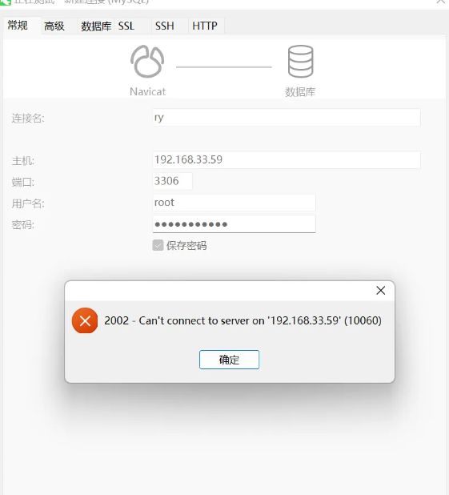

# 解决mysql8.0版本以上的安装后登录不了的问题和修改密码

步骤：

**1.更改mysql配置文件**

```shell
vi /etc/my.cnf                             #进入mysql配置文件
```

在my.cnf配置文件下添加一下内容

```shell
skip-grant-tables                          #即不校验密码登录
```

**2.重启mysql数据库并登录数据库**

```shell
systemctl restart mysqld
mysql -u root -p    #不用输入密码，直接回车
```

**3.进入数据库后，需要先将root密码置空**

```mysql
use user;
update user set authentication_string='' where user = 'root';
```

**4.清理完成后查看一下密码是否为空**

```mysql
select host,user,authentication_string,plugin from user;
```

**5.退出登录：\q**
**6.去my.cnf配置5文件里注释掉skip-grant-tables**

```shell
vi /etc/my.cnf     
```

**7.重启mysql服务** 

```shell
systemctl restart mysqld
```

**8.免密登录mysql**

```shell
mysql -u root -p
```

然后直接回车启用mysql，切换到数据库

```mysql
use mysql
```

**9.修改密码（密码要有大写小写字母特殊字符，还要求长度，如果mysql没有配置密码复杂度则可以设置简单密码。）**

```mysql
alter user 'root'@'localhost' identified by '新设置的密码';
或者
ALTER USER 'root'@'localhost' IDENTIFIED WITH mysql_native_password BY '你的密码';
```

**10.刷新mysql相关系统权限表，退出**

```mysql
FLUSH privileges;
```

然后退出数据库\q

**11.再次登录数据库，输入新设置的密码登录**

```shell
mysql -u root -p              #登录数据库
```

回车然后输入新密码就可以登录了
————————————————


# 设置远程访问权限

1，登进MySQL之后，

2，输入以下语句，进入mysql库：

```mysql
use mysql
```

**3，更新域属性，'%'表示允许外部访问：**

```mysql
update user set host='%' where user ='root';
```

4，执行以上语句之后再执行：

```mysql
FLUSH PRIVILEGES;
```

5，再执行授权语句：

```mysql
GRANT ALL PRIVILEGES ON *.* TO 'root'@'%'WITH GRANT OPTION;
```

6，执行以上语句之后再执行：

```mysql
FLUSH PRIVILEGES;
```

然后外部就可以通过账户密码访问了。

7，其它说明：

**`FLUSH PRIVILEGES`; 命令本质上的作用是：**

**将当前user和privilige表中的用户信息/权限设置从mysql库(MySQL数据库的内置库)中提取到内存里。**

**MySQL用户数据和权限有修改后，希望在"不重启MySQL服务"的情况下直接生效，那么就需要执行这个命令。**

**通常是在修改ROOT帐号的设置后，怕重启后无法再登录进来，那么直接flush之后就可以看权限设置是否生效。**

**而不必冒太大风险。**

————————————————


# 其它远程登录问题

如图所示：



**解决方案：**
下面列举可能出现的几种情况：可根据问题逐个解决

- **1.防火墙原因，需要关闭防火墙**（建议开放防火墙端口）

  ```shell
  systemctl stop firewalld
  systemctl disable firewalld
  ```

- **2.数据库未开启，重启数据库**

  ```shell
  service mysql restart
  ```

- **3.数据库中的root权限不足**

输入授权语句

```mysql
GRANT ALL PRIVILEGES ON *.* TO 'root'@'%' IDENTIFIED BY 'root密码' WITH GRANT OPTION;
```

刷新配置信息

```mysql
FLUSH PRIVILEGES;
```

————————————————


# 补充：ubuntu系统如何对外开放端口

> 在 ubuntu 下可以通过 **ufw --help** 可以查看所有 **ufw 防火墙** 的相关命令。具体命令都要加 sudo 以 root 身份执行。

**１.查看已经开启的端口** ：查看防火墙状态：inactive是关闭，active是开启。

```shell
sudo ufw status
```

**2.打开端口**（使用`sudo ufw deny 3306`**关闭端口**）

```shell
sudo ufw allow 3306
```

**3.开启防火墙**（使用`sudo ufw disable`**关闭防火墙**）

```shell
sudo ufw enable
```

**４.重启防火墙**

```shell
sudo ufw reload
```

**5.再次查看一下端口是否已开放**

```shell
sudo ufw status
```


