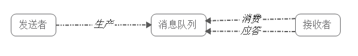

# 一、消息队列(MQ)概述

消息队列（Message Queue），是分布式系统中重要的组件，其通用的使用场景可以简单地描述为：

> 当不需要立即获得结果，但是并发量又需要进行控制的时候，差不多就是需要使用消息队列的时候。

消息队列主要解决了应用耦合、异步处理、流量削锋等问题。

当前使用较多的消息队列有RabbitMQ、RocketMQ、ActiveMQ、Kafka、ZeroMQ、MetaMq等，而部分数据库如Redis、Mysql以及phxsql也可实现消息队列的功能。

# 二、消息队列使用场景

消息队列在实际应用中包括如下四个场景：

- 应用耦合：多应用间通过消息队列对同一消息进行处理，避免调用接口失败导致整个过程失败；
- 异步处理：多应用对消息队列中同一消息进行处理，应用间并发处理消息，相比串行处理，减少处理时间；
- 限流削峰：广泛应用于秒杀或抢购活动中，避免流量过大导致应用系统挂掉的情况；
- 消息驱动的系统：系统分为消息队列、消息生产者、消息消费者，生产者负责产生消息，消费者(可能有多个)负责对消息进行处理；

---

下面详细介绍上述四个场景以及消息队列如何在上述四个场景中使用：

## 应用耦合

具体场景：用户使用QQ相册上传一张图片，人脸识别系统会对该图片进行人脸识别，一般的做法是，服务器接收到图片后，图片上传系统立即调用人脸识别系统，调用完成后再返回成功，如下图所示：

该方法有如下缺点：

- 人脸识别系统被调失败，导致图片上传失败；
- 延迟高，需要人脸识别系统处理完成后，再返回给客户端，即使用户并不需要立即知道结果；
- 图片上传系统与人脸识别系统之间互相调用，需要做耦合；

若使用消息队列：

客户端上传图片后，图片上传系统将图片信息如uin、批次写入消息队列，直接返回成功；而人脸识别系统则定时从消息队列中取数据，完成对新增图片的识别。 

此时图片上传系统并不需要关心人脸识别系统是否对这些图片信息的处理、以及何时对这些图片信息进行处理。事实上，由于用户并不需要立即知道人脸识别结果，人脸识别系统可以选择不同的调度策略，按照闲时、忙时、正常时间，对队列中的图片信息进行处理。

*详解：*

**解耦：**可以在多个系统之间进行解耦，将原本通过网络之间的调用的方式改为使用MQ进行消息的异步通讯，只要该操作不是需要同步的，就可以改为使用MQ进行不同系统之间的联系，这样项目之间不会存在耦合，系统之间不会产生太大的影响，就算一个系统挂了，也只是消息挤压在MQ里面没人进行消费而已，不会对其他的系统产生影响。

**不使用MQ的情况**:

**使用MQ进行解耦之后**:

## 异步处理

具体场景：用户为了使用某个应用，进行注册，系统需要发送注册邮件并验证短信。对这两个操作的处理方式有两种：串行及并行。

（1）串行方式：新注册信息生成后，先发送注册邮件，再发送验证短信；

在这种方式下，需要最终发送验证短信后再返回给客户端。

（2）并行处理：新注册信息写入后，由发短信和发邮件并行处理； 

在这种方式下，发短信和发邮件 需处理完成后再返回给客户端。

假设以上三个子系统处理的时间均为50ms，且不考虑网络延迟，则总的处理时间：

> 串行：50+50+50=150ms  并行：50+50 = 100ms

若使用消息队列：

并在写入消息队列后立即返回成功给客户端，则总的响应时间依赖于写入消息队列的时间，而写入消息队列的时间本身是可以很快的，基本可以忽略不计，因此总的处理时间相比串行提高了2倍，相比并行提高了一倍；

*详解：*

**异步：**加入一个操作设计到好几个步骤，这些步骤之间不需要同步完成，比如客户去创建了一个订单，还要去客户轨迹系统添加一条轨迹、去库存系统更新库存、去客户系统修改客户的状态等等。这样如果这个系统都直接进行调用，那么将会产生大量的时间，这样对于客户是无法接收的；并且像添加客户轨迹这种操作是不需要去同步操作的，如果使用MQ将客户创建订单时，将后面的轨迹、库存、状态等信息的更新全都放到MQ里面然后去异步操作，这样就可加快系统的访问速度，提供更好的客户体验。

**不使用MQ情况：**

**使用MQ进行异步之后：**

## 限流削峰

具体场景：购物网站开展秒杀活动，一般由于瞬时访问量过大，服务器接收过大，会导致流量暴增，相关系统无法处理请求甚至崩溃。而加入消息队列后，系统可以从消息队列中取数据，相当于消息队列做了一次缓冲。

该方法有如下优点： 

1. 请求先入消息队列，而不是由业务处理系统直接处理，做了一次缓冲,极大地减少了业务处理系统的压力； 
2. 队列长度可以做限制，事实上，秒杀时，后入队列的用户无法秒杀到商品，这些请求可以直接被抛弃，返回活动已结束或商品已售完信息；

*详解：*

**削峰：**一个系统访问流量有高峰时期，也有低峰时期，比如说，中午整点有一个抢购活动等等。比如系统平时流量并不高，一秒钟只有100多个并发请求，系统处理没有任何压力，一切风平浪静，到了某个抢购活动时间，系统并发访问了剧增，比如达到了每秒5000个并发请求，而我们的系统每秒只能处理2000个请求，那么由于流量太大，我们的系统、数据库可能就会崩溃。这时如果使用MQ进行流量削峰，将用户的大量消息直接放到MQ里面，然后我们的系统去按自己的最大消费能力去消费这些消息，就可以保证系统的稳定，只是可能要跟进业务逻辑，给用户返回特定页面或者稍后通过其他方式通知其结果。

**使用MQ进行削峰:**

## 消息驱动的系统

具体场景：用户新上传了一批照片， 人脸识别系统需要对这个用户的所有照片进行聚类，聚类完成后由对账系统重新生成用户的人脸索引(加快查询)。这三个子系统间由消息队列连接起来，前一个阶段的处理结果放入队列中，后一个阶段从队列中获取消息继续处理。

该方法有如下优点：

- 避免了直接调用下一个系统导致当前系统失败；
- 每个子系统对于消息的处理方式可以更为灵活，可以选择收到消息时就处理，可以选择定时处理，也可以划分时间段按不同处理速度处理；

> **消息队列有什么优点和缺点？**
>
> 优点：
>
> 1、对结构复杂、设计系统多的操作进行解耦操作，降低系统的操作复杂度、降低系统的维护成本。
>
> 2、对一个可以进行异步操作的一些系统操作进行异步，减小操作的响应时间，提供更好的用户体验。   
>
> 3、可对高流量进行削峰，保证系统的平稳运行。 
>
> 缺点：
>
> 1、系统可用性降低。比如在系统中引入MQ，那么万一MQ挂了怎么办呢？一般而言，引入的外部依赖越多，系统 越脆弱，每一个依赖出问题都会导致整个系统的崩溃。   
>
> 2、系统复杂度提高。需要考虑MQ的各种情况，比如：消息的重复消费、消息丢失、保证消费顺序等等......   
>
> 3、数据一致性问题。比如A系统已经给客户返回操作成功，这时候操作BC都成功了，操作D却失败了，导致数据不一致。

# 三、消息队列的两种模式

> 消息队列包括两种模式，点对点模式（point to point， queue）和发布/订阅模式（publish/subscribe，topic）。

## 点对点模式

点对点模式下包括三个角色：

- 消息队列
- 发送者 (生产者)
- 接收者（消费者）

消息发送者生产消息发送到queue中，然后消息接收者从queue中取出并且消费消息。消息被消费以后，queue中不再有存储，所以消息接收者不可能消费到已经被消费的消息。

点对点模式特点：

- 每个消息只有一个接收者（Consumer）(即一旦被消费，消息就不再在消息队列中)；
- 发送者和接收者间没有依赖性，发送者发送消息之后，不管有没有接收者在运行，都不会影响到发送者下次发送消息；
- 接收者在成功接收消息之后需向队列应答成功，以便消息队列删除当前接收的消息；

## 发布/订阅模式

发布/订阅模式下包括三个角色：

- 角色主题（Topic）
- 发布者(Publisher)
- 订阅者(Subscriber)

发布者将消息发送到Topic,系统将这些消息传递给多个订阅者。

发布/订阅模式特点：

- 每个消息可以有多个订阅者；
- 发布者和订阅者之间有时间上的依赖性。针对某个主题（Topic）的订阅者，它必须创建一个订阅者之后，才能消费发布者的消息。
- 为了消费消息，订阅者需要提前订阅该角色主题，并保持在线运行；

# 四、常用消息队列介绍

> 主要介绍四种常用的消息队列（RabbitMQ/ActiveMQ/RocketMQ/Kafka）的主要特性、优点、缺点。

## RabbitMQ

> [RabbitMQ](https://www.rabbitmq.com/) 2007年发布，是一个在[AMQP](http://www.amqp.org/)(高级消息队列协议)基础上完成的，可复用的企业消息系统，是当前最主流的消息中间件之一。

**主要特性：**

1. 可靠性: 提供了多种技术可以让你在性能和可靠性之间进行权衡。这些技术包括持久性机制、投递确认、发布者证实和高可用性机制；
2. 灵活的路由： 消息在到达队列前是通过交换机进行路由的。RabbitMQ为典型的路由逻辑提供了多种内置交换机类型。如果你有更复杂的路由需求，可以将这些交换机组合起来使用，你甚至可以实现自己的交换机类型，并且当做RabbitMQ的插件来使用；
3. 消息集群：在相同局域网中的多个RabbitMQ服务器可以聚合在一起，作为一个独立的逻辑代理来使用；
4. 队列高可用：队列可以在集群中的机器上进行镜像，以确保在硬件问题下还保证消息安全；
5. 多种协议的支持：支持多种消息队列协议；
6. 服务器端用Erlang语言编写，支持只要是你能想到的所有编程语言；
7. 管理界面: RabbitMQ有一个易用的用户界面，使得用户可以监控和管理消息Broker的许多方面；
8. 跟踪机制：如果消息异常，RabbitMQ提供消息跟踪机制，使用者可以找出发生了什么；
9. 插件机制：提供了许多插件，来从多方面进行扩展，也可以编写自己的插件；

**优点：**

1. 由于erlang语言的特性，mq 性能较好，高并发；
2. 健壮、稳定、易用、跨平台、支持多种语言、文档齐全；
3. 有消息确认机制和持久化机制，可靠性高；
4. 高度可定制的路由；
5. 管理界面较丰富，在互联网公司也有较大规模的应用；
6. 社区活跃度高；

**缺点：**

1. 尽管结合erlang语言本身的并发优势，性能较好，但是不利于做二次开发和维护；
2. 实现了代理架构，意味着消息在发送到客户端之前可以在中央节点上排队。此特性使得RabbitMQ易于使用和部署，但是使得其运行速度较慢，因为中央节点增加了延迟，消息封装后也比较大；
3. 需要学习比较复杂的接口和协议，学习和维护成本较高；

## ActiveMQ

> [ActiveMQ](http://activemq.apache.org/)是由Apache出品，ActiveMQ 是一个完全支持JMS1.1和J2EE 1.4规范的 JMS Provider实现。它非常快速，支持多种语言的客户端和协议，而且可以非常容易的嵌入到企业的应用环境中，并有许多高级功能。

**主要特性：**

1. 服从 JMS 规范：JMS 规范提供了良好的标准和保证，包括：同步或异步的消息分发，一次和仅一次的消息分发，消息接收和订阅等等。遵从 JMS 规范的好处在于，不论使用什么 JMS 实现提供者，这些基础特性都是可用的；
2. 连接性：ActiveMQ 提供了广泛的连接选项，支持的协议有：HTTP/S，IP 多播，SSL，STOMP，TCP，UDP，XMPP等等。对众多协议的支持让 ActiveMQ 拥有了很好的灵活性。
3. 支持的协议种类多：OpenWire、STOMP、REST、XMPP、AMQP ；
4. 持久化插件和安全插件：ActiveMQ 提供了多种持久化选择。而且，ActiveMQ 的安全性也可以完全依据用户需求进行自定义鉴权和授权；
5. 支持的客户端语言种类多：除了 Java 之外，还有：C/C++，.NET，Perl，PHP，Python，Ruby；
6. 代理集群：多个 ActiveMQ 代理可以组成一个集群来提供服务；
7. 异常简单的管理：ActiveMQ 是以开发者思维被设计的。所以，它并不需要专门的管理员，因为它提供了简单又使用的管理特性。有很多中方法可以监控 ActiveMQ 不同层面的数据，包括使用在 JConsole 或者 ActiveMQ 的Web Console 中使用 JMX，通过处理 JMX 的告警消息，通过使用命令行脚本，甚至可以通过监控各种类型的日志。

**优点：**

1. 跨平台(JAVA编写与平台无关有，ActiveMQ几乎可以运行在任何的JVM上)
2. 可以用JDBC：可以将数据持久化到数据库。虽然使用JDBC会降低ActiveMQ的性能，但是数据库一直都是开发人员最熟悉的存储介质。将消息存到数据库，看得见摸得着。而且公司有专门的DBA去对数据库进行调优，主从分离；
3. 支持JMS ：支持JMS的统一接口;
4. 支持自动重连；
5. 有安全机制：支持基于shiro，jaas等多种安全配置机制，可以对Queue/Topic进行认证和授权。
6. 监控完善：拥有完善的监控，包括Web Console，JMX，Shell命令行，Jolokia的REST API；
7. 界面友善：提供的Web Console可以满足大部分情况，还有很多第三方的组件可以使用，如hawtio；

**缺点：**

1. 社区活跃度不及RabbitMQ高；
2. 根据其他用户反馈，会出莫名其妙的问题，会丢失消息；
3. 目前重心放到activemq6.0产品-apollo，对5.x的维护较少；
4. 不适合用于上千个队列的应用场景；

## RocketMQ

> [RocketMQ](https://github.com/alibaba/RocketMQ)出自 阿里公司的开源产品，用 Java 语言实现，在设计时参考了 Kafka，并做出了自己的一些改进，消息可靠性上比 Kafka 更好。RocketMQ在阿里集团被广泛应用在订单，交易，充值，流计算，消息推送，日志流式处理，binglog分发等场景。

**主要特性：**

1. 是一个队列模型的消息中间件，具有高性能、高可靠、高实时、分布式特点；
2. Producer、Consumer、队列都可以分布式；
3. Producer向一些队列轮流发送消息，队列集合称为Topic，Consumer如果做广播消费，则一个consumer实例消费这个Topic对应的所有队列，如果做集群消费，则多个Consumer实例平均消费这个topic对应的队列集合；
4. 能够保证严格的消息顺序；
5. 提供丰富的消息拉取模式；
6. 高效的订阅者水平扩展能力；
7. 实时的消息订阅机制；
8. 亿级消息堆积能力；
9. 较少的依赖；

**优点：**

1. 单机支持 1 万以上持久化队列
2. RocketMQ 的所有消息都是持久化的，先写入系统 PAGECACHE，然后刷盘，可以保证内存与磁盘都有一份数据， 

 访问时，直接从内存读取。

1. 模型简单，接口易用（JMS 的接口很多场合并不太实用）；
2. 性能非常好，可以大量堆积消息在broker中；
3. 支持多种消费，包括集群消费、广播消费等。
4. 各个环节分布式扩展设计，主从HA；
5. 开发度较活跃，版本更新很快。

**缺点：**

1. 支持的客户端语言不多，目前是java及c++，其中c++不成熟；
2. RocketMQ社区关注度及成熟度也不及前两者；
3. 没有web管理界面，提供了一个CLI(命令行界面)管理工具带来查询、管理和诊断各种问题；
4. 没有在 mq 核心中去实现JMS等接口；

## Kafka

> [Apache Kafka](http://kafka.apache.org/)是一个分布式消息发布订阅系统。它最初由LinkedIn公司基于独特的设计实现为一个分布式的提交日志系统( a distributed commit log)，，之后成为Apache项目的一部分。Kafka系统快速、可扩展并且可持久化。它的分区特性，可复制和可容错都是其不错的特性。

**主要特性：**

1. 快速持久化，可以在O(1)的系统开销下进行消息持久化；
2. 高吞吐，在一台普通的服务器上既可以达到10W/s的吞吐速率； 
3. .完全的分布式系统，Broker、Producer、Consumer都原生自动支持分布式，自动实现负载均衡；
4. 支持同步和异步复制两种HA；
5. 支持数据批量发送和拉取；
6. zero-copy：减少IO操作步骤；
7. 数据迁移、扩容对用户透明；
8. 无需停机即可扩展机器；
9. 其他特性：严格的消息顺序、丰富的消息拉取模型、高效订阅者水平扩展、实时的消息订阅、亿级的消息堆积能力、定期删除机制；

**优点：**

1. 客户端语言丰富，支持java、.net、php、ruby、python、go等多种语言；
2. 性能卓越，单机写入TPS约在百万条/秒，消息大小10个字节；
3. 提供完全分布式架构, 并有replica机制, 拥有较高的可用性和可靠性, 理论上支持消息无限堆积；
4. 支持批量操作；
5. 消费者采用Pull方式获取消息, 消息有序, 通过控制能够保证所有消息被消费且仅被消费一次;
6. 有优秀的第三方Kafka Web管理界面Kafka-Manager；
7. 在日志领域比较成熟，被多家公司和多个开源项目使用；

**缺点：**

1. Kafka单机超过64个队列/分区，Load会发生明显的飙高现象，队列越多，load越高，发送消息响应时间变长
2. 使用短轮询方式，实时性取决于轮询间隔时间；
3. 消费失败不支持重试；
4. 支持消息顺序，但是一台代理宕机后，就会产生消息乱序；
5. 社区更新较慢；

## 纵观特性对比

| 特性                    | ActiveMQ                                           | RabbitMQ                                                     | RocketMQ                                                     | kafka                                                        |
| ----------------------- | -------------------------------------------------- | ------------------------------------------------------------ | ------------------------------------------------------------ | ------------------------------------------------------------ |
| 单机吞吐量              | 万级，吞吐量比RocketMQ和kafka要低一个数量级        | 万级，吞吐量比RocketMQ和kafka要低一个数量级                  | 10万级，RocketMQ也是可以支撑高吞吐的一种MQ                   | 10万级别，kafka最大优点就是吞吐量大，一般配合大数据类的系统来进行实时数据计算、日志采集等场景。 |
| topic数量对吞吐量的影响 |                                                    |                                                              | topic可以达到几百、几千个的级别，吞吐量会有小幅度的下降。这是RocketMQ的一大优势，可在同等数量机器下支撑大量的topic | topic从几十个到几百个的时候，吞吐量会大幅下降。所以在同等机器数量下，kafka尽量保证topic数量不要过多。如果支撑大规模topic需要增加更多的机器 |
| 时效性                  | ms级                                               | 微秒级，这是rabbitmq的一大特点，延迟是最低的                 | ms级                                                         | 延迟在ms级以内                                               |
| 可用性                  | 高，基于主从架构实现可用性                         | 高，基于主从架构实现可用性                                   | 非常高，分布式架构                                           | 非常高，kafka是分布式的，一个数据多个副本，少数机器宕机，不会丢失数据，不会导致不可用 |
| 消息可靠性              | 有较低的概率丢失数据                               |                                                              | 经过参数优化配置，可以做到0丢失                              | 经过参数配置，消息可以做到零丢失                             |
| 功能支持                | MQ领域的功能及其完备                               | 基于erlang开发，所以并发性能极强，性能极好，延时低           | MQ功能较为完备，分布式扩展性好                               | 功能较为简单，主要支持加单MQ功能                             |
| 优势                    | 非常成熟，功能强大，在业内大量公司和项目中都有应用 | erlang语言开发，性能极好、延时很低，吞吐量万级、MQ功能完备，管理界面非常好，社区活跃；互联网公司使用较多 | 接口简单易用，阿里出品有保障，吞吐量大，分布式扩展方便、社区比较活跃，支持大规模的topic、支持复杂的业务场景，可以基于源码进行定制开发 | 超高吞吐量，ms级的时延，极高的可用性和可靠性，分布式扩展方便 |
| 劣势                    | 偶尔有较低概率丢失消息，社区活跃度不高             | 吞吐量较低，erlang语音开发不容易进行定制开发，集群动态扩展麻烦 | 接口不是按照标准JMS规范走的，有的系统迁移要修改大量的代码，技术有被抛弃的风险 | 有可能进行消息的重复消费                                     |
| 应用                    | 主要用于解耦和异步，较少用在大规模吞吐的场景中     | 都有使用                                                     | 用于大规模吞吐、复杂业务中                                   | 在大数据的实时计算和日志采集中被大规模使用，是业界的标准     |

综上所述，总结如下： 一般业务系统要引入MQ，最早大家都用ActiveMQ，但现在用的不多了。没有经过大规模吞吐场景的验证，社区也不活跃，不推荐再使用。 后来大家开始用rabbitMQ，但是它是使用erlang语言开发的，如果不精通erlang，对公司而言，几乎处于不可控的状态，单其是开源的，社区活跃度高，拥有比较稳定的支持。 现在越来越多的公司开始使用RocketMQ，但是要小心被抛弃的风险。如果公司有实力自己去维护开发，推荐使用。否则还是选择RabbitMQ。 如果实在大数据的实时计算、日志采集等领域，用kafka是业界标准。

所以，对于中小型公司，技术实力一般的，应该用rabbitmq，对于大公司，基础架构研发能力强大的，推荐使用RocketMQ。

